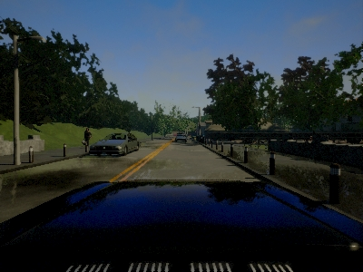
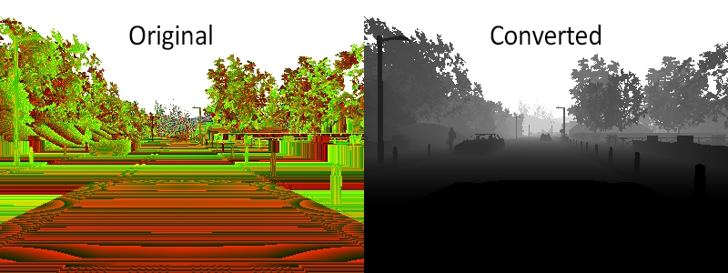
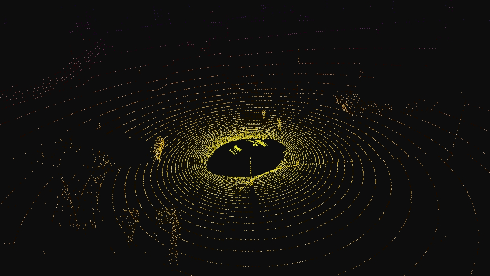
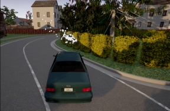

# 第38章 PPT：多传感器套件与数据采集

> 共 17 页，标注页码 · 图号与教学文档对应 · 课时：2 课时（90 分钟）

---

## P1 第38章 多传感器套件与数据采集

- **要点：** 本章贯通「传感器配置 → 标定 → 数据采集 → 回放」全链路

| 小节 | 内容 | 页码 |
|:--|:--|--:|
| 38.1 | 相机传感器：类型、参数、内参、解码 | P3–P6 |
| 38.2 | 激光雷达：参数、点云格式、噪声模型 | P7–P8 |
| 38.3 | RADAR / GNSS / IMU 传感器 | P9–P10 |
| 38.4 | 传感器标定：内参、外参、坐标对齐 | P11–P12 |
| 38.5 | rosbag 数据采集与回放 | P13–P14 |

<!-- 旁白：欢迎大家进入第 38 章。前面几章我们只用了单一传感器，本章把 RGB、Depth、LiDAR、RADAR、GNSS、IMU 全部挂到车上组成完整感知套件，最后用 rosbag2 串成数据集。幻灯片目录表中 38.1 到 38.5 共五节，按「配置→标定→采集→回放」顺序展开，13–14 两页是实训重点，请按表格页码顺序学习。 -->

---

## P2 学习目标

- **要点：** 掌握 CARLA 多传感器套件的配置、标定与数据采集全流程

1. 掌握 RGB / Depth / Semantic Segmentation 三种相机的配置与数据格式
2. 理解 LiDAR 关键参数（线数、FOV、丢点率）与点云处理流程
3. 学会 RADAR、GNSS、IMU 传感器的配置与消息转换
4. 理解内参（传感器内部参数）与外参（传感器间空间变换）
5. 掌握 CARLA 与 ROS 坐标系差异及 Y 轴取反规则
6. 掌握基于 rosbag2 的采集、同步与回放方法

<!-- 旁白：五个小节的实践目标，对应本章要动手做的五件事：配相机、配雷达、用其余传感器、做标定、录数据。第三、四两条把「外面装了什么、装在哪」讲清楚，第五、六条是自动驾驶数据集制作的基本功，最后要能独立录一段多传感器数据集并回放。 -->

---

## P3 38.1.1 相机类型

- **要点：** CARLA 提供三种相机，按输出类型选择任务

| 相机类型 | 输出 | 编码 | 用途 |
|---------|------|------|------|
| RGB 相机 | 彩色图像 | BGRA 8-bit | 视觉感知、目标检测 |
| Depth 相机 | 深度图 | 32 位浮点 | 距离估计、3D 重建 |
| Semantic Segmentation 相机 | 语义标签图 | 32 位标签 | 语义理解 |

```python
rgb_camera_bp = blueprint_library.find('sensor.camera.rgb')
depth_camera_bp = blueprint_library.find('sensor.camera.depth')
semseg_camera_bp = blueprint_library.find('sensor.camera.semantic_segmentation')
```


图注：RGB 相机输出的城市场景图，可直接用于目标检测与视觉感知任务。

<!-- 旁白：三种相机共用同一套蓝图查找与挂载流程，区别只在蓝图名和输出含义。对照表格记三个关键词：RGB 是彩色 8 位、Depth 是距离编码、语义分割是类别标签。注意 CARLA 的 Depth 和语义图都是把信息编码进 RGB 通道，和常见深度图格式不一样，后面 P6 会讲解码。右侧这幅图就是 RGB 相机的典型输出画面。 -->

---

## P4 38.1.2 相机参数配置

- **要点：** image_size/fov/sensor_tick 决定图像规格与采样频率

| 参数 | 默认值 | 说明 |
|------|--------|------|
| image_size_x | 1920 | 图像宽度（像素） |
| image_size_y | 1080 | 图像高度（像素） |
| fov | 90.0 | 视场角（度） |
| sensor_tick | 0.0 | 传感器采样间隔（秒） |
| lens_flare | False | 是否启用镜头光晕 |
| gamma | 2.2 | 伽马校正值 |
| motion_blur_intensity | 0.0 | 运动模糊强度 |
| motion_blur_max_distortion | 0.0 | 运动模糊最大失真 |

```python
camera_bp.set_attribute('image_size_x', '800')
camera_bp.set_attribute('image_size_y', '600')
camera_bp.set_attribute('fov', '90')
camera_bp.set_attribute('sensor_tick', '0.05')   # 20 FPS

camera_transform = carla.Transform(
    carla.Location(x=1.6, z=1.7),
    carla.Rotation(pitch=0, yaw=0, roll=0)
)
rgb_camera = world.spawn_actor(camera_bp, camera_transform, attach_to=vehicle)
```

<!-- 旁白：参数表里 sensor_tick 最关键，0 表示每个仿真步长都发布，设为 0.05 秒就是 20 帧每秒。仿真中分辨率常用 800×600 以降低带宽。挂载位置 x=1.6、z=1.7 相当于挡风玻璃后视镜位置，attach_to=vehicle 让相机随车运动。fov 越大视野越广、单像素角分辨率越低，是内参计算的输入。 -->

---

## P5 38.1.3 内参矩阵与畸变模型

- **要点：** 内参 K 把 3D 世界坐标投影到 2D 像素平面

```
K = [fx   0   cx]
    [0   fy   cy]
    [0    0    1]
```

```python
def get_camera_intrinsics(camera_actor, image):
    h, w = image.height, image.width
    fov = float(camera_actor.attributes['fov'])

    fx = w / (2.0 * math.tan(fov * math.pi / 360.0))
    fy = h / (2.0 * math.tan(fov * math.pi / 360.0))
    cx = w / 2.0
    cy = h / 2.0

    K = np.array([[fx, 0, cx],
                  [0, fy, cy],
                  [0,  0,  1]])
    return K
```

- CARLA 相机默认采用针孔模型，**无畸变**（畸变系数为 0）
- 模拟真实相机畸变：`cv2.initUndistortRectifyMap(k1=0.05, k2=0.02)` 后处理加径向畸变
- 传感器任务中提供内参 yaml 即可让下游（如相机-点云融合）使用

<!-- 旁白：K 矩阵四个量可以这样理解——fx、fy 是焦距的像素度量，cx、cy 是图像中心。CARLA 相机无畸变是仿真与真车最大的差别之一，所以不要直接套用真车标定流程。代码里 fx、fy 相等，因为水平与垂直像素尺寸一致；如果 fov 90 度、宽 800，fx 约等于 w/2，可以当场验算。 -->

---

## P6 38.1.4 Depth 与 Semantic Segmentation 数据处理

- **要点：** Depth 必须按 CARLA 公式解码，SemSeg 用 Cityscapes 标签

```python
def decode_depth_image(raw_data):
    data = np.frombuffer(raw_data, dtype=np.uint8) \
                .reshape((raw_data.height, raw_data.width, 4))
    data = data[:, :, :3]          # 取 BGR 通道

    # 解码公式: (R + G*256 + B*256*256) / (256^3 - 1) * 1000 米
    depth = data[:, :, 2] * 256 * 256 + data[:, :, 1] * 256 + data[:, :, 0]
    depth = depth / (256 * 256 * 256 - 1) * 1000.0
    return depth
```

- Semantic Segmentation 标签映射（Cityscapes 子集）：
  - 0 未标注、1 建筑、4 行人、6 道路、7 人行道、9 车辆、10 墙、11 交通标志


图注：Depth 相机输出的原始编码图（左）与解码后的距离图，灰阶越亮表示越近。

<!-- 旁白：Depth 相机输出的不是直接距离，而是颜色编码，R、G、B 三个通道分别编码距离的 32 位编码，按公式解码后乘以 1000 才是米。拿 256 三次方减 1 当分母，就是为了把三个字节映射到 0 到 1000 米。语义分割则直接用 Cityscapes 标签号查表即可。两张图对应同一场景，用解码后的深度图和语义图做融合是常见的感知预处理。 -->

---

## P7 38.2.1 LiDAR 配置参数

- **要点：** 线束、点频、垂直 FOV 与丢点率决定点云形态

| 参数 | 默认值 | 说明 |
|------|--------|------|
| channels | 32 | 激光通道数（线束） |
| range | 100.0 | 最大探测距离（米） |
| points_per_second | 560000 | 每秒点云数量 |
| rotation_frequency | 10.0 | 旋转频率（Hz） |
| upper_fov | 10.0 | 垂直 FOV 上限（度） |
| lower_fov | -30.0 | 垂直 FOV 下限（度） |
| horizontal_fov | 360.0 | 水平 FOV（度） |
| sensor_tick | 0.0 | 采样间隔 |
| dropoff_general_rate | 0.0 | 通用丢点率 |

```python
lidar_bp = blueprint_library.find('sensor.lidar.ray_cast')
lidar_bp.set_attribute('channels', '64')
lidar_bp.set_attribute('range', '100')
lidar_bp.set_attribute('points_per_second', '1000000')
lidar_bp.set_attribute('rotation_frequency', '20')
lidar_bp.set_attribute('upper_fov', '15')
lidar_bp.set_attribute('lower_fov', '-25')
lidar_bp.set_attribute('sensor_tick', '0.05')          # 20 Hz
lidar_bp.set_attribute('dropoff_general_rate', '0.1')  # 10% 噪声
lidar = world.spawn_actor(lidar_bp, lidar_transform, attach_to=vehicle)
```


图注：64 线 LiDAR 在城镇场景下采集的点云，颜色表示反射强度。

<!-- 旁白：LiDAR 参数表只需要记四类：线束、距离、点频、竖直视场角。64 线配置里四个要点可以对照记住：通道 64、每秒 100 万点、垂直到 15 到负 25 度。用 rotation_frequency 20 与 20Hz 采样频率对应，点云图展示的是反射强度分布的典型画面，雷达是穿雨雾的，LiDAR 在雨天可见性下降，是两种传感器设计差异。 -->

---

## P8 38.2.2 点云格式与处理、38.2.3 噪声模型

- **要点：** CARLA 原始点云转 Nx4，含坐标与强度；丢点率模拟真实噪声

```python
def lidar_raw_to_pointcloud(raw_data):
    """raw_data -> N x 4 数组: [x, y, z, intensity]"""
    points = np.frombuffer(raw_data.raw_data, dtype=np.float32)
    points = points.reshape(-1, 4)

    # 坐标系转换：CARLA (x前, y右, z上) -> ROS (x前, y左, z上)
    points[:, 1] = -points[:, 1]     # Y 轴取反
    return points
```

- 再封装 `pointcloud_to_ros2_msg()`：填 PointField(x/y/z/intensity)、point_step=16、is_dense=True
- 噪声模型通过三个参数模拟：

| LiDAR 型号 | 线数 | 测距 | 点频 | 垂直 FOV |
|:--|--:|--:|--:|--:|
| Velodyne VLP-16 | 16 | 100 m | 300000 点/秒 | ±15° |
| Ouster OS1-64 | 64 | 120 m | 1310720 点/秒 | ±22.5° |
| Hesai Pandar40P | 40 | 200 m | 720000 点/秒 | ±15° |

<!-- 旁白：点云每点四个浮点数，x、y、z 坐标与强度按 16 字节定长。CARLA 的 Y 轴与 ROS 相反，处理第一步就取反。三款主流雷达对照：VLP-16 入门、OS1-64 高线数、Pandar40P 超远距。dropoff 参数模拟反射缺失，官方文档称之为统计模型而非物理模型，噪声模型用随机数按统计模型生成，需要固定随机种子才能复现。 -->

---

## P9 38.3.1 RADAR 传感器

- **要点：** RADAR 输出目标级检测，含距离、速度、方位角

| 参数 | 默认值 | 说明 |
|------|--------|------|
| horizontal_fov | 30.0 | 水平视场角（度） |
| vertical_fov | 5.0 | 垂直视场角（度） |
| range | 100.0 | 最大探测距离（米） |
| points_per_second | 1500 | 每秒检测点数 |
| sensor_tick | 0.0 | 采样间隔 |

```python
radar_bp = blueprint_library.find('sensor.other.radar')
# horizontal_fov=60, vertical_fov=10, range=50, points_per_second=2000
radar = world.spawn_actor(radar_bp, radar_transform, attach_to=vehicle)

def radar_callback(data):
    """检测点字段：velocity 径向速度(m/s)、azimuth 水平方位角(rad)、
       altitude 垂直仰角(rad)、depth 距离(m)"""
    for detection in data:
        print(f"距离: {detection.depth:.2f}m, "
              f"速度: {detection.velocity:.2f}m/s, "
              f"方位角: {detection.azimuth:.2f}rad")
```


图注：毫米波雷达的目标级探测视图，一个检测点包含距离、速度与角度信息。

<!-- 旁白：RADAR 与 LiDAR 最大区别是输出目标级而不是点云级，每个检测点都直接带径向速度，这对目标跟踪至关重要。参数表默认 1500 点每秒，典型性能是每秒 2000 个点、50 米距离。回调里四个字段记住首字母 V-A-D：速度、方位角、仰角、距离。图中每个标记都是一次检测结果，在雨雾条件下比相机稳定得多。 -->

---

## P10 38.3.2 GNSS、38.3.3 IMU 传感器

- **要点：** GNSS 输出经纬度，IMU 输出六轴数据，转 ROS 消息需 Y 轴取反

| GNSS 参数 | 默认值 | 说明 | IMU 参数 | 默认值 | 说明 |
|:--|--:|:--|:--|--:|:--|
| noise_alt_bias | 0.0 | 海拔噪声偏置 | noise_accel_stddev_x | 0.0 | X 加速度噪声 |
| noise_alt_stddev | 0.0 | 海拔噪声标准差 | noise_accel_stddev_y | 0.0 | Y 加速度噪声 |
| noise_lat_stddev | 0.0001 | 纬度噪声标准差 | noise_accel_stddev_z | 0.0 | Z 加速度噪声 |
| noise_lon_stddev | 0.0001 | 经度噪声标准差 | noise_gyro_stddev_x | 0.0 | X 陀螺仪噪声 |
| sensor_tick | 0.1 | 10 Hz | noise_gyro_stddev_z | 0.05 | Z 陀螺仪噪声 |

```python
# GNSS -> NavSatFix (frame_id='gnss_link', STATUS_FIX, SERVICE_GPS)
# IMU -> Imu (frame_id='imu_link')
msg.linear_acceleration.y = -imu_data.accelerometer.y   # Y 轴取反
msg.angular_velocity.y    = -imu_data.gyroscope.y       # Y 轴取反
msg.orientation.w         = imu_data.compass            # 朝向用罗盘
```

<!-- 旁白：GNSS 的噪声是偏置与标准差，10Hz 更新，转成 NavSatFix 后下游就可以用。IMU 转 Imu 有两个取反点，Y 轴取反规则和点云相同，注意加速度、角速度、朝向字段与 IMU 的 50Hz 采样。可以用 GNSS 定位与 IMU 组合，Angular velocity 陀螺仪噪声 0.05，让算法在 50Hz 速度上工作。 -->

---

## P11 38.4.1 内参标定、38.4.2 外参标定

- **要点：** 内参描述传感器自身，外参描述传感器间相对位姿

```yaml
# camera_intrinsics.yaml 内参
camera:
  image_width: 800
  image_height: 600
  camera_name: front_camera
  camera_matrix:
    rows: 3
    cols: 3
    data: [530.0, 0.0, 400.0, 0.0, 530.0, 300.0, 0.0, 0.0, 1.0]
  distortion_model: plumb_bob
  distortion_coefficients:
    rows: 1
    cols: 5
    data: [0.05, -0.02, 0.001, 0.002, 0.0]
```

```yaml
# sensor_transforms.yaml 外参（TF 变换）
transforms:
  - frame_id: lidar_link
    child_frame_id: camera_front_link
    translation: [0.5, 0.0, 0.2]      # x, y, z（米）
    rotation: [0.0, 0.0, 0.0, 1.0]    # 四元数 (x, y, z, w)
  - frame_id: base_link
    child_frame_id: lidar_link
    translation: [1.5, 0.0, 2.0]
    rotation: [0.0, 0.0, 0.0, 1.0]
```

<!-- 旁白：两份 yaml 是标定的最终产物。内参 yaml 的 camera_matrix 前三个数字分别是 fx、fy、cx、cy 的 530、400、300，distortion_coefficients 五个数对应 k1、k2、p1、p2、k3。外参 yaml 每一组是 TF 树里的 static_transform_publisher，翻译是 x/y/z，旋转用四元数，读外参就是要知道谁在谁的哪个位置，把相机外参填入后就可以做点云与图像的融合。 -->

---

## P12 38.4.3 sensor_tick 与同步、38.4.4 坐标系对齐

- **要点：** sensor_tick 决定发布频率；CARLA 与 ROS 坐标 Y 轴相反

| sensor_tick | 行为 |
|:--|:--|
| 0.0 | 每个仿真步长触发回调 |
| 0.05 | 20 Hz 固定频率 |
| 0.1 | 10 Hz 固定频率 |
| 0.033 | ~30 Hz 固定频率 |

| 方向 | CARLA | ROS |
|:--|:--|:--|
| X | 前 | 前 |
| Y | 右 | 左 |
| Z | 上 | 上 |

```python
def carla_to_ros_transform(carla_transform):
    ros_x = location.x
    ros_y = -location.y          # Y 轴取反
    ros_z = location.z
    yaw = math.radians(-rotation.yaw)   # 偏航角取反
    # 欧拉角转四元数后返回 (x, y, z, 四元数)
```

<!-- 旁白：sensor_tick 表格四种取值对应仿真逐帧、20、10、约 30 赫兹。综合频率时给多传感器统一 tick，这是时间同步的官方建议。坐标表格只有 Y 一栏不同，物理上把右手系换成左手系，所以用 Y 取反规则记忆即可，代码里 Y 和 Yaw 都要取反。用 TF2 托管变换，仿真中传感器挂载点即外参真值，先用仿真验证标定流程再上真车。 -->

---

## P13 38.5.1 rosbag record、38.5.2 数据同步与时间戳对齐

- **要点：** record 白名单话题，ApproximateTimeSynchronizer 对齐时间戳

```bash
# 录制特定话题（推荐）
ros2 bag record \
  /camera/rgb/image_raw \
  /camera/depth/image_raw \
  /camera/semseg/image_raw \
  /lidar/points \
  /radar/detections \
  /gnss/data \
  /imu/data \
  -o carla_sensor_data

# 录制 10 秒
timeout 10 ros2 bag record -a -o short_recording
```

```python
def sync_callback(rgb_msg, depth_msg, lidar_msg, gnss_msg):
    """ApproximateTimeSynchronizer 同步回调"""
    stamp = rgb_msg.header.stamp          # 统一时间戳基准
    dataset_entry = {
        'timestamp': stamp.sec + stamp.nanosec * 1e-9,
        'rgb': rgb_msg, 'depth': depth_msg,
        'lidar': lidar_msg, 'gnss': gnss_msg
    }
    return dataset_entry

from message_filters import ApproximateTimeSynchronizer, Subscriber
sync = ApproximateTimeSynchronizer(subs, 10, 0.05, allow_headerless=False)
```

<!-- 旁白：录制命令是采集战线，用 -o 指定包名，只录需要的话题，全部录制会浪费磁盘。10 秒用 timeout 限制，dataset_entry 字典保存时间戳、图像、点云、GNSS 一帧数据。时间戳单位换算秒、纳秒乘 1e-9。同步器参数队列长度 10，slop 0.05 秒，时间戳差在 50 毫秒内匹配，三个 Subscriber 消息类型与话题一一对应，然后自动对齐。 -->

---

## P14 38.5.3 数据集管理、38.5.4 rosbag 回放

- **要点：** 数据集按序列/传感器分目录，play 支持变速与循环回放

```python
class CarlaDatasetRecorder:
    def __init__(self, output_dir='./carla_datasets'):
        self.sequence_id = 0
        self.frame_id = 0

    def create_sequence(self):
        seq_dir = f'{self.output_dir}/seq_{self.sequence_id:04d}'
        for sub in ('rgb', 'depth', 'lidar', 'calib'):
            os.makedirs(f'{seq_dir}/{sub}', exist_ok=True)
        return seq_dir

    def save_frame_data(self, seq_dir, data_dict):
        cv2.imwrite(f'{seq_dir}/rgb/{self.frame_id:06d}.png',
                     cv2.cvtColor(rgb, cv2.COLOR_BGR2RGB))
        np.save(f'{seq_dir}/lidar/{self.frame_id:06d}.npy', lidar)
```

```bash
ros2 bag info carla_sensor_data      # 查看包信息
ros2 bag play carla_sensor_data      # 回放
ros2 bag play carla_sensor_data --rate 0.5   # 半速播放
ros2 bag play carla_sensor_data --loop        # 循环回放
```

```
CARLA 仿真服务器 ──► ROS2 桥接 ──► rosbag record
   │ 相机 │ LiDAR │ RADAR │ GNSS/IMU        │  数据采集
   └──► Image/PointCloud2/NavSatFix         │  离线回放
                                            └─► rosbag play
```

<!-- 旁白：数据集目录按 seq 序号分序列，序列内按传感器建子目录，图片 6 位补零、点云 npy，方便批量读取。回放命令优先级：info 检查完整性、play 默认原速、rate 0.5 半速观察、loop 循环复现，start-offset 5 从第 5 秒开始。图底部架构是本章的最终结果：仿真里的所有传感器数据进入桥接、录成包、再回放消费，形成采集与回放的闭环，也是后续离线算法开发的输入。 -->

---

## P15 本章要点

- **要点：** 本章六大要点依次收束

1. CARLA 提供 RGB / Depth / Semantic Segmentation 三种相机，sensor_tick 控制采样频率
2. LiDAR 通过 channels、range、points_per_second、FOV、丢点率模拟真实点云（Nx4 格式）
3. RADAR 输出目标级检测（distance/velocity/azimuth/altitude），GNSS 输出经纬度，IMU 输出六轴数据
4. 标定分内参（传感器内部参数）与外参（传感器间空间变换）两部分
5. CARLA 与 ROS 坐标系差异核心是 Y 轴取反，标定结果以 TF2 管理
6. rosbag record 采集数据，ApproximateTimeSynchronizer 实现多传感器时间戳对齐

<!-- 旁白：收束时为前六个要点各补一句：相机的 tick 就是采样率；点云噪声模型用丢点率模拟反射缺失且需固定种子；RADAR 输出目标级检测、GNSS 经纬度与 IMU 六轴加速度角速度；内参外参分别描述传感器自身与相互位姿；Y 轴取反在 TF2 中挂载点即真值；ApproximateTimeSynchronizer 用滑窗匹配。认为最大难点是真机采集时间戳对齐，仿真中验证标定后上真车。 -->

---

## P16 练习题

- **要点：** 四道题检验配置、点云、标定、采集四个模块

1. 配置 RGB 相机 800×600、fov 90、sensor_tick 0.05 时，输出是 20 FPS。若 fov 改为 120，简述内参 fx 变大还是变小？为什么？
2. 简述 CARLA 三种相机的蓝图名，并说明 Depth 相机原始数据为什么要按 `(R+G*256+B*256*256)/(256^3-1)*1000` 解码？
3. 配置 64 线 LiDAR 时，写出 channels、points_per_second 与 rotation_frequency 的推荐值，并说明 dropoff_general_rate=0.1 的作用。
4. 设计一条指令录制 /camera/rgb、/lidar/points、/imu/data 三个话题到 bag，并写出用于多传感器时间戳对齐的推荐类名。

<!-- 旁白：四道题对应配置、处理、点云、采集四环节。第一题 fov 越大 fx 越小约成像。第二题三相机蓝图名各写一行、按官方公式解码才能得真实距离。第三题 64 线点频 100 万、rotation 20、丢点率 0.1 表示 10% 反射缺失。第四题多传感器时间戳对齐推荐用 ApproximateTimeSynchronizer，写 bag 前记住校验完整性。 -->

---

## P17 下章预告

- **要点：** 下一章进入「全局路径规划与地图导航：地图、搜索、Waypoint、Lanelet 与航线规划

- 第 39 章将回答「全局路径规划与地图导航」：
  - HD Map 与 OpenDRIVE 与 xodr 地图
  - Dijkstra 与 A* 搜索算法
  - Waypoint API 与导航
  - Lanelet2 道路模型与高精地图元素

- 本章 38 章的多传感器数据集将与地图结合成「采集 → 建图 → 规划」第一环

<!-- 旁白：第 38 章完成了「感知与数据」，第 39 章开始回答「感知之后怎么走」。四节内容对照我们现在录的多传感器数据集，先有高精地图与搜索算法再有全局路径规划。结尾顺势衔接：数据质量是规划的前提，正是 38 章录包质量保证的延伸。 -->