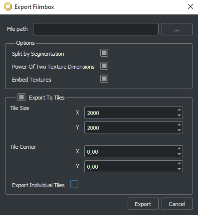
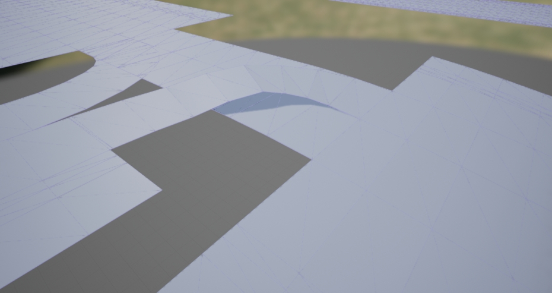

# 第39章 PPT：全局路径规划与地图导航

> 共 16 页，标注页码 · 图号与教学文档对应 · 课时：2 课时（90 分钟）

---

## P1 第39章 全局路径规划与地图导航

- **要点：** 从"高精地图描述"到"全局路径规划"，本章打通"地图 → 路线 → 车道中心线"全链路

| 小节 | 内容 | 页码 |
|:--|:--|--:|
| 39.1 | OpenDRIVE 地图格式与 HD Map | P3–P5 |
| 39.2 | 全局路径规划算法 Dijkstra / A\* | P6–P8 |
| 39.3 | 道路网络与 Waypoint API | P9–P11 |
| 39.4 | Lanelet2 地图与 Autoware 生态 | P12–P13 |

<!-- 旁白：本章按"地图 → 算法 → 工具 → 生态"推进，前两小节讲数学、后两小节讲接口。学习的着力点是让全局规划的结果能落回 CARLA 的可行驶车道。 -->

---

## P2 学习目标

- **要点：** 学完本章能读 OpenDRIVE、写 A\* 与 Waypoint 生成路径

1. 理解 OpenDRIVE 地图格式与 HD Map 关键概念
2. 掌握 Dijkstra / A\* 全局路径规划算法原理
3. 学会使用 CARLA Waypoint API 生成车道中心线
4. 熟悉 Lanelet2 地图与 Autoware 兼容格式

<!-- 旁白：四条目标严格对应四小节，前两条建立算法直觉，后两条落到工具链。验收闭环是让规划出的路径在 CARLA 地图上能沿车道中心线走通。 -->

---

## P3 39.1.1 HD Map 概念

- **要点：** 高精地图相对传统导航地图的差异集中在精度、语义与更新

| 特性 | HD Map | 传统导航地图 |
|:--|:--|:--|
| 精度 | 10–20 cm | 5–10 m |
| 车道级 | 每条车道独立建模 | 道路级聚合 |
| 语义 | 停止线 / 限速 / 转向 | 仅有路名 |
| 高程 | 横坡 / 纵坡 / 超高 | 无 |
| 更新 | 云端实时 | 季度更新 |

> 官方要点：HD Map 是自动驾驶的"超感官"——能"看见"遮挡后的道路

<!-- 旁白：精度提升两个数量级源于车道级建模与语义标注。官方要点强调地图是感知之外的先验信息，在遮挡下也能提供道路几何的预测，为定位与规划提供先验支撑。 -->

---

## P4 39.1.2 道路/车道/连接描述

- **要点：** OpenDRIVE 以"参考线 + 车道"编码道路，车道编号左正右负

```
Road (道路)
 ├── PlanView (水平几何)：直线、螺旋线、回旋曲线
 ├── ElevationProfile (纵断面)
 ├── LateralProfile (横断面)
 └── Lanes (车道)
      └── LaneSection (车道段)
           ├── Left (左车道, ID > 0)
           ├── Center (中心线, ID = 0)
           └── Right (右车道, ID < 0)
```

**车道编号规则：** 沿道路参考线方向，左侧车道为正（1, 2, 3…），右侧为负（-1, -2, -3…）

**连接描述：** `roadLink` 表达路口与换道关系，`laneLink` 描述同一车道的延续关系


RoadRunner 中将道路与车道元素按 OpenDRIVE 标准导出为高精地图文件

<!-- 旁白：参考线定义长度与方位，车道段沿参考线铺开，中心线 id=0 是左右车道分割点。左右车道编号规则是 OpenDRIVE 判定的第一依据，务必沿参考线方向判断。 -->

---

## P5 39.1.3 坐标原点与 OpenDRIVE 坐标系

- **要点：** CARLA 导出的 OpenDRIVE 坐标系与 CARLA 世界坐标不一致，需原点平移

```python
world = client.get_world()
xodr = world.get_map().to_opendrive()
with open('town03.xodr', 'w') as f:
    f.write(xodr)
```

```xml
<road id="0" length="256.78">
  <planView>
    <geometry s="0.0" x="12.34" y="56.78" hdg="0.523"
              length="256.78">
      <line/>
    </geometry>
  </planView>
  <lanes>
    <laneSection s="0.0">
      <center><lane id="0" type="driving"/></center>
      <right><lane id="-1" type="driving"/></right>
    </laneSection>
  </lanes>
</road>
```


网格与道路中心线错位是坐标系不一致（dx, dy）的典型表现

<!-- 旁白：坐标原点差异是 OpenDRIVE 应用的典型"坑"——CARLA 的 xodr 以自身原点导出，上游工具若直接画地图会整体平移，需要把增量 (dx, dy) 对齐到惯导原点。 -->

---

## P6 39.2.1 Dijkstra vs A\*

- **要点：** Dijkstra 均匀扩展，A\* 用可采纳启发函数偏向目标

| 特性 | Dijkstra | A\* |
|:--|:--|:--|
| 启发函数 | 无 | h(n)（曼哈顿/欧氏） |
| 扩展顺序 | 距源点均匀 | 向着目标方向 |
| 最短路径保证 | 一定 | 可采纳启发即最优先 |
| 典型实现 | 堆 + 前驱表 | 堆 + f = g + h |

```python
import heapq
def astar(graph, start, goal, h):
    open_set = [(h(start), 0, start)]      # (f, g, node)
    g_cost = {start: 0}
    while open_set:
        f, g, u = heapq.heappop(open_set)
        ...
```

<!-- 旁白：Dijkstra 与 A\* 的差别只在启发函数，h≡0 时 A\* 退化为 Dijkstra。可采纳性保证最短路径，一致性保证不重复入队，出队即已确定，教学实现用堆即可。 -->

---

## P7 39.2.2 启发函数设计

- **要点：** 曼哈顿可用于四邻域栅格，欧氏更贴合连续地图，均要求 h ≤ 真实代价

```
h_manhattan = |dx| + |dy|         # 曼哈顿（四邻域栅格）
h_euclid    = sqrt(dx^2 + dy^2)   # 欧氏（八邻域 / 连续）

可采纳性:  h(n) ≤ h*(n)  → 路径最优
一致性:    h(u) ≤ c + h(v) → 不重复扩展
```

| 启发函数 | 公式 | 适用 | 备注 |
|:--|:--|:--|:--|
| 曼哈顿 | `|dx| + |dy|` | 四邻域 | 可采纳 |
| 欧氏 | `sqrt(dx²+dy²)` | 连续/八邻域 | 可采纳 |
| 对角线 | `max(dx, dy)`（四邻域） | 不可采纳 | 更快 |

<!-- 旁白：三条启发函数表格给出适用与可采纳性：曼哈顿与欧氏在栅格上均可用，对角线函数加速搜索但可能放弃最优性。优先级：最优性 > 速度快，评测重点。 -->

---

## P8 39.2.3/4 搜索过程对比与官方要点

- **要点：** 开阔地带两者扩展相近，绕障时 A\* 的墙边扩张比 Dijkstra 少一个数量级

```
起点 ■ 目标 ◆ 障碍 █  四邻域

Dijkstra  (均匀扩张)         A* (向目标偏差)
■■■··▂········                     ···◆·█
··█··█·······                     ···█·█
····█··█····                     ···█··█
```

**官方要点：Dijkstra 与 A\***

- E. W. Dijkstra (1959) *A Note on Two Problems in Connexion with Graphs*
- Hart, Nilsson & Raphael (1968) *A Formal Basis for the Heuristic Determination of Minimum Cost Paths*
- 数据结构：优先队列 + 前驱表；教学示范用 Python `heapq` 即可

<!-- 旁白：官方要点给出两篇经典文献与实现建议：优先队列是教学实现的核心，复杂度推导是考试基础。启发搜索适用范围广，状态空间大时开销高。 -->

---

## P9 39.3.1 CARLA Waypoint API

- **要点：** `map.get_waypoint` 返回最近车道点，`next/previous` 沿车道前推，换道用左右车道

```python
world = client.get_world()
map = world.get_map()

wp = map.get_waypoint(vehicle.get_location())   # 最近车道中心点
nxt = wp.next(2.0)[0]                           # 前方 2 m 处
prv = wp.previous(2.0)[0]                       # 后方 2 m 处

left  = wp.get_left_lane()                      # 左车道中心线
right = wp.get_right_lane()                     # 右车道中心线
at_junction = wp.is_junction                    # 路口内？
```

| 方法 | 返回值 | 说明 |
|:--|:--|:--|
| `next(d)` | Waypoint 列表 | 沿车道前向采样 |
| `previous(d)` | Waypoint 列表 | 沿车道后向采样 |
| `get_left_lane()` | Waypoint | 换左车道 |
| `is_junction` | bool | 是否位于路口 |

<!-- 旁白：Waypoint 是"贴在地图车道上的航点"，next(d) 会给出该车道上距离 d 米的全部候选。路口内 next 常返回多条候选，需要配合转向意向挑选，是路径算法的输入基础。 -->

---

## P10 39.3.2 车道中心线生成

- **要点：** 从起点沿 `next(2.0)` 反复前推即可采样出车道中心线点列

```python
def build_lane_centerline(waypoint, distance=500.0,
                          step=2.0):
    points, cur, traveled = [], waypoint, 0.0
    while traveled < distance:
        points.append((cur.transform.location.x,
                       cur.transform.location.y,
                       cur.transform.location.z))
        nxt = cur.next(step)
        if not nxt:
            break
        cur = nxt[0]
        traveled += step
    return points
```

**车道中心线：** 每个点含位置与航向角（`transform.rotation.yaw`），供航点跟踪下发

<!-- 旁白：车道中心线就是重复调用 next(2) 的点列，步长决定点密度。列表只存位置，航向角从 transform 提取。这个点列直接喂给轨迹跟踪器作参考线。 -->

---

## P11 39.3.3 路径生成

- **要点：** 起终点各取最近 Waypoint，用 A\* 或沿车道序列连接成可行驶路径

```python
def generate_path(world, start_loc, goal_loc):
    map = world.get_map()
    start = map.get_waypoint(start_loc)
    goal  = map.get_waypoint(goal_loc)
    path, cur = [], start
    visited = set()
    while dist(cur, goal) > 2.0:
        visited.add(cur)
        candidates = [w for w in cur.next(2.0)
                      if w not in visited]
        if not candidates:
            break
        cur = min(candidates,
                  key=lambda w: w.transform.location.distance(
                      goal.transform.location))
        path.append(cur)
    return path
```

```
起点 ● ──→ 车道中心线采样 ──→ 终点 ○
```

<!-- 旁白：路径生成是"沿车道贪心追踪目标"：每步在 next(2) 的候选中选离终点最近者。简单场景即可工作，换道与路口需要配合 A\* 保证全局最优。 -->

---

## P12 39.4.1/2 Lanelet 与 LaneletMap 概念

- **要点：** Lanelet 是可通行车道片段，LaneletMap 聚合为全图，元素带交通规则

| 概念 | 说明 | 类比 |
|:--|:--|:--|
| Lanelet | 可通行车道片段 | OpenDRIVE 车道段 |
| Regulatory Element | 交通规则（限速/让行） | 路牌语义 |
| LaneletMap | 全局地图容器 | HD Map 总图 |

```python
# 概念演示伪代码：Lanelet 前后边界 * 左右边界
class Lanelet:
    left, right = LineString(), LineString()
    regulatory_elements = []     # 限速、停止等
```

**OpenDRIVE → Lanelet2：** 借助 `lanelet2_io` 读取 xodr/osm，按车道片段重建 Lanelet 并迁移规则元素

<!-- 旁白：Lanelet 的边界是左右两条线串，中间是可通行区域，规则元素挂在上面对应限速与停车。转换工具按车道片段重建，规则元素需人工校对名称映射。 -->

---

## P13 39.4.3/4 Autoware 兼容格式

- **要点：** Autoware 用 Lanelet2 向量地图 + 点云地图，Lanelet 文件以 .osm 描述

```
<vector_map>
  ├── lanelet2 (.osm)      # 矢量道路网
  └── pointcloud_map (.pcd) # 定位点云地图
```

| 地图类型 | 文件 | 用途 |
|:--|:--|:--|
| 矢量地图 | `lanelet2_map.osm` | 全局规划与语义 |
| 点云地图 | `pointcloud_map.pcd` | 定位配准 |
| 高程地图 | `elevation.csv` | 坡度信息 |

**官方要点 —— Lanelet2 与 Autoware 官方生态**

- 官方将 Lanelet2 作为 Autoware 默认地图格式，运行时由 `map` 节点加载并发布
- 从 CARLA 换到 Autoware 的最小路径：xodr → Lanelet2 → 插件加载

<!-- 旁白：Autoware 把 Lanelet2 作为默认地图格式，点云地图专供定位配准。两张地图分开加载，分别发布到话题 /map 与 /pointcloud_map，分辨率要求不同。 -->

---

## P14 本章要点

- **要点：** 六条主线覆盖"地图描述 → 图搜索 → 路径生成 → 地图生态"

1. HD Map 精度 10–20 cm，含车道级、语义、高程与云端更新
2. OpenDRIVE 以"参考线 + 车道段"编码，左正右负，坐标需原点平移
3. Dijkstra 均匀扩展，A\* 用可采纳启发函数，h≡0 退化为 Dijkstra
4. 曼哈顿/欧氏/对角线三种启发函数的适用性与可采纳性各不同
5. Waypoint `next/previous/左右车道` 是车道中心线与路径生成的基础
6. Lanelet2 是 Autoware 默认地图格式，xodr → Lanelet2 是最小迁移路径

<!-- 旁白：六条要点从地图数据格式到搜索算法再到工具生态。考试记住三张表：HD Map 对比表、搜索算法对比表、三种启发函数表，路径生成动手写一遍最扎实。 -->

---

## P15 练习题

- **要点：** 覆盖地图读取、路径规划、Waypoint 生成与地图转换四类技能

1. 导出 Town03 的 OpenDRIVE 字符串，统计 `<road>` 与 `<lane>` 数量
2. 用 Python 实现 Dijkstra 与 A\*，在 10×10 栅格含障碍物地图上对比扩展节点数
3. 修改启发函数为对角线距离，观察路径最优性与扩展节点数的变化
4. 用 Waypoint API 从指定起点沿 `next(2.0)` 采样 500 m 车道中心线
5. 在路口让车辆转弯：对比 `is_junction` 下多条 next 候选的选取策略
6. 将导出的 xodr 交由 lanelet2_io 转换为 Lanelet2 并核对道路数量

<!-- 旁白：六道练习中，第二、三题是算法核心，第四、五题是工具核心，第六题打通生态。建议先实现 A\* 再用 Waypoint 生成路径，两段代码正好组装出一条完整路线。 -->

---

## P16 下章预告

- **要点：** 第40章 车辆纵横向控制

**第40章 车辆纵横向控制**

- 基于 PID 的车辆纵向控制（油门/刹车映射与速度跟踪）
- 基于 Pure Pursuit / Stanley 的横向控制
- PID 参数整定与 CARLA 仿真调参
- 为自动驾驶仿真闭环"感知 → 规划 → 控制"收尾

课后任务：保持本章路径生成代码可用，预读第40章讲义

<!-- 旁白：全局路径算好后，车辆要靠控制器沿路径行驶。下一章的纵横向控制为规划结果提供执行层的落点，感知、规划、控制三大模块由此闭环。 -->