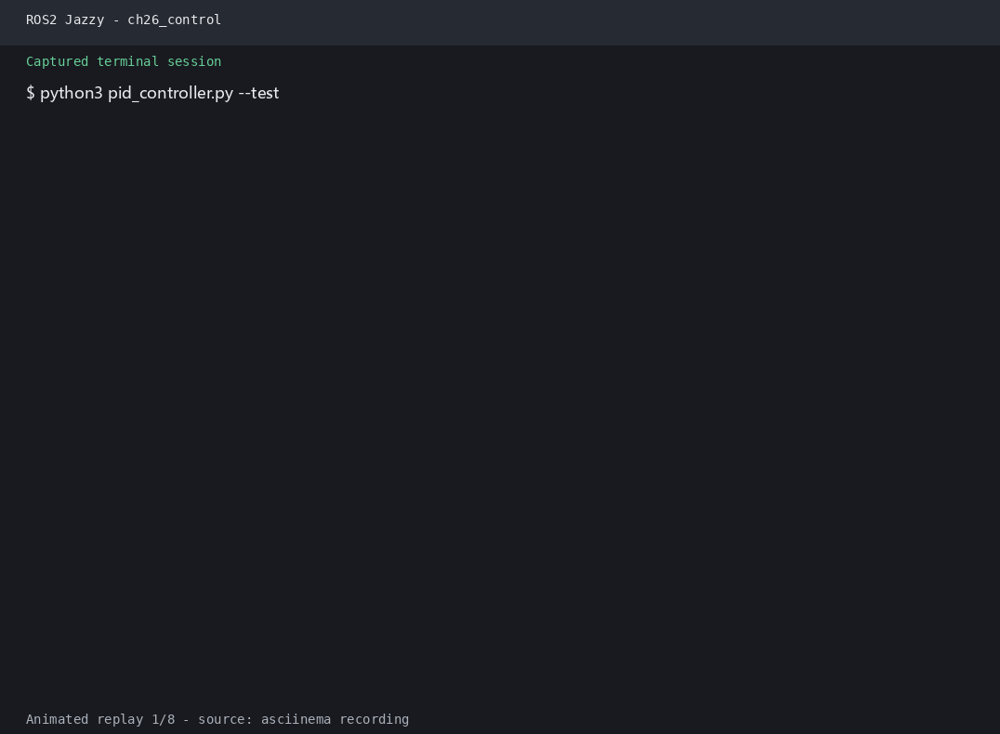
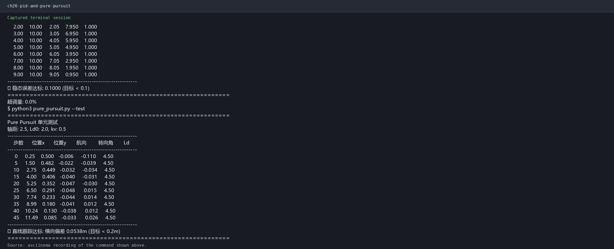
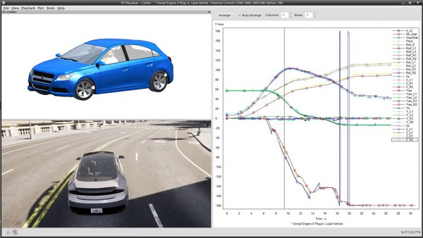

# 第40章 PPT：车辆纵横向控制

> 共 17 页，标注页码 · 图号与教学文档对应 · 课时：2 课时（90 分钟）

---

## P1 第40章 车辆纵横向控制

- **要点：** 从"规划出路径"到"跟踪路径"，本章闭环 PID、Pure Pursuit 与 Stanley

| 小节 | 内容 | 页码 |
|:--|:--|--:|
| 40.1 | PID 控制原理与参数整定 | P3–P6 |
| 40.2 | 纵向控制：油门/刹车映射与速度 PID | P7–P9 |
| 40.3 | 横向控制：Pure Pursuit 与 Stanley | P10–P12 |
| 40.4 | PID 参数调优与 CARLA 仿真 | P13–P14 |

<!-- 旁白：本章是感知-规划-控制闭环的最后一环：上一章算出全局路径，本章让车辆精确跟踪它。三大控制器公式都要求手推一遍，调参步骤建议上机复现。 -->

---

## P2 学习目标

- **要点：** 学完本章能独立实现速度跟踪与路径跟踪两类控制器

1. 掌握 PID 控制原理与 Ziegler-Nichols 参数整定
2. 理解油门/刹车映射策略与纵向控制架构
3. 学会速度 PID 控制器与目标速度跟踪
4. 掌握 Pure Pursuit 与 Stanley 横向控制算法
5. 学会在 CARLA 仿真中进行 PID 参数调优

<!-- 旁白：五条目标对应四个小节加一套调优实践：纵向前三节、横向两节、调优一节。验收标准是车辆在 CARLA 中沿圆周路径误差收敛在阈值内。 -->

---

## P3 40.1.1 PID 基本定义

- **要点：** PID 输出为比例、积分、微分三项线性叠加，离散化后可直接进控制周期

$$ u(t) = K_p e(t) + K_i \int e(\tau) d\tau + K_d \frac{d e}{dt} $$

增量式离散：

```
u[k] = Kp * e[k] + Ki * sum(e) * dt + Kd * (e[k] - e[k-1]) / dt
```

```python
def pid(error, integral, derivative):
    return Kp * error + Ki * integral + Kd * derivative
```

| 项 | 作用 | 物理直觉 |
|:--|:--|:--|
| P | 当前误差的即时反应 | 越偏越用力 |
| I | 历史误差的累积 | 消灭稳态偏差 |
| D | 误差变化趋势的预测 | 提前刹车 |

<!-- 旁白：三项各管一摊：P 管当前、I 管过去、D 管未来。离散化公式与连续公式在阶段评测时要求一致，把 dt 一并乘进 Ki、Kd 即可。 -->

---

## P4 40.1.2 P / I / D 项物理意义

- **要点：** 上升时间、超调量与稳态误差三指标间的权衡构成整定记忆表

| 参数 | 上升时间 | 超调量 | 调节时间 | 稳态误差 |
|:--|:--|:--|:--|:--|
| Kp ↑ | 减小 | 增大 | 增大 | 减小 |
| Ki ↑ | 减小 | 增大 | 增大 | 明显减小 |
| Kd ↑ | 影响小 | 减小 | 减小 | 影响小 |

**记忆规律：** P 与 I 同向影响超调，D 反之；稳态误差只有 I 能消灭

<!-- 旁白：这张参数影响表是整定考试的高频考点：四列按"升/降/平稳"编口诀记。注意 Ki 与 Kd 同样减小上升时间而 D 列几乎不变，稳态误差仅 I 能消除。 -->

---

## P5 40.1.3 Ziegler-Nichols 整定

- **要点：** 临界比例法四步得出查表参数，无需对象模型即可上手

```
步骤：
 1. 仅用比例控制，逐步增大 Kp 直至等幅振荡
 2. 记录临界增益 Ku 与临界周期 Tu
 3. 查表得到 Kp / Ki / Kd
 4. 上机微调
```

| 控制器 | Kp      | Ki          | Kd           |
|:--|:--|:--|:--|
| P   | 0.5 Ku  | —           | —            |
| PI  | 0.45 Ku | 0.54 Ku/Tu  | —            |
| PID | 0.6 Ku  | 1.2 Ku/Tu   | 0.075 Ku Tu  |

<!-- 旁白：ZN 法四个步骤数值不查表直接算即可：试凑出等幅振荡的 Ku、Tu，再套公式。PID 一行 Ki 是 1.2 倍 Ku/Tu 而 Kd 是 0.075 倍 Ku*Tu，方向相反别记混。 -->

---

## P6 40.1.4/5 优缺点与官方要点

- **要点：** PID 模型无关、实现简单，静态性能与整定依赖经验是其边界

| 优点 | 缺点 |
|:--|:--|
| 不依赖对象模型 | 无模型最优性（不上限） |
| 三项参数直觉清晰 | 积分饱和（windup） |
| 广泛工业落地方案 | 大延迟系统不稳 |

**官方要点 —— PID 整定的经典文献**

- Ziegler & Nichols (1942) *Optimum Settings for Automatic Controllers（临界比例法出处）*
- 从 ZN 查表到继电器自整定（Aström 继电反馈），无需再手动试凑

<!-- 旁白：优缺点表与文献可对照记忆：Ziegler–Nichols 1942 论文给出经验整定，后续继电自整定把整定过程自动化。工程上先查表后上机微调，为调优节省时间。 -->

---

## P7 40.2.1 油门/刹车映射

- **要点：** 把速度环输出 u ∈ [-1, 1] 映射到油门与刹车两路执行

```
PID 输出 u ∈ [-1, 1]
        │
   u ≥ 0 │ u < 0
        ↓
   throttle = u       brake = -u
   brake = 0          throttle = 0
```

```python
def map_throttle_brake(u):
    if u >= 0:
        return u, 0.0        # (throttle, brake)
    else:
        return 0.0, -u       # (throttle, brake)
```

<!-- 旁白：油门与刹车互斥映射是纵向控制最容易理解的一步：正输出给油门负输出给刹车。映射函数把速度环输出直接转成 CarlaEgoVehicleControl 的两个量。 -->

---

## P8 40.2.2 速度 PID 控制器

- **要点：** 速度环以目标速度误差为输入，输出油门/刹车，构成闭环

```
目标速度 v_ref ──→ [ 速度 PID ] ──→ 油门/刹车 ──→ 车辆
                      ↑                            │
                      └──────── 实际速度 v ────────┘
```

```python
class SpeedPID(Node):
    def __init__(self):
        super().__init__('speed_pid')
        self.err_int = 0.0
        self.err_prev = 0.0

    def update(self, v_ref, v_actual, dt):
        e = v_ref - v_actual
        self.err_int += e * dt
        u = (Kp * e + Ki * self.err_int
            + Kd * (e - self.err_prev) / dt)
        self.err_prev = e
        return max(-1.0, min(1.0, u))
```

<!-- 旁白：速度环把目标与实际速度之差送进 PID，输出经油门/刹车映射执行。注意积分项带 dt、微分项除以 dt，输出统一限幅 [-1, 1] 防积损与突变。 -->

---

## P9 40.2.3 目标速度跟踪

- **要点：** 目标速度曲线逐步变更时，速度 PID 输出油门刹车跟踪误差收敛

 
运行演示：车辆目标速度跟踪控制效果（左：GIF 动画，右：静态帧）

| 误差来源 | 表现 | 对策 |
|:--|:--|:--|
| 目标突变 | 超调、震荡 | 目标速度斜坡化 |
| 重力影响 | 上坡速度掉 | 前馈补偿 |
| 积分饱和 | 松油门延迟 | anti-windup |

<!-- 旁白：目标速度突变是超调的主要来源，斜坡化后跟踪更稳。积分项在有持续扰动时补偿，但长时间饱和会滞后整车，需要 anti-windup 结束时清零积分。 -->

---

## P10 40.3.1 Pure Pursuit 算法

- **要点：** 以前视距离 Ld 为半径搜索目标点，转向角由航向差决定，几何简洁

```
L (轴距、前视距离 Ld、目标点方向与车身轴线夹角 α)：

        δ = atan( 2 * L * sin(α) / Ld )

      方向: 前视点 (gx, gy) 基于当前位姿
```

```python
def pure_pursuit_steer(v, alpha, L, Ld):
    delta = math.atan2(2.0 * L * math.sin(alpha), Ld)
    return max(-1.0, min(1.0, delta))
```

**参数直觉：** `Ld` 越大越平稳、转向越缓；`Ld` 越小越激进、贴线越紧

<!-- 旁白：前视距离是 Pure Pursuit 唯一的关键参数：前视点越远越稳定切弯越靠里，越近越准确但容易震荡。公式只需一条 arctan 语句，跟随前视点切圆即可完成转向。 -->

---

## P11 40.3.2 Stanley 控制器

- **要点：** 前轴中心为基准输出航向误差与横向偏差两项，源自 DARPA 挑战赛

```
Stanley 控制器（前轴中心为基准）

  δ = ψ_e + atan( k * e / (v) )
         │
  ψ_e  航向误差：车头方向与路径切线夹角
  e    横向偏差：前轴中心到路径最近点的垂距
  k    增益：随车速自适应缩放
```

```python
def stanley_steer(psi_e, e, v, k=0.5):
    delta = psi_e + math.atan2(k * e, max(v, 0.5))
    return max(-1.0, min(1.0, delta))
```

**官方要点 —— Stanley 与 DARPA 实战：横摆误差项的价值**：在真实车辆上，横摆误差项（`ψ_e`）保证高速接弯不偏出车道

<!-- 旁白：Stanley 短板与 Pure Pursuit 类似，但以车体坐标系前轴为基准输出航向误差与横向偏差，DARPA 竞赛证明横摆误差项能让高速入弯不切道。 -->

---

## P12 40.3.3 两种控制器对比

- **要点：** Pure Pursuit 看前视点，Stanley 看前轴误差；弯道高速与低速各有所长

| 特性 | Pure Pursuit | Stanley |
|:--|:--|:--|
| 依据 | 前视目标点 | 前轴中线误差 |
| 低速弯道 | 平滑稳定 | 低误差精确 |
| 高速弯道 | 震荡风险 | 更稳定防偏 |
| 调参 | 前视距离一个参数 | 增益 k 经验值 |
| 实现 | 几何外插简单 | 误差外插稍复杂 |

**官方要点 —— Pure Pursuit 官方出处：前视距离的物理直觉**（Coulter 1992，CMU）

<!-- 旁白：对比表按"依据/低速/高速/调参/实现"五行记忆：低速选 Pure Pursuit 平滑，高速选 Stanley 防偏出。前视距离唯一参数与增益两挡是关键。 -->

---

## P13 40.4.1/2 手动调参步骤

- **要点：** 先 ZN 求出初值，再按性能指标表微调，最后上 CARLA 仿真验证

```
手动调参四步
 1. ZN 整定给出初值
 2. 按性能指标表微调 (P 先、I 次之、D 最后)
 3. 目标速度斜坡化 (抑制超调)
 4. 观测指标: 超调量、上升时间、调节时间、稳态误差
```

| 指标 | 定义 | 理想值 |
|:--|:--|:--|
| 超调量 | 最大偏差/目标值 | ≤ 10% |
| 上升时间 | 首次到达目标的时间 | 越短越好 |
| 调节时间 | 进入 5% 稳态带的时间 | 越短越好 |
| 稳态误差 | 长时间残差 | ≤ 1% |


纵横向控制调参后的仿真分析：以性能指标表为验收标准，在仿真环境中验证控制效果

<!-- 旁白：四指标表是调参验收标准：先整定出初值，再按表逐项微调顺序 P→I→D。超调与调节时间偏软约束，稳态误差由 I 项决定，理想值作为达标线。仿真分析进一步把表内指标映射到曲线观察。 -->

---

## P14 40.4.3/4 自适应 PID 与 CARLA 调参

- **要点：** 车速分档在线切换参数，CARLA 中遍历仿真验证调参效果

```python
# 自适应：按车速段切换参数
def get_gains(v):
    if v < 5:   return Kp_slow, Ki_slow, Kd_slow
    if v < 15: return Kp_cruise, Ki_cruise, Kd_cruise
    return Kp_fast, Ki_fast, Kd_fast
```

| 速度段 | 场景 | 说明 |
|:--|:--|:--|
| 低速 < 5 m/s | 泊车 / 起步 | 贴线准 |
| 中速 < 15 m/s | 城区巡航 | 动态平衡 |
| 高速 ≥ 15 m/s | 快速路 | 防震荡 |

**官方要点 —— CARLA 车辆物理与 Autoware 轨迹跟随的官方参考**：CARLA 中 `CarlaEgoVehicleControl` 的 `throttle`/`brake`/`steer` 均归一化到 [-1, 1] 后经物理引擎执行；Autoware 的 trajectory_follower 以横向 MPC、纵向带前馈的 PID 实现轨迹跟随


CARLA 模块架构：客户端经 CarlaEgoVehicleControl 下发节气门/刹车/转向指令

<!-- 旁白：自适应 PID 把参数表按速度段切开同时切换，高速段倾向防震荡、低速段倾向贴线准。CARLA 官方参考强调物理引擎与 Autoware 轨迹跟随控制器的接口，需要综合速度与路径。 -->

---

## P15 本章要点

- **要点：** 六条主线覆盖"原理 → 纵/横向控制 → 整定 → 仿真验证"全链路

1. PID = P·当前 + I·历史 + D·趋势，四指标表记参数方向
2. Ziegler-Nichols 临界比例法四步得 Ku/Tu 后可查表整定
3. 纵向控制：速度 PID 输出限幅后经油门/刹车映射执行
4. 横向控制：Pure Pursuit 用前视点切圆、Stanley 用前轴误差
5. 弯道高速与低速分别选 Stanley 防偏、Pure Pursuit 平滑
6. 调参顺序 P→I→D，按性能指标表验收，CARLA 仿真闭环

<!-- 旁白：六条要点对应本章四个主题加两条调优。考试高频是 P/I/D 影响表、ZN 整定表、对比表三张表，动手顺序推荐先纵向再横向。 -->

---

## P16 练习题

- **要点：** 覆盖四类技能：PID 写码、油门/刹车映射、导航控制与调参

1. 实现离散 PID 并用正弦目标曲线仿真，记录超调量与稳态误差
2. 实现速度 PID 并画出油门/刹车映射的两段输出曲线
3. 在 CARLA 中以 5 m/s 弯道测试 Pure Pursuit 的前视距离参数
4. 分别用 Pure Pursuit / Stanley 沿圆路径对比跟踪误差曲线
5. 实现 ZN 整定：手动找 Ku/Tu、查表出三组参数并上 CARLA 仿真
6. 按 P→I→D 顺序调参并用性能指标表验收，比较四个指标变化

<!-- 旁白：六道练习中第一题综合理论与仿真，二、三题贴近实现，四、五题分别考察算法与整定，第六题验收调优流程。建议按顺序完成后对照本章要点自查。 -->

---

## P17 下章预告

- **要点：** 课程收尾：从自动驾驶仿真到系统集成

**课程总结与自动驾驶系统集成**

- 回顾 ROS 2 全栈：话题、服务、动作与生命周期通信机制
- CARLA 自动驾驶仿真闭环：感知 → 规划 → 控制全链路打通
- 多传感器标定、全局路径规划与纵横向控制成果汇总
- 课程项目：综合运用全书知识点完成自动驾驶仿真任务

课后任务：整理全书知识图谱，完成课程综合实践项目

<!-- 旁白：本章之后课程收尾：全书以感知、规划、控制三大模块闭环收官。把标定、全局规划与控制成果串成完整自动驾驶仿真系统，作为课程项目的验收素材。 -->