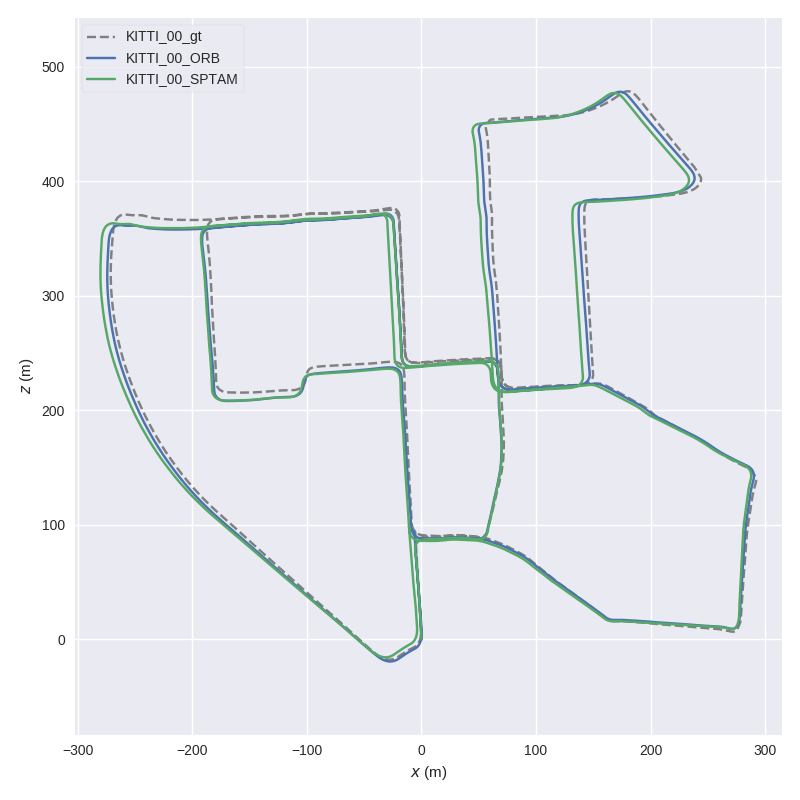
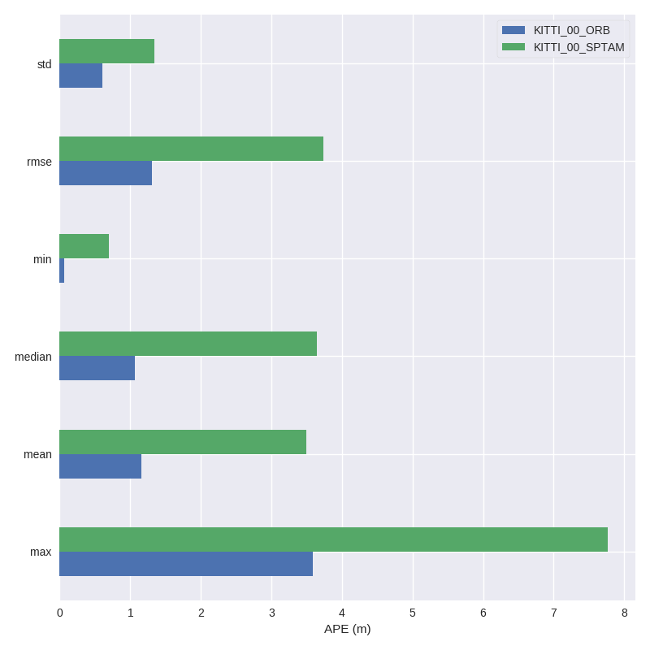

# 第41章 PPT：多传感器融合定位

> 共 16 页，标注页码 · 图号与教学文档对应

---

## P1

# 多传感器融合定位

- 课时：2 课时（90 分钟）
- 授课方式：讲授 + 演示
- 章节主线：定位技术概述 → 扩展卡尔曼滤波（EKF）→ LiDAR-IMU-GNSS 松耦合融合 → CARLA 真值对比与 evo 精度评估

<!-- 旁白：同学们好，今天我们进入第41章——多传感器融合定位。前面各章我们分别学习了感知、规划和控制，而定位是它们共同的基石。本章主线是：先对比各类传感器定位方案的优劣，再深入 EKF 的预测-更新结构，然后搭建 LiDAR-IMU-GNSS 松耦合融合系统，最后用 CARLA 真值和 evo 工具完成标准化精度评估。 -->

---

## P2

- **要点：** 本章围绕「多传感器融合定位」的完整技术链路展开

## 学习目标

1. 理解多传感器融合定位的必要性，掌握松耦合、紧耦合、深耦合三种融合策略的区别
2. 掌握扩展卡尔曼滤波（EKF）预测-更新两阶段结构、15 维状态向量设计与协方差传播方法
3. 学会基于 robot_localization 搭建 LiDAR-IMU-GNSS 松耦合融合系统
4. 掌握传感器频率对齐与 TF2 坐标树设计要点
5. 理解马氏距离异常检测对融合鲁棒性的作用
6. 能够获取 CARLA Ground Truth 真值，并用 evo 工具按 ATE/RPE 指标完成定位精度标准化评估

<!-- 旁白：这页给出本章六个学习目标，从融合策略概念到 EKF 状态设计，再到工程落地与量化评估。请注意目标的递进关系：先理解为什么融合，再掌握怎么融合，最后学会怎么评价融合得好不好。带着这六个问题听讲，效率会更高。 -->

---

## P3

- **要点：** 单一传感器无法在所有场景下可靠定位，多传感器融合是必然选择

## 41.1 传感器定位方案对比

| 特性 | GNSS (GPS/RTK) | IMU (惯性) | LiDAR (激光) | 视觉 (Camera) |
|------|----------------|------------|---------------|---------------|
| 精度 | 米级~厘米级(RTK) | 航姿精确, 位置发散 | 厘米级 | 米级~分米级 |
| 频率 | 1~20 Hz | 100~1000 Hz | 10~20 Hz | 15~60 Hz |
| 长期稳定性 | 好 (无漂移) | 差 (积分漂移) | 好 (地图匹配) | 中 (受光照影响) |
| 短期稳定性 | 差 (多径/遮挡) | 好 (高频) | 好 | 好 |
| 环境依赖 | 需卫星信号 | 无外部依赖 | 需特征结构 | 需光照/纹理 |
| 成本 | 低~高 | 低~高 | 高 | 低 |
| 主要缺陷 | 隧道/高楼遮挡 | 零偏随时间累积 | 退化场景(长走廊) | 光照变化/动态 |

- 定位系统是自动驾驶感知与决策的基石
- 各传感器优缺点互补，融合可覆盖更广工作区间

<!-- 旁白：这张表从精度、频率、长短期稳定性、环境依赖、成本和主要缺陷六个维度对比四类定位传感器。核心结论是：没有任何一种传感器能在所有场景下可靠工作——GNSS 怕隧道遮挡，IMU 积分发散，LiDAR 在长走廊退化，视觉受光照制约。正因如此，取长补短的融合才是必然选择。 -->

---

## P4

- **要点：** 三种融合策略在观测层面与信息交互深度上不同

## 41.1.2 融合定位策略

| 策略 | 融合层次 | 特点 | 代表 |
|------|---------|------|------|
| 松耦合 (Loosely Coupled) | 状态估计层 | 各传感器独立输出位姿估计，再融合 | robot_localization EKF |
| 紧耦合 (Tightly Coupled) | 原始观测层 | 直接融合伪距、特征点等观测 | FAST-LIO2、LIO 系 |
| 深耦合 (Deeply Coupled) | 信号层面 | 信号与导航数据深度融合 | GNSS+IMU 组合 |

- 本章采用松耦合 EKF 架构，融合 LiDAR SLAM 位姿、IMU 预积分、GNSS 定位解

- 41.1.3 紧耦合前沿——FAST-LIO2：把原始点云特征直接纳入迭代 EKF 观测方程，配合 ikd-tree 增量式地图维护，实现「无预建图、直接里程计」，中速场景厘米级精度


FAST-LIO2 硬件平台与建图效果（来源：hku-mars/FAST_LIO 官方仓库）

<!-- 旁白：这页对比三种融合策略：松耦合在状态估计层融合各传感器的位姿输出，紧耦合直接融合伪距、点云特征等原始观测，深耦合则在信号层面融合。本章选择工程上最常用的松耦合 EKF 架构。配图是 FAST-LIO2 的硬件平台与建图效果，它代表紧耦合前沿——原始点云特征直接进入迭代 EKF，配合 ikd-tree 增量地图，无需预建图即可实现中速场景厘米级里程计。 -->

---

## P5

- **要点：** EKF 两类核心步骤：由 IMU 驱动的预测步 + 各传感器驱动的更新步

## 41.2.1 EKF 算法流程

```
┌─────────────────────────────────────────────────────┐
│                  EKF 融合流程                         │
│                     初始化                             │
│               x₀, P₀, Q, R  (k=0)                    │
│                         │                           │
│                    ┌────▼────┐                      │
│                    │ 预测步   │ (IMU 驱动)            │
│                    │ x̄ₖ = f(x̂ₖ₋₁, uₖ)              │
│                    │ P̄ₖ = F·Pₖ₋₁·Fᵀ + Q            │
│                    └────┬────┘                      │
│                         │                           │
│           ┌─────────────┼─────────────┐             │
│           ▼             ▼             ▼             │
│      LiDAR 观测    GNSS观测    其他观测              │
│    z_ℓ ~ N(0,R_ℓ)  z_g ~ N(0,R_g)                  │
│           │             │                          │
│           ▼             ▼                          │
│    ┌──────────────────────────┐                     │
│    │ 更新步 (迭代观测)          │                     │
│    │ Kₖ = P̄ₖ·Hᵀ(H·P̄ₖ·Hᵀ+R)⁻¹ │                     │
│    │ x̂ₖ = x̄ₖ + Kₖ(zₖ − h(x̄ₖ)) │                     │
│    │ Pₖ = (I − Kₖ·H)P̄ₖ       │                     │
│    └──────────────────────────┘                     │
│                         │                          │
│                    ┌────▼────┐                      │
│                    │ 输出 x̂ₖ  │                      │
│                    │ k = k+1  │                      │
│                    └─────────┘                      │
└─────────────────────────────────────────────────────┘
```

<!-- 旁白：这张流程图展示 EKF 的两阶段结构：初始化 x₀、P₀、Q、R 之后，预测步由 IMU 高频驱动，沿运动模型外推状态与协方差；更新步则由 LiDAR、GNSS 等观测迭代修正。核心三式是卡尔曼增益 Kₖ 的计算、状态修正与协方差收缩。请注意箭头方向：预测在前、更新在后，二者循环往复构成完整的递归估计。 -->

---

## P6

- **要点：** robot_localization 用 15 维状态统一描述车辆运动；协方差按块对角结构建模

## 41.2.2 15 维状态向量

```
x = [x, y, z,            ← 位置 (m)
     roll, pitch, yaw,   ← 姿态 (rad)
     vx, vy, vz,         ← 线速度 (m/s)
     wx, wy, wz,         ← 角速度 (rad/s)
     ax, ay, az]ᵀ        ← 线加速度 (m/s²)
```

## 41.2.3/41.2.4 预测与协方差传播

```text
pₖ = pₖ₋₁ + vₖ₋₁·Δt + ½·aₖ₋₁·Δt²
vₖ = vₖ₋₁ + aₖ₋₁·Δt
qₖ = qₖ₋₁ ⊗ exp(ωₖ₋₁·Δt/2)
P̄ₖ = F · Pₖ₋₁ · Fᵀ + Q
R = blkdiag(R_lidar, R_gnss, R_imu)
```

- 预测函数 F：状态转移雅可比（15×15）
- 观测协方差：`R_lidar = diag(σ_xy², σ_xy², σ_z², σ_rp², σ_rp², σ_yaw²)`；`R_gnss = diag(σ_gnss², σ_gnss², σ_gnss²)`
- 快照背景——卡尔曼滤波源头：Kalman 1960 年论文《A New Approach to Linear Filtering and Prediction Problems》，本章 41.2 两阶段结构是该文献的通行教学表述；多伦多大学 Coursera《State Estimation and Localization for Self-Driving Cars》课程的作业设计与本章「IMU 高频预测 + GNSS/LiDAR 低频修正」完全同构

<!-- 旁白：15 维状态向量把位置、姿态、线速度、角速度、加速度全部纳入，这是 robot_localization 的标准模式。预测阶段用运动学方程外推状态，协方差按 F·P·Fᵀ+Q 传播，观测协方差按传感器分块对角组织。页脚快照提醒大家：Kalman 1960 年论文是一切的源头，多伦多大学 Coursera 课程的作业结构与本章「IMU 高频预测 + 低频观测修正」完全同构，适合课后进阶。 -->

---

## P7

- **要点：** LiDAR SLAM 输出位姿、IMU 高频数据、GNSS 位置解在 EKF-15 中融合

## 41.3.1 松耦合整体架构

```
┌─────────┐ 点云  ┌────────────┐ 位姿     ┌───────────┐
│ LiDAR   │──────▶│ LiDAR SLAM │─────────▶│           │
└─────────┘       │(FAST-LIO/  │ /odom    │  EKF-15   │
                  │ HDL)       │          │           │
┌─────────┐ 数据  └────────────┘          │ robot_    │
│  IMU    │──────────────────────────────▶│ localiz-  |
└─────────┘ /imu/data                     │ ation     │
                  ┌────────────┐          │           │
┌─────────┐ 原始  │ GNSS RTK  │ /gps     │           │
│ GNSS    │──────▶│ 定位解算    │─────────▶│           │
└─────────┘       └────────────┘          └─────┬─────┘
                                                │
                                         ┌──────▼──────┐
                                         │ /odometry/  │
                                         │ filtered    │
                                         └─────────────┘
```

- 松耦合各传感器独立工作，故障隔离性好；融合点在状态估计层

<!-- 旁白：松耦合架构的关键在于各传感器先独立求解，再在 EKF-15 处汇合：LiDAR 点云经 SLAM 输出位姿，IMU 直接提供高频原始数据，GNSS RTK 输出位置解算，三者全部汇入 robot_localization，最终发布 /odometry/filtered。这种架构的优势是故障隔离性好——任一传感器失效不会污染其他通道，融合点清晰且便于工程替换。 -->

---

## P8

- **要点：** 按传感器频率决定其在 EKF 中的角色；TF2 坐标树遵循 REP-105 纪律

## 41.3.2 传感器频率对齐策略

| 传感器 | 原始频率 | EKF 接收方式 | 说明 |
|--------|---------|-------------|------|
| IMU | 100~200 Hz | 预测步驱动 | 每个 IMU 消息触发一次预测 |
| LiDAR SLAM | 10~20 Hz | 位姿观测更新 | 完整 6-DOF 位姿更新 |
| GNSS | 1~10 Hz | 位置观测更新 | 仅更新 x/y/z |

## 41.3.3 TF2 坐标树设计

```
map ──(static)──▶ odom ──(EKF)──▶ base_link
                                   │
                          ┌────────┼────────┐
                          ▼        ▼        ▼
                      lidar_link  imu_link  gps_link
                     (static)   (static)   (static)

map:       世界固定坐标系 (UTM/高斯投影)
odom:      里程计坐标系, 无累计漂移的连续参考系
base_link: 车辆本体坐标系 (后轴中心)
map→odom:  初始化时确定, 之后 odom 在 map 中漂移
odom→base_link: EKF 估计的相对位姿 (无跳变)
base_link→sensor: 通过 URDF 标定的固定变换
```

<!-- 旁白：频率对齐策略按各传感器的节奏分配角色：IMU 100~200Hz 驱动预测步，LiDAR SLAM 10~20Hz 触发完整 6-DOF 位姿更新，GNSS 1~10Hz 只更新位置三个分量。下方 TF2 坐标树遵循 REP-105 纪律：map→odom 由滤波器发布，odom→base_link 是 EKF 估计的无跳变相对位姿，传感器挂载用 URDF 静态变换。理解每个坐标系的原点与漂移特性，是调试定位系统的前提。 -->

---

## P9

- **要点：** 马氏距离超过卡方阈值即判为异常观测并丢弃，保证融合鲁棒性

## 41.3.4 协方差阈值与异常检测

```python
# 融合策略伪代码
def fuse_sensor_data(ekf, measurement):
    # 马氏距离异常检测
    innovation = measurement.z - ekf.h(ekf.x)
    S = ekf.H @ ekf.P @ ekf.H.T + measurement.R
    mahalanobis = innovation.T @ np.linalg.inv(S) @ innovation

    if mahalanobis > CHI2_95[measurement.dim]:
        logger.warn(f"异常观测丢弃: χ²={mahalanobis:.2f}")
        return ekf  # 拒绝异常观测

    return ekf.update(measurement)
```

## 41.3.5 官方要点——robot_localization 配置规范

- 每个传感器以 `odom0`/`imu0`/`pose0` 前缀接入，`odom0_config` 用 15 维布尔掩码声明提供哪些分量
- 官方明确警告「同一时刻不要让两个传感器同时提供绝对位姿」，否则协方差冲突导致抖动
- 强制 REP-105 纪律：map → odom → base_link 三级树，滤波器发布 map↔odom
- 滤波频率设为传感器最高频率（IMU 常见 100–200 Hz），用 `differential` 区分位姿与速度融合

<!-- 旁白：这段伪代码展示马氏距离异常检测：先计算新息及其协方差 S，再求马氏距离，一旦超过 95% 卡方阈值就丢弃该观测。这一机制在传感器短暂失效或退化场景下尤为关键。下半页是官方配置规范：15 维布尔掩码声明各传感器提供的分量，且同一时刻不能有两个传感器都提供绝对位姿，否则协方差冲突会引发抖动。 -->

---

## P10

- **要点：** CARLA 通过 CarlaActor 提供毫米级真值，转发为 ROS 2 话题

## 41.4.1 获取 CarlaActor 真值

```python
# CARLA 真值订阅示例
class CarlaGtNode(Node):
    def __init__(self):
        super().__init__('carla_gt_node')
        self.sub = self.create_subscription(
            CarlaActor, '/carla/ego_pose', self.gt_callback, 10)
        self.gt_pub = self.create_publisher(
            Odometry, '/carla/ground_truth', 10)

    def gt_callback(self, msg):
        odom = Odometry()
        odom.header.stamp = self.get_clock().now().to_msg()
        odom.header.frame_id = 'map'
        odom.pose.pose = msg.pose  # CARLA 绝对位姿 (map系)
        odom.twist.twist = msg.twist
        self.gt_pub.publish(odom)
```

- `carla.Actor.get_transform()` 与 `get_velocity()` 提供真值来源
- 真值发布到 `/carla/ground_truth`，供评估阶段对比使用

<!-- 旁白：CARLA 的 get_transform 与 get_velocity 提供毫米级真值。这个 CarlaGtNode 订阅 /carla/ego_pose，在回调里把消息包装成 Odometry——frame_id 设为 map 系，时间戳用 ROS 时钟——再发布到 /carla/ground_truth。请重点看回调里的两行赋值：pose 直接取 CARLA 绝对位姿，twist 取速度，后续评估阶段就以这个话题作为对比基准。 -->

---

## P11

- **要点：** ATE 衡量绝对偏差，RPE 衡量相对漂移；评估前必须做时间戳与坐标对齐

## 41.4.2 精度评估指标

| 指标 | 全称 | 公式 | 含义 |
|------|------|------|------|
| ATE | Absolute Trajectory Error | (1/N)Σ‖p_est,i − p_gt,i‖ | 绝对轨迹偏差 |
| ATE RMSE | ATE Root Mean Square Error | √((1/N)Σ‖p_est,i − p_gt,i‖²) | 均方根绝对误差 |
| RPE | Relative Pose Error | (1/M)Σ‖(p_est,i⁻¹p_est,i+Δ)⁻¹(p_gt,i⁻¹p_gt,i+Δ)‖ | 相对位姿漂移 |
| RPE trans | RPE Translation | RPE 的平移分量 | 距离漂移 |
| RPE rot | RPE Rotation | RPE 的旋转分量 | 角度漂移 |

## 41.4.3 评估流程

```
CARLA Ground Truth ─┬─ 时间戳对齐 (线性插值) ─┬─ 计算 ATE / RPE ──▶ 可视化轨迹+误差
EKF 定位输出 /odometry/filtered ───────────── presume┘
evo 工具 (评估) ────────────────────────────────────────────────┘
```

<!-- 旁白：这张表定义了定位评估的标准指标：ATE 衡量估计轨迹与真值的绝对偏差，RPE 衡量固定间隔内的相对漂移，两者都分平移与旋转分量。下方评估流程强调两个前置动作：时间戳对齐用线性插值完成，坐标差异用刚体对齐消除。跳过对齐直接比较两条轨迹，是初学者最常犯的错误，评估结论会整体失真。 -->

---

## P12

- **要点：** evo 一键完成 TUM 格式转换与 ATE/RPE 评估，`-a` 刚体对齐消除坐标系差异

## 41.4.4 使用 evo 工具评估

```bash
# 保存轨迹
ros2 bag record -o localization_eval /carla/ground_truth /odometry/filtered

# 转换为 TUM 格式
evo_traj bag localization_eval.db3 /odometry/filtered --save_as_tum
evo_traj bag localization_eval.db3 /carla/ground_truth --save_as_tum

# ATE 评估
evo_ape tum ground_truth.tum filtered_odometry.tum -a --plot --plot_mode xy

# RPE 评估
evo_rpe tum ground_truth.tum filtered_odometry.tum -a --delta 1.0 --plot
```

- `evo_ape` 计算 ATE（含平移/旋转分量），`evo_rpe` 按固定间隔（1 m 或 1 s）分窗计算 RPE，内置 Umeyama 刚体对齐（`-a`）与尺度校正（`-s`）
- 官方明确提醒：未对齐前直接比较两条轨迹是常见错误
- 支持 TUM/KITTI/EuRoC 三种轨迹格式互转，`--plot` 可视化误差曲线



evo 轨迹对齐示例与误差可视化（来源：MichaelGrupp/evo 官方仓库）

<!-- 旁白：这组 evo 命令构成标准化评估的完整闭环：先用 ros2 bag record 同时录制真值与滤波输出，再转成 TUM 格式，然后 evo_ape 算 ATE、evo_rpe 算 RPE，参数 -a 触发 Umeyama 刚体对齐。配图是 evo 的轨迹对齐与误差可视化效果。请记住官方提醒：未对齐就直接比较两条轨迹是常见错误，参数顺序与格式也要严格一致。 -->

---

## P13

- **要点：** CARLA 场景下各项精度的典型指标要求与标准化评估闭环

## 41.4.5 典型精度目标 (CARLA 场景下)

| 场景 | ATE RMSE 目标 | RPE (每米) |
|------|--------------|------------|
| 高速路 (直线+弯道) | < 0.30 m | < 0.05 m/m |
| 城区 (有GNSS) | < 0.20 m | < 0.03 m/m |
| 隧道/LiDAR退化 | < 0.80 m | < 0.10 m/m |
| 停车场 (无GNSS) | < 0.50 m | < 0.08 m/m |

- 把 robot_localization 基线评估结果与 FAST-LIO2 论文指标表对照，理解两类方法差距
- 评估完成后返回 41.4.4 流程微调协方差配置，形成闭环



evo 输出的轨迹与误差统计结果（来源：MichaelGrupp/evo 官方仓库）

<!-- 旁白：这页给出 CARLA 各场景的量化达标线：城区有 GNSS 时要求最严，ATE RMSE 小于 0.2 米；隧道或 LiDAR 退化场景放宽到 0.8 米；停车场无 GNSS 时靠 LiDAR 与里程计支撑 0.5 米。配图是 evo 输出的轨迹与误差统计。达标后应回到 41.4.4 流程微调协方差配置再复测，形成「评估—调参—复测」的工程闭环。 -->

---

## P14

- **要点：** 按课程主线回顾定位系统从原理到评估的完整链路

## 本章要点

1. 多传感器融合定位通过互补各传感器优势实现鲁棒定位
2. EKF 是工业界应用最广泛的融合框架，预测-更新结构清晰
3. 松耦合架构灵活易实现，robot_localization 提供成熟方案
4. TF2 坐标树设计是定位系统的基础，需严格定义坐标系变换
5. CARLA Ground Truth 为定位精度评估提供理想基准
6. ATE/RPE 是评估定位精度的标准指标
7. 马氏距离异常检测保证融合在恶劣场景下的鲁棒性

<!-- 旁白：这七个要点串起完整链路：融合的必要性来自传感器互补，EKF 以清晰的预测-更新结构成为工业界主流，松耦合加 robot_localization 是最易落地的方案，TF2 坐标树是系统基础，最后用 CARLA 真值与 ATE/RPE 完成量化评估，马氏距离检测为恶劣场景兜底。请大家对照这条主线自查掌握程度，薄弱处回看对应页面。 -->

---

## P15

- **要点：** 以动手验证为中心，覆盖状态估计的从理论到实践

## 练习题

1. 单传感器方案中，哪些场景会导致 GNSS 定位不可用？应如何融合补救？
2. 简述松耦合 EKF 中 IMU 与 GNSS 各自扮演的预测/更新角色
3. 为什么 15 维状态中位置、姿态、速度、角速度、加速度都需要协方差建模？
4. TF2 坐标树中 map→odom、odom→base_link 分别由谁发布？为什么这样设计？
5. 用 evo 评估时 `-a` 参数的作用是什么？不用的后果？
6. CARLA 真值帧为 map 系，为什么可直接与 robot_localization 输出对比？

<!-- 旁白：六道练习覆盖本章核心：从 GNSS 失效场景的融合补救，到 IMU/GNSS 在 EKF 中的角色分工，再到 15 维协方差建模的意义、TF2 发布责任的划分、evo 参数 -a 的作用与真值坐标系问题。建议每题都写出简答要点，特别是第 4、5 题，直接对应工程调试中的高频错误。 -->

---

## P16

- **要点：** 下一章进入交通参与者感知，多传感器系统将驱动后续任务层级

## 下章预告

- 第 42 章将以多传感器融合定位输出为前端，进入交通参与者感知
- 敬请期待：如何识别与分类车辆、行人、自行车等交通参与者

<!-- 旁白：本章我们打通了从传感器对比、EKF 融合到 evo 评估的完整定位链路。有了高频稳定的自车位姿输出，下一章进入交通参与者感知——如何用相机与激光雷达识别并分类车辆、行人、自行车，并为其维护稳定的目标 ID。定位是自车认知，感知是他车认知，二者共同构成后续规划的输入。 -->
