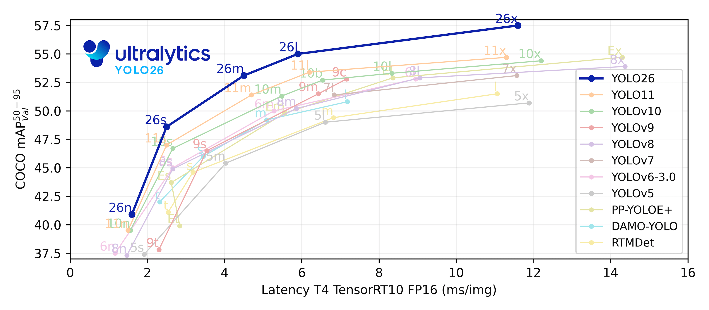
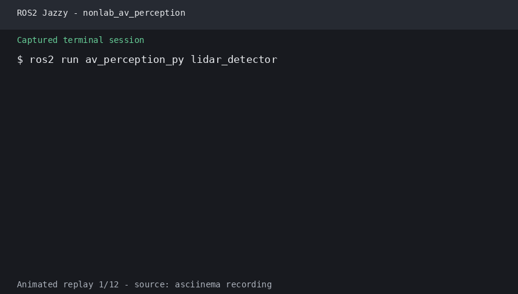

# 第42章 PPT：交通参与者感知

> 共 17 页，标注页码 · 图号与教学文档对应

---

## P1

# 交通参与者感知

- 课时：2 课时（90 分钟）
- 授课方式：讲授 + 演示
- 章节主线：目标检测概述 → YOLO 目标检测 → LiDAR 点云聚类 → 多目标跟踪

<!-- 旁白：各位同学好，欢迎进入感知层最后一章《交通参与者感知》。本章围绕检测、聚类、跟踪三件核心工作展开，主线是从目标检测概述到 YOLO，再到 LiDAR 点云聚类与多目标跟踪。全章共 17 页、2 课时，以讲授与演示结合的方式进行。先建立整体地图，学习时注意各节之间的递进关系，为下一章的决策规划打基础。 -->

---

## P2

- **要点：** 本章围绕感知层的三件核心工作：检测、聚类、跟踪

## 学习目标

1. 理解 2D/3D 目标检测的基本原理与评价指标（IoU、mAP）
2. 掌握 YOLO 单阶段目标检测算法及其 ROS 2 集成
3. 学会 LiDAR 点云预处理与 DBSCAN 聚类方法
4. 掌握卡尔曼滤波多目标跟踪与 ID 分配机制
5. 掌握匈牙利算法的最优分配与新增/消失目标管理
6. 了解主流检测方法对比与工程选型依据

<!-- 旁白：本页列出六大学习目标，覆盖 2D/3D 检测原理与评价指标、YOLO 集成、DBSCAN 聚类、卡尔曼跟踪与匈牙利匹配以及方法对比选型。建议以此清单自检进度：能解释 IoU 与 mAP、会调 ROS 2 接口、能写聚类与跟踪核心代码。其中匈牙利算法与 ID 分配是本章难点，可结合 P12、P13 的代码反复理解，最后一条属工程视野，用于选型。 -->

---

## P3

- **要点：** 目标检测是自动驾驶感知的核心任务，2D 在图像平面、3D 在空间位置

## 42.1.1 2D 与 3D 目标检测

| 维度 | 输入 | 输出 | 典型算法 | 优点 | 缺点 |
|:----:|:----:|:----:|:--------:|:----:|:----:|
| 2D检测 | RGB图像 | bbox + 类别 | YOLO, Faster R-CNN | 速度快，数据集丰富 | 缺少深度信息 |
| 3D检测 | LiDAR/立体相机 | 3D bbox + 类别 | PointPillars, VoxelNet | 完整空间信息 | 点云稀疏，计算量大 |

- 2D 检测输出图像平面边界框：x_min/y_min/x_max/y_max + 类别 + 置信度
- 3D 检测输出空间立方体：中心、尺度、朝向角，为规划提供几何约束

<!-- 旁白：本页用对比表概括 2D 与 3D 检测的差异：输入分别是 RGB 图像与 LiDAR 或立体相机，输出为 2D/3D 边界框，典型算法 YOLO、Faster R-CNN 与 PointPillars、VoxelNet。注意 2D 快且数据集丰富但缺少深度，3D 提供完整空间信息却点云稀疏。读表时抓住维度与传感器两条主线，理解两者为何互补、如何选型。 -->

---

## P4

- **要点：** IoU 度量框重合度，mAP 度量全类别检测精度；KITTI 是国际标准基准

## 42.1.2 精度评价指标

```
IoU = Area(Intersection) / Area(Union)

      ┌────┐
  ┌────┤GT  │
  │Pred│░░░░│
  └────┘░░░░│
       └────┘
   IoU = ░░ / (□ + □ - ░░)
```

- mAP：对所有类别求 AP 的平均值，AP 为 PR 曲线下面积
- mAP@0.5 指 IoU 阈值为 0.5；mAP@0.5:0.95 指 IoU 从 0.5 到 0.95（步长 0.05）取平均

## 42.1.3 目标检测流程

```
输入图像 → 特征提取(Backbone) → 特征金字塔(Neck) → 检测头(Head) → 后处理(NMS)
   │             │                     │                │              │
   │        ResNet/ViT/CSP        FPN/PAN         分类+回归     过滤重叠框
   └─────────────┴─────────────────────┴────────────────┴──────────────┘
```

## 42.1.4 官方要点——KITTI 官方评测协议

- 2D 检测以 IoU≥0.7（车辆）/0.5（行人）判正样本，按 easy/moderate/hard 三档报告，排名以 moderate 为准
- 3D 检测把 IoU 抬升到鸟瞰框层面（BEV AP）；官方开发包 `kitti-object-eval-python` 被 nuScenes、Waymo 沿用

<!-- 旁白：本页汇集精度评价指标与检测流程两幅示意图。IoU 度量预测框与真值的重合度，mAP 是对所有类别求 AP 平均值，mAP@0.5:0.95 按步长 0.05 从 0.5 取到 0.95。流程图上 Backbone 提特征、Neck 建特征金字塔、Head 分类回归、最后 NMS 过滤重叠框。KITTI 官方以 moderate 档排名，是后续 YOLO 章节反复引用的国际基准。 -->

---

## P5

- **要点：** YOLO 把检测视为回归问题，一次前向输出全部边界框与类别

## 42.2.1 YOLO 原理

- 核心思想：将图像划分为 S×S 网格，每个网格负责预测中心落在其内的目标

```
YOLO网络结构:
┌────────────┐    ┌────────────┐    ┌───────────┐    ┌──────────────┐
│ Backbone   │ →  │ Neck       │ →  │ Head      │ →  │ Post-process │
│ (CSPDarknet│    │ (PAN-FPN)  │    │ (Decoupled│    │ (NMS)        │
│  /C2f)     │    │            │    │  Head)    │    │              │
└────────────┘    └────────────┘    └───────────┘    └──────────────┘
     ↓                  ↓                 ↓
 多尺度特征       特征融合         分类分支
 (P3/P4/P5)     跨尺度传递       回归分支

输出张量: [batch, 4+1+C, N_anchors]
  • 4: bbox坐标 (tx, ty, tw, th)
  • 1: 目标置信度
  • C: 类别数 (COCO: 80)
  • N_anchors: 每个网格的锚框数
```

| 特性 | 单阶段 (YOLO) | 双阶段 (Faster R-CNN) |
|:----:|:-------------:|:--------------------:|
| 速度 | 快（实时） | 较慢 |
| 精度 | 高（v8+已接近） | 更高 |
| 流程 | 一步回归 | 先提候选框再分类 |
| 适用 | 实时自动驾驶 | 精度优先场景 |


YOLO 单阶段检测示例：公交车目标检测结果（来源：ultralytics/yolov5 官方仓库）

<!-- 旁白：本页进入 YOLO 原理：把检测视为回归问题，图像分为 S×S 网格，每个网格负责预测中心落在其内的目标。结构图中 Backbone、Neck、Head、后处理四级对应输出张量 [batch,4+1+C,N_anchors]，单双阶段表格对比是否显式提取候选框，单阶段一步回归故实时。右侧 yolov5_bus 示例图展示公交车的实际检测效果。 -->

---

## P6

- **要点：** YOLOv8 以 C2f 骨干、解耦 anchor-free 头与 DFL 损失实现精度/速度平衡

## 42.2.2 YOLOv8 网络结构

```
YOLOv8 Architecture Detail:

Backbone (CSPDarknet):
  Input(3×640×640)
  → Conv k3s2 (64)
  → C2f (128) ←── Cross Stage Partial with 2 convolutions
  → Conv k3s2 (128)
  → C2f (256)
  → Conv k3s2 (256)
  → C2f (512)       ──→ P4 (1/16)
  → Conv k3s2 (512)
  → C2f (512) × 3   ──→ P5 (1/32)   ←── SPPF

Neck (PAN-FPN):
  P5 → ConvUp → concat(P4) → C2f → P5'
  P4 → ConvUp → concat(P3) → C2f → P4'
  P4' → Conv → concat(P5') → C2f → P5''

Head (Decoupled):
  每个尺度 → 2个Conv分支 → 分类输出 + 回归输出 → DFL + IoU Loss
```



YOLOv8 与主流检测模型的精度-延迟对比（来源：ultralytics/assets 官方仓库）

<!-- 旁白：本页展开 YOLOv8 网络结构细节：Backbone 用 CSPDarknet 的 C2f 模块逐级卷积下采样得到 P3/P4/P5 多尺度特征，Neck 的 PAN-FPN 跨尺度传递融合，Head 解耦为分类与回归两个分支，输出经 DFL 与 IoU Loss 训练。图中 yolov8_comparison 对比主流模型的精度与延迟，便于选型时定位 YOLOv8 的均衡点。 -->

---

## P7

- **要点：** 检测结果经 vision_msgs/Detection2DArray 发布，官方 API 让集成一步到位

## 42.2.3 ROS 2 集成接口

```text
/camera/yolo/detections  →  vision_msgs/Detection2DArray
/camera/yolo/visualize   →  sensor_msgs/Image (带标注的图像)

# 自定义检测消息 (用于3D信息扩展)
# msg/Detection3D.msg
std_msgs/Header header
string[] class_names
float32[] scores
float32[] x_min
float32[] y_min
float32[] x_max
float32[] y_max
float32[] depth         # 深度估计值
```

## 42.2.4 官方要点——Ultralytics 官方文档

- 模型家族从 `yolov8n`（nano）到 `yolov8x`，官方基准表以 mAP 与推理延迟双维度选型；嵌入式平台（Jetson）普遍选 n/s 档
- `model.predict(source, conf=..., iou=...)` 直接返回检测框张量；`model.track` 内置 ByteTrack 跟踪逻辑（`tracker="bytetrack.yaml"`）
- 集成时只需把 `results.boxes` 转为 `vision_msgs/Detection2DArray`
- 训练与推理的输入尺寸（640）与归一化要保持一致，否则 mAP 掉点

<!-- 旁白：本页说明 ROS 2 集成接口：检测结果经 /camera/yolo/detections 话题以 vision_msgs/Detection2DArray 发布，可视化经 /camera/yolo/visualize 输出带标注图像。自定义 Detection3D 消息可扩展深度估计。官方要点提醒：模型从 yolov8n 到 yolov8x，嵌入式平台普遍选 n/s 档；评估与推理的输入尺寸 640 与归一化必须一致，否则 mAP 掉点，这是集成最常见的坑。 -->

---

## P8

- **要点：** 大点云先降采样、裁剪 ROI、去离群点，聚类才有质量

## 42.3.1 点云预处理

```
体素滤波示意图:
                    ┌───┬───┬───┐
                    │ · │ · │   │  ← 每个体素内取平均
  原始点云: ····  → ├───┼───┼───┤
                    │   │ · │ · │
                    └───┴───┴───┘
  稠密点云            稀疏化点云（体素尺寸=0.1m）
```

```python
# 直通滤波：保留前方0~50m范围
x_min, x_max = 0.0, 50.0   # X轴前方
y_min, y_max = -20.0, 20.0 # Y轴左右
z_min, z_max = -2.0, 3.0   # Z轴高度

mask = (points[:, 0] >= x_min) & (points[:, 0] <= x_max) & \
       (points[:, 1] >= y_min) & (points[:, 1] <= y_max) & \
       (points[:, 2] >= z_min) & (points[:, 2] <= z_max)
filtered = points[mask]
```

- 半径滤波：统计半径 R 内邻点数量，少于阈值判为离群点移除

<!-- 旁白：本页介绍点云预处理三件套：体素滤波按体素取平均稀疏化、直通滤波按 X/Y/Z 直通范围裁剪出 ROI、半径滤波按邻点数剔除离群点。图中体素滤波示意图直观展示稠密点云变稀疏的效果，直通滤波代码保留前方 0 到 50 米、左右 20 米、高度负 2 到 3 米的范围。预处理质量直接决定聚类效果。 -->

---

## P9

- **要点：** DBSCAN 基于密度，自动发现簇数、任意形状、抗噪声

## 42.3.2 DBSCAN 聚类算法

```
DBSCAN算法参数:
  • eps (ε): 邻域半径
  • minPts: 核心点的最小邻域点数

算法流程:
  1. 对每个点，计算ε邻域内的点数
  2. 若点数 ≥ minPts，标记为核心点
  3. 核心点之间密度可达 → 同一簇
  4. 非核心点但落在核心点邻域内 → 边界点
  5. 其他 → 噪声点

示意图:
  噪声点·   ·边界点   ·核心点   ··核心点的ε邻域
    ·    ╭──────╮
     ·· ╱ ····· ╲··
       │ ·◎····· │
     ·· ╲ ··◎·· ╱··
        ╰──────╯
   ○ = 核心点  ◎ = 边界点  · = 噪声点

DBSCAN vs K-Means:
  • DBSCAN: 自动发现簇数，任意形状，抗噪声
  • K-Means: 需指定K，凸形簇，对噪声敏感
```

<!-- 旁白：本页讲解 DBSCAN 聚类：eps 邻域半径与 minPts 最小邻域点数两个参数决定核心点、边界点与噪声点的划分。图中以圆点示意三类点，理解密度可达即可自动发现簇数、任意形状、抗噪声。与 K-Means 相比无需指定 K。注意参数敏感，为 42.3.3 欧式聚类铺垫。 -->

---

## P10

- **要点：** 欧式聚类是 DBSCAN 在三维空间的工程化特例，可直接用 sklearn 实现

## 42.3.3 欧式聚类

```python
def euclidean_clustering(points, cluster_tolerance=0.5, min_cluster_size=10, max_cluster_size=10000):
    """欧式聚类实现"""
    from sklearn.cluster import DBSCAN

    clustering = DBSCAN(
        eps=cluster_tolerance,
        min_samples=min_cluster_size,
        metric='euclidean',
        n_jobs=-1
    ).fit(points)

    labels = clustering.labels_
    n_clusters = len(set(labels)) - (1 if -1 in labels else 0)

    clusters = []
    for label in range(n_clusters):
        mask = labels == label
        cluster_points = points[mask]
        if min_cluster_size <= len(cluster_points) <= max_cluster_size:
            clusters.append(cluster_points)

    return clusters, labels
```

## 42.3.4 官方要点——sklearn 与 PCL

- sklearn 官方文档警告 DBSCAN 复杂度 O(n²)（可用树索引优化），大点云先降采样再聚类
- PCL `EuclideanClusterExtraction`：`cluster_tolerance` 应接近传感器点距（0.5–1.0 m），过小拆碎车体、过大连片行人
- PCL 标准管线：`VoxelGrid` 降采样 → `CropBox`/`PassThrough` 裁剪 ROI → 聚类，与 42.3.1 顺序一致

<!-- 旁白：本页把欧式聚类落成代码：直接调用 sklearn 的 DBSCAN，cluster_tolerance 即 eps 应接近传感器点距 0.5 到 1.0 米，min_cluster_size 限制最小簇点数、max_cluster_size 限制最大簇点数。官方建议：大点云先降采样避免 O(n²) 复杂度，PCL 标准管线为 VoxelGrid 降采样、CropBox 裁剪、聚类，与 42.3.1 顺序一致；cluster_tolerance 过小拆碎车体、过大连片行人。 -->

---

## P11

- **要点：** 卡尔曼滤波预测-更新循环给出目标状态的最优估计与稳定 ID 延续

## 42.4.1 卡尔曼滤波跟踪

```
状态向量: x = [cx, cy, cz, vx, vy, vz, w, h, l]
            位置     速度     尺寸

预测步骤:
  x̂ₖ|ₖ₋₁ = F·x̂ₖ₋₁|ₖ₋₁ + B·uₖ          # 状态预测
  Pₖ|ₖ₋₁ = F·Pₖ₋₁|ₖ₋₁·Fᵀ + Q          # 协方差预测

更新步骤:
  Kₖ = Pₖ|ₖ₋₁·Hᵀ·(H·Pₖ|ₖ₋₁·Hᵀ + R)⁻¹  # 卡尔曼增益
  x̂ₖ|ₖ = x̂ₖ|ₖ₋₁ + Kₖ·(zₖ - H·x̂ₖ|ₖ₋₁)  # 状态更新
  Pₖ|ₖ = (I - Kₖ·H)·Pₖ|ₖ₋₁             # 协方差更新

F: 状态转移矩阵    Q: 过程噪声协方差
H: 观测矩阵        R: 观测噪声协方差
```

## 跟踪流水线

```
帧1: 检测 → 初始化跟踪器(分配ID=1,2,...)
帧2: 检测 → 预测(卡尔曼预测) → 匹配(匈牙利算法) → 更新(卡尔曼更新)
帧3: 检测 → 预测 → 匹配 → 更新
  ...
帧N: 丢失目标 → 计数值++ → 超过阈值 → 删除跟踪器
```

<!-- 旁白：本页是跟踪核心：卡尔曼滤波预测-更新循环给出目标状态最优估计。状态向量九维含位置、速度、尺寸，预测步骤按 F·P·Fᵀ+Q 传播协方差，更新步骤以卡尔曼增益 K 融合观测量。跟踪流水线展示预测、匹配、更新的逐帧循环，配合 max_lost 丢失计数管理，ID 因此得以延续到下一帧。 -->

---

## P12

- **要点：** 匈牙利算法以 IoU 代价矩阵求全局最优分配，处理新增/消失目标

## 42.4.2 匈牙利匹配

```
代价矩阵构建:
        检测 D₁  D₂  D₃  ...  Dₘ
跟踪 T₁  [d₁₁  d₁₂  d₁₃  ...  d₁ₘ]
    T₂   [d₂₁  d₂₂  d₂₃  ...  d₂ₘ]
    T₃   [d₃₁  d₃₂  d₃₃  ...  d₃ₘ]
    ...  [ ...  ...  ...  ...  ...]
    Tₙ   [dₙ₁  dₙ₂  dₙ₃  ...  dₙₘ]

dᵢⱼ = IoU(跟踪Tᵢ的预测框, 检测Dⱼ的检测框)  ← 取负值作为代价

匈牙利算法步骤:
  1. 每行减去最小值
  2. 每列减去最小值
  3. 用最少直线覆盖所有零元素
  4. 若直线数=维度，找到最优匹配
  5. 否则，调整矩阵并重复步骤3
```

## 匹配策略

| 场景 | 处理 |
|:----:|:----:|
| 检测匹配到跟踪 | 更新跟踪器状态，重置丢失计数 |
| 检测无匹配 | 创建新跟踪器，分配新ID |
| 跟踪无匹配 | 增加丢失计数，若超阈值则删除 |
| IoU < 阈值 | 视为无效匹配，强制不匹配 |

<!-- 旁白：本页讲解匈牙利匹配：代价矩阵每个元素是跟踪预测框与检测框的 IoU 取负值，算法经行列减最小值与最少直线覆盖零元素的迭代步骤找到全局最优分配。匹配策略表给出四场景：命中则更新并重置丢失计数、检出无匹配新建跟踪器分配新 ID、跟踪无匹配超阈值删除，IoU 低于阈值强制不匹配是防误配的关键。 -->

---

## P13

- **要点：** 每个目标生命周期内保持唯一 ID，命中确认、丢失释放

## 42.4.3 ID 分配与管理

```python
class TrackObject:
    """单个跟踪目标"""
    def __init__(self, obj_id, detection):
        self.id = obj_id
        self.class_name = detection.class_name
        self.confidence = detection.confidence

        # 卡尔曼滤波器
        self.kf = KalmanFilter(dim_x=9, dim_z=6)
        self.kf.x = self.init_state(detection)

        self.lost_count = 0     # 丢失帧计数
        self.hit_count = 1      # 命中帧计数
        self.max_lost = 10      # 最大容忍丢失帧数
        self.is_confirmed = False

    def predict(self):
        self.kf.predict()
        self.lost_count += 1
        return self.get_state()

    def update(self, detection):
        self.kf.update(self.measurement(detection))
        self.lost_count = 0
        self.hit_count += 1
        self.is_confirmed = self.hit_count > 3
```

- ID 分配规则：无匹配的新检测分配自增新 ID；连续命中 3 帧以上确认为稳定跟踪；丢失超阈值释放 ID；已释放的 ID 不立即重用，避免 ID 跳变

<!-- 旁白：本页的 TrackObject 实现 ID 管理：卡尔曼滤波器 dim_x=9 与 dim_z=6 对应预测更新维度，lost_count 与 hit_count 双计数，命中三帧以上确认稳定跟踪，丢失超阈值释放 ID。ID 分配规则强调已释放 ID 不立即重用，避免 ID 跳变造成身份混乱，是跟踪鲁棒性的工程要点。 -->

---

## P14

- **要点：** 不同检测方法各有适用场景，选型是精度、时延与多模态的均衡

## 42.4.4 检测方法对比

| 检测方法 | 传感器 | 输出维度 | FPS | 精度 | 适用场景 |
|:--------:|:------:|:--------:|:---:|:----:|:--------:|
| YOLOv8 | RGB Camera | 2D bbox | 60-120 | mAP@50: 53% | 通用目标检测 |
| PointPillars | LiDAR | 3D bbox | 50-80 | AP@70: 75% | 车辆检测 |
| DBSCAN聚类 | LiDAR | 点云簇 | 100+ | 依赖参数 | 通用障碍物 |
| BEVFormer | Camera+LiDAR | BEV 3D | 20-30 | NDS: 55% | 多模态融合 |

## 42.4.5 官方要点——SORT 与匈牙利算法

- 「卡尔曼滤波 + 匈牙利匹配」框架出自 Bewley 等 2016 年 SORT 论文：7 维状态、恒速运动模型、IoU 距离代价矩阵
- 官方 `sort.py` 仅数百行，是匈牙利匹配与 ID 管理的最佳阅读材料
- 论文结论：只靠「运动 + 关联」即可在 KITTI 达到当时最优 MOTA，ID switch 主要来自长时间遮挡——正是 max_lost 机制要解决的问题；DeepSORT/SimpleTrack 沿此路线扩展

<!-- 旁白：本页的检测方法对比表为工程选型提供依据：YOLOv8 面向通用目标检测，PointPillars 面向 LiDAR 车辆检测，DBSCAN 聚类适用通用障碍物，BEVFormer 做多模态融合。官方 SORT 论文指出仅靠运动加关联即可达当时 KITTI 最优 MOTA，ID 切换主要来自长时间遮挡，正是 max_lost 机制要解决的问题。对照表可选择自己的工程组合。 -->

---

## P15

- **要点：** 按「检测 → 聚类 → 跟踪」主线总结感知层核心结论

## 本章要点

1. 2D 检测在图像平面、3D 检测在空间位置，各有适用场景
2. IoU 与 mAP 构成检测精度的标准评价，KITTI 是国际基准
3. YOLO 单阶段一次回归全部目标，v8 以 C2f + 解耦头实现实时高精度
4. LiDAR 预处理三件套：体素降采样、直通裁剪、半径去噪
5. DBSCAN 基于密度自动发现簇数，欧式聚类是其工程化特例
6. 卡尔曼滤波 + 匈牙利匹配实现稳定跟踪，ID 管理保证身份不跳变

<!-- 旁白：本页按检测、聚类、跟踪主线总结本章六条要点：2D/3D 检测各有适用场景，IoU 与 mAP 是标准评价，YOLO 单阶段一次回归全部目标，预处理三件套保障聚类质量，DBSCAN 密度聚类自动发现簇数，卡尔曼滤波加匈牙利匹配实现稳定跟踪与 ID 管理。建议逐条反查对应页码巩固。 -->

---

## P16

- **要点：** 以对比分析与工程实现为脉络设计练习

## 练习题

1. 简述 YOLO 单阶段检测与 Faster R-CNN 双阶段检测的区别
2. 解释 DBSCAN 中 eps 和 minPts 参数对聚类结果的影响
3. 卡尔曼滤波中的 Q 矩阵和 R 矩阵分别代表什么含义？
4. 匈牙利匹配中，如何处理新出现的目标和消失的目标？
5. LiDAR 点云聚类前为什么要进行预处理？列举常用的过滤方法



传感器感知演示（ch31 激光感知运行输出）

<!-- 旁白：本页五道练习题覆盖本章主干：YOLO 与 Faster R-CNN 的区别、DBSCAN 两个参数的影响、卡尔曼 Q/R 矩阵含义、匈牙利匹配处理新增与消失目标、聚类前预处理的原因与过滤方法。下面运行演示展示 ch31 激光感知的实际运行输出，可将理论结果与运行输出相互印证。 -->

---

## P17

- **要点：** 下一章进入行为决策与交通规则

## 下章预告

- 第 43 章将以感知结果为基础，进入行为决策与交通规划
- 敬请期待：决策规划层如何把感知输出变成安全合理的驾驶行为

<!-- 旁白：本页预告下一章：第 43 章将以感知结果为基础，进入行为决策与交通规则。敬请期待决策规划层如何把感知输出变成安全合理的驾驶行为，感知与决策的衔接正是综合项目的关键链路。 -->