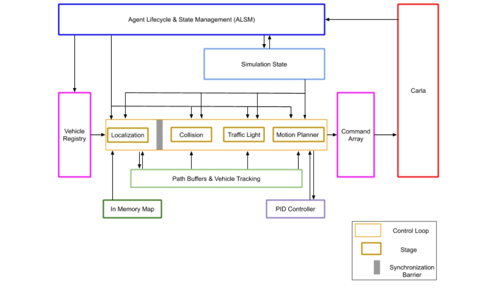
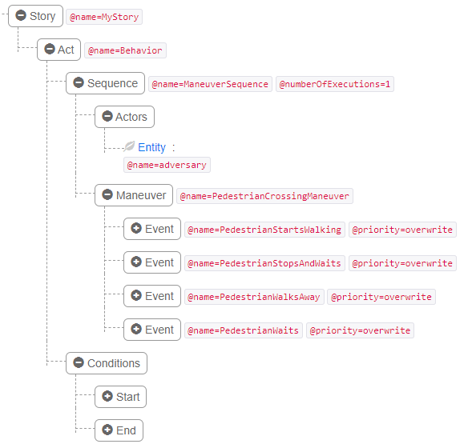
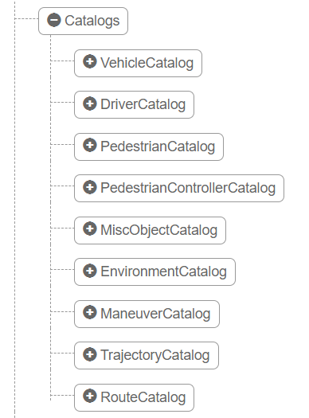

# 第43章 PPT：行为决策与交通规则

> 共 17 页，标注页码 · 图号与教学文档对应

---

## P1

# 行为决策与交通规则

- 课时：2 课时（90 分钟）
- 授课方式：讲授 + 演示
- 章节主线：分层决策架构 → 有限状态机 (FSM) → 交通灯识别与响应 → Traffic Manager → Scenario Runner

<!-- 旁白：各位同学好，本章进入《行为决策与交通规则》，主线是分层决策架构、有限状态机 FSM、交通灯识别与响应、Traffic Manager 与 Scenario Runner 五部分。全章共 17 页、2 课时，采用讲授加演示的方式。建议上承感知层、下接规划控制来把握本章在整车架构中的位置。 -->

---

## P2

- **要点：** 本章把感知结果转成驾驶行为，并接入 CARLA 仿真验证

## 学习目标

1. 理解行为决策在自动驾驶分层架构中的位置与作用，掌握行为规划与运动规划的分工
2. 掌握用有限状态机（FSM）实现行为决策：状态定义、状态转移表与转移逻辑
3. 学会 CARLA 交通灯 API：识别灯色、判断停止线距离、多路口受控灯筛选
4. 了解 Traffic Manager 的架构与核心参数，能配置不同驾驶风格的背景交通流
5. 熟悉 Scenario Runner 场景测试框架，能运行内置场景
6. 能编写行人横穿、前车切入等自定义场景

<!-- 旁白：本页列出六大学习目标，覆盖分层架构定位与分工、FSM 状态与转移表、CARLA 交通灯 API、Traffic Manager 参数配置驾驶风格、Scenario Runner 内置场景与自定义场景编写。建议按此清单自检：能否画出分层流程图、写出转移表、调通交通灯 API、配置 TM 风格并运行自定义场景。 -->

---

## P3

- **要点：** 决策系统自上而下分层细化：任务规划 → 行为决策 → 运动规划 → 控制

## 43.1.1 分层决策架构

```
+---------------------------------------------------+
|  任务规划 (Route Planning)                         |
|  全局路径: A → B, 考虑道路网络、交通规则、拥堵    |
+---------------------------------------------------+
          ↓ 全局路径 (+ 车道级路线)
+---------------------------------------------------+
|  行为决策 (Behavioral Decision)                    |
|  巡航 / 跟车 / 变道 / 停车 / 避障 / 超车          |
|  有限状态机 (FSM) 或 行为树 (Behavior Tree)       |
+---------------------------------------------------+
          ↓ 驾驶行为 + 目标车道 + 目标速度
+---------------------------------------------------+
|  运动规划 (Motion Planning)                        |
|  生成平滑、无碰撞的轨迹 (路径 + 速度曲线)         |
|  常用算法: A*, RRT*, Lattice Planner, DWA         |
+---------------------------------------------------+
          ↓ 轨迹点 (x, y, θ, v, a, t)
+---------------------------------------------------+
|  控制 (Control)                                    |
|  PID, MPC 跟踪轨迹 → 油门/刹车/转向            |
+---------------------------------------------------+
```

- 行为规划负责离散驾驶决策（如「跟车」「变道」），时间尺度 100ms~1s
- 运动规划负责连续轨迹生成，时间尺度 10ms~100ms，两者逐级细化衔接

## 43.1.2 关键输入与输出

| 类型 | 内容 | 说明 |
|------|------|------|
| 输入 | 定位信息 | 自车位置、朝向、速度 |
| 输入 | 车道信息 | 车道中心线、车道宽度、车道类型 |
| 输入 | 障碍物 | 车辆、行人、骑行者等动态物体 |
| 输入 | 交通标志 | 红绿灯、限速牌、停止标志 |
| 输入 | 全局路径 | 任务规划给出的目标路线 |
| 输出 | 目标行为 | FOLLOW_LANE, CHANGE_LEFT, STOP 等 |
| 输出 | 目标速度 | 期望行驶速度 (m/s) |
| 输出 | 目标车道 | 变道目标车道索引 |

<!-- 旁白：本页的分层决策架构自上而下：任务规划给出 A 到 B 的全局路径，行为决策在 100ms 到 1s 尺度上决定巡航、跟车等离散行为，运动规划以 10ms 到 100ms 生成无碰撞轨迹，控制层用 PID、MPC 跟踪轨迹输出油门刹车转向。注意行为决策输出目标行为、目标速度与目标车道三件套，是上下层之间的传递接口，下方输入输出表可对照记忆。 -->

---

## P4

- **要点：** 行为决策的经典实现是 FSM，七种驾驶状态覆盖常见场景

## 43.2.1 状态定义

| 状态 | 英文 | 说明 |
|------|------|------|
| 巡航 | CRUISE | 车道保持，无前车时按限速行驶 |
| 跟车 | FOLLOW | 检测到前车，保持安全距离和速度 |
| 变道左 | CHANGE_LEFT | 向左变道（超车或绕行） |
| 变道右 | CHANGE_RIGHT | 向右变道（让行或出口） |
| 停车 | STOP | 红灯、停止线、行人前停车 |
| 避障 | AVOID | 动态/静态障碍物紧急避让 |
| 完成 | COMPLETE | 到达目的地 |

## 43.1.3 官方要点——分层决策与 FSM 的国际课程范式

- 多伦多大学 Coursera 自动驾驶专项课程与本章分层架构完全对应：mission → behavior → motion
- 工程纪律一：每个状态必须显式声明进入/退出条件
- 工程纪律二：转移条件要「非重叠、可穷举」，否则 FSM 会出现不可复现的抖动
- 状态多时行为树可读性更好，但需处理回退（fallback）节点优先级

<!-- 旁白：本页定义 FSM 的七个状态：巡航、跟车、变道左右、停车、避障与完成，覆盖常见驾驶场景。官方课程范式强调两条工程纪律：每个状态必须显式声明进入与退出条件，转移条件要非重叠、可穷举，否则 FSM 会出现不可复现的抖动。状态多时行为树可读性更好，但需处理回退节点优先级。 -->

---

## P5

- **要点：** 状态转移图直观刻画驾驶行为之间的触发关系

## 43.2.2 状态转移图

```
                         +----------+
            +----------->+  CRUISE  +<-----------+
            |            +----+-----+            |
            |                 |                  |
     前车接近         绿灯/无障碍         前车切入
            |                 |                  |
            v                 v                  |
       +--------+       +----------+     +-------------+
       | FOLLOW +------>+   STOP   +---->+ CHANGE_LEFT |
       +--------+       +----------+     +-------------+
            |                 |                  |
     前车消失         红灯/行人           变道完成
            |                 |                  |
            +------+    +----+-----+            |
                   |    |          |            |
                   v    v          v            v
               +--------+   +-------------+
               | CRUISE |   | CHANGE_RIGHT|
               +--------+   +-------------+
```

- 转移图与代码中的转移表一一对应，是评审 FSM 完整性的依据

<!-- 旁白：本页的状态转移图把驾驶状态间的触发关系画成箭头：前车接近进入跟车，红灯或行人进入停车，前车切入触发变道，变道完成回到巡航。图中每条箭头都能在 P6 的转移表中找到对应行，两者一一对应，是评审 FSM 完整性的依据。可先看转移图理解触发条件，再核对转移表覆盖是否完备。 -->

---

## P6

- **要点：** 状态转移表把每条转移的条件与动作写死，实现时只需查表分发

## 43.2.3 状态转移表

| 当前状态 | 条件 | 下一状态 | 动作 |
|----------|------|----------|------|
| CRUISE | 前车距离 < 安全距离 | FOLLOW | 切换至跟车模式 |
| CRUISE | 红灯或行人 | STOP | 减速至停止 |
| CRUISE | 前车速度过慢且左道可行 | CHANGE_LEFT | 打左转向灯 |
| FOLLOW | 前车离开/消失 | CRUISE | 加速至巡航速度 |
| FOLLOW | 前车刹车 | FOLLOW | 同步减速 |
| STOP | 绿灯且无障碍 | CRUISE | 起步加速 |
| STOP | 红灯持续 | STOP | 保持停止 |
| CHANGE_LEFT | 变道完成/中止 | CRUISE | 回正方向 |
| AVOID | 避让完成 | CRUISE | 恢复巡航 |

## 43.2.4 FSM 实现要点

```python
class FsmState(Enum):
    CRUISE = 1
    FOLLOW = 2
    CHANGE_LEFT = 3
    CHANGE_RIGHT = 4
    STOP = 5
    AVOID = 6
    COMPLETE = 7

class BehaviorFSM:
    def __init__(self):
        self.state = FsmState.CRUISE
        self.transition_table = {
            FsmState.CRUISE: self._handle_cruise,
            FsmState.FOLLOW: self._handle_follow,
            FsmState.STOP:   self._handle_stop,
            ...
        }

    def update(self, perception):
        handler = self.transition_table[self.state]
        new_state, cmd = handler(perception)
        self.state = new_state
        return cmd
```

- 每帧调用 update，按当前状态取对应 handler，返回新状态与驾驶命令

<!-- 旁白：本页把转移表与实现对应：每条转移写明当前状态、条件、下一状态与动作四列，例如巡航遇前车距离小于安全距离转入跟车，红灯则减速停止。代码里每帧调用 update，按当前状态从转移表中取出对应 handler，返回新状态与驾驶命令。实现时只要查表分发即可，逻辑集中、不易出错。 -->

---

## P7

- **要点：** CARLA 用 TrafficLight 对象表达路口灯，API 提供灯色、位置与停止线

## 43.3.1 CARLA 交通灯 API

```python
# 获取影响车辆的下一个交通灯
traffic_light = vehicle.get_traffic_light()

if traffic_light is not None:
    state = traffic_light.get_state()
    # carla.TrafficLightState.Red / Yellow / Green / Off

    # 获取交通灯位置
    tl_location = traffic_light.get_location()

    # 获取触发交通灯的停止线位置
    stop_line = traffic_light.get_stop_waypoints()[0]
```

## 43.3.3 多路口场景

- 车辆可能同时受多个交通灯影响（多车道、大路口），用交通灯管理器按车道归属筛选：

```python
def get_relevant_traffic_light(world, vehicle):
    tl_manager = world.get_traffic_light_manager()
    affecting_tl = tl_manager.get_affecting_traffic_light(vehicle)
    return affecting_tl
```

## 43.3.4 官方要点——CARLA 交通灯 API 的官方细节

- `get_affected_lane_waypoints()` 返回该灯管辖的停止线列表，是「是否受控于该灯」的推荐判定方式
- `get_green_time()` / `get_elapsed_time()` 用于灯色超时预测
- 官方强调：模拟器不会替你刹车，车辆必须自行查询并遵守灯色
- `world.get_actors()` 过滤 `traffic.traffic_light` 后按 `get_opendrive_id()` 与地图对齐，可跨场景复用

<!-- 旁白：本页介绍 CARLA 交通灯 API：vehicle.get_traffic_light 获取影响车辆的下一个灯，get_state 读灯色，get_stop_waypoints 拿到停止线位置。多路口时车辆可能受多个灯影响，用交通灯管理器 get_affecting_traffic_light 按车道归属筛选。官方强调模拟器不会替你刹车，车辆必须自行查询并遵守灯色；get_affected_lane_waypoints 是判定受控于该灯的推荐方式。 -->

---

## P8

- **要点：** 灯色分类加停止线距离判断，构成完整的红灯停车逻辑

## 43.3.2 灯色分类与停止线判断

```
          +---------+
          | UNKNOWN |  ← 初始化/未检测到
          +----+----+
               |
         检测到交通灯
               |
               v
        +-------------+
        | APPROACHING |  ← 接近路口，判断灯色
        +------+------+
               |
     +---------+---------+
     |         |         |
     v         v         v
 +------+ +--------+ +--------+
 | RED  | | YELLOW | | GREEN  |
 +--+---+ +----+---+ +---+----+
    |         |         |
    |   黄灯剩余>3s      |
    +----+----+---------+
         |         |
      减速停止   匀速通过
         v         v
      +------+  +--------+
      | STOP |  | CRUISE |
      +------+  +--------+
```

```python
def should_stop_for_traffic_light(vehicle, traffic_light, stop_margin=3.0):
    if traffic_light is None:
        return False
    light_state = traffic_light.get_state()
    if light_state == carla.TrafficLightState.Green:
        return False
    stop_waypoints = traffic_light.get_stop_waypoints()
    if not stop_waypoints:
        return False
    stop_loc = stop_waypoints[0].transform.location
    distance = vehicle.get_location().distance(stop_loc)
    if distance < stop_margin:              # 已到停止线
        return True
    if light_state in [carla.TrafficLightState.Red,
                       carla.TrafficLightState.Yellow]:
        return distance < 15.0              # 15 米内需减速停车
    return False
```

<!-- 旁白：本页给出完整的红灯停车逻辑：灯色识别加停止线距离判断。状态图从未知经接近再到红黄绿分类，黄灯剩余大于 3 秒可减速，否则减速停止，绿灯匀速通过。should_stop_for_traffic_light 函数以 stop_margin 3 米判断已到停止线，红灯黄灯在 15 米内需减速停车。注意各参数与调用顺序即可完成交通灯响应。 -->

---

## P9

- **要点：** Traffic Manager 是 CARLA 内置交通流管理模块，一条指令接管车辆

## 43.4.1 CARLA 内置交通管理

```python
client = carla.Client('localhost', 2000)
world = client.get_world()

# 创建 Traffic Manager 实例（端口参数）
traffic_manager = client.get_trafficmanager(8000)

# 将车辆交给 TM 控制
vehicle.set_autopilot(True, traffic_manager.get_port())
```

## 43.4.5 官方要点——TM 官方架构：阶段流水线与混合物理模式

- 官方文档把 TM 描述为「CARLA 内置的自动驾驶后台」：按定位、碰撞检测、交通灯处理、运动学四个阶段（stages）流水线运行，每个 actor 独立计算
- 大批量背景车辆建议开启「混合物理模式（hybrid physics mode）」：仅 ego 附近全物理仿真、远处用运动学简化，把 CPU 开销压到可用水平
- TM 与外部控制器可共存，但同一车辆不能同时被 TM 与 FSM 接管



CARLA Traffic Manager 2 架构图（来源：carla-simulator/carla 官方仓库）

<!-- 旁白：本页进入 Traffic Manager：一行 set_autopilot 即把车辆交给内置后台。官方架构按定位、碰撞检测、交通灯处理、运动学四个阶段流水线运行，每个 actor 独立计算。大批量背景车建议开启混合物理模式，仅 ego 附近全物理仿真、远处运动学简化，把 CPU 开销压到可用水平。注意同一车辆不能同时被 TM 与 FSM 接管。 -->

---

## P10

- **要点：** TM 参数可精细调节单车的驾驶风格，激进与保守只是一组参数

## 43.4.2 核心参数配置

| 参数 | 方法 | 范围 | 说明 |
|------|------|------|------|
| 车速 | `set_desired_speed(vehicle, kmh)` | [0, 200] | 目标车速 (km/h) |
| 跟车距离 | `set_distance_to_leading_vehicle(vehicle, dist)` | [0.5, 100] | 与前车的距离 (m) |
| 闯灯概率 | `set_ignore_traffic_light_percentage(vehicle, pct)` | [0, 100] | 忽略红绿灯的百分比 |
| 变道偏好 | `set_lane_change_behavior(vehicle, mode)` | 0/1/2 | 0:无变道, 1:左, 2:右 |
| 限速忽略 | `set_ignore_signs_percentage(vehicle, pct)` | [0, 100] | 忽略限速标志 |
| 强行变道 | `set_force_lane_change(vehicle, enable)` | True/False | 强制变道 |

## 43.4.3 配置示例

```python
def configure_aggressive_driver(traffic_manager, vehicle):
    traffic_manager.set_desired_speed(vehicle, 80.0)
    traffic_manager.set_distance_to_leading_vehicle(vehicle, 2.0)
    traffic_manager.set_ignore_traffic_light_percentage(vehicle, 20.0)
    traffic_manager.set_ignore_signs_percentage(vehicle, 10.0)
    traffic_manager.set_lane_change_behavior(vehicle, 2)  # 右道优先

def configure_conservative_driver(traffic_manager, vehicle):
    traffic_manager.set_desired_speed(vehicle, 50.0)
    traffic_manager.set_distance_to_leading_vehicle(vehicle, 8.0)
    traffic_manager.set_ignore_traffic_light_percentage(vehicle, 0.0)
    traffic_manager.set_ignore_signs_percentage(vehicle, 0.0)
    traffic_manager.set_lane_change_behavior(vehicle, 1)  # 左道优先
```

- TM 常用于背景交通流（批量控制多辆车）；自车行为用自定义 FSM 精细控制

<!-- 旁白：本页的 TM 参数表给出六大驾驶参数：目标车速、跟车距离、闯灯概率、变道偏好、限速忽略与强行变道。示例代码对比激进与保守两种风格：激进时速 80、跟车 2 米、闯灯概率 20%，保守时速 50、跟车 8 米、完全遵守信号。TM 常用于批量控制背景交通流，自车行为用自定义 FSM 精细控制。 -->

---

## P11

- **要点：** 内置 TM 与自定义 FSM 各司其职：背景流交给 TM，自车用 FSM

## 43.4.4 TM 与自定义 FSM 的关系

```
+---------------------+         +------------------------+
|  Traffic Manager    |         |  自定义 FSM 节点       |
|  (内置驾驶策略)      |         |  (ROS2 Behavior Node)  |
+---------------------+         +------------------------+
|  - 巡航/跟车         |         |  - 复杂场景决策         |
|  - 红绿灯响应        |         |  - 变道超车策略         |
|  - 限速适应          |         |  - 行人横穿检测        |
|  - 简单避障          |         |  - 紧急避让            |
+---------------------+         +------------------------+
|  常用于背景交通流    |         |  常用于自车行为控制    |
|  批量控制多辆车      |         |  精细控制单车辆        |
+---------------------+         +------------------------+
```

- 边界条件：同一车辆同时只能被 TM 或 FSM 一方接管

<!-- 旁白：本页对比 TM 与自定义 FSM 的分工：TM 负责巡航跟车、红绿灯响应、限速适应与简单避障，适合批量控制背景交通流；FSM 处理复杂场景决策、变道超车策略、行人横穿检测与紧急避让，适合精细控制自车。边界条件是同一车辆同时只能被一方接管。两列结合即完整决策方案。 -->

---

## P12

- **要点：** Scenario Runner 把「场景脚本 + 被测算法 + 判据」三层解耦，可测内置也可测自定义场景

## 43.5.1 场景测试框架

```
+----------------------------------------------------+
|                 Scenario Runner                      |
+----------------------------------------------------+
|  +--------------+  +-------------+  +------------+  |
|  | Scenario     |  | Agent       |  | Evaluation |  |
|  | 定义场景    |  | 被测算法    |  | 性能评估   |  |
|  | - 初始条件  |  | - 行为决策  |  | - 碰撞     |  |
|  | - 触发条件  |  | - 运动规划  |  | - 红绿灯   |  |
|  | - 终止条件  |  | - 控制      |  | - 路线     |  |
|  +--------------+  +-------------+  +------------+  |
|  |   OpenScenario 1.0 / 自定义 Python 场景       |  |
+----------------------------------------------------+
         ↓                      ↓
+------------------+   +------------------+
|  CARLA Simulator |   |  ROS2 / Autoware |
|  环境与物理引擎  |   |  自动驾驶系统    |
+------------------+   +------------------+
```

## 43.5.2 内置场景类型

| 场景 | 描述 | 典型测试 |
|------|------|----------|
| `FollowLeadingVehicle` | 前车匀速/减速 | 跟车响应 |
| `VehicleTurningRight` | 前车右转 | 转弯让行 |
| `CrossPedestrian` | 行人横穿马路 | 紧急制动 |
| `CutIn` | 旁车切入本车道 | 避让决策 |
| `DynamicObjectCross` | 动态物体横穿 | 综合避障 |
| `TrafficLightScenario` | 红绿灯场景 | 信号灯响应 |

<!-- 旁白：本页的 Scenario Runner 三层框架把场景脚本与被测算法、性能判据解耦：Scenario 定义初始、触发与终止条件，Agent 是被测的行为决策与规划控制，Evaluation 评估碰撞、红绿灯与路线。内置场景表列六类典型测试，如 FollowLeadingVehicle 测跟车响应、CrossPedestrian 测紧急制动。理解三层脉络即可扩展自定义。 -->

---

## P13

- **要点：** 自定义场景 = 行为树（触发 + 动作）+ 判据，两例覆盖典型险情

## 43.5.3 自定义场景：行人横穿

```python
class PedestrianCrossing(BasicScenario):
    def _initialize_actors(self, config):
        pedestrian_loc = self._get_spawn_point()
        pedestrian_blueprint = (
            self._world.get_blueprint_library().find("walker.pedestrian.*")
        )
        self._pedestrian = self._world.spawn_actor(
            pedestrian_blueprint, pedestrian_loc
        )
        self.other_actors.append(self._pedestrian)

    def _create_behavior(self):
        root = py_trees.composites.Sequence("PedestrianBehavior")
        approach = WaypointReached(self.ego_vehicles[0], self._trigger_point, 5.0)
        cross = CrossPedestrian(self._pedestrian, self._target_point)
        root.add_child(approach)
        root.add_child(cross)
        return root

    def _create_test_criteria(self):
        collision_criterion = CollisionTest(self.ego_vehicles[0])
        return [collision_criterion]
```

## 43.5.4 自定义场景：前车切入

```python
class CutInScenario(BasicScenario):
    def _create_behavior(self):
        root = py_trees.composites.Sequence("CutInBehavior")
        wait = DriveDistance(self._cutting_vehicle, 30.0)
        cut_in = ChangeLane(self._cutting_vehicle, direction="left",
                            target_lane_id=self._target_lane)
        brake = BrakeVehicle(self._cutting_vehicle, 0.7)
        root.add_child(wait)
        root.add_child(cut_in)
        root.add_child(brake)
        return root
```



OpenSCENARIO 故事板（storyboard）中场景触发与动作的编排示意（来源：carla-simulator/scenario_runner 官方仓库）

<!-- 旁白：本页两个自定义场景模板：行人横穿用 WaypointReached 触发后执行 CrossPedestrian 过街，前车切入则是 DriveDistance 行驶 30 米后 ChangeLane 变道、BrakeVehicle 刹车。两者都靠 _initialize_actors、_create_behavior 与 _create_test_criteria 三个核心方法组织行为树与判据。下方 storyboard 图展示触发与动作编排。 -->

---

## P14

- **要点：** 一条命令运行内置或自定义场景；OpenSCENARIO 标准让场景跨仿真器可移植

## 43.5.5 运行场景

```bash
# 运行内置场景
cd ~/carla/PythonAPI/scenario_runner
python scenario_runner.py \
    --scenario FollowLeadingVehicle \
    --reloadWorld \
    --agent agent.py

# 运行自定义场景
python scenario_runner.py \
    --scenario PedestrianCrossing \
    --scenario-config configs/my_scenario.xml \
    --reloadWorld
```

## 43.5.6 官方要点——Scenario Runner 与 OpenSCENARIO

- 官方 `srunner` 示例（FollowLeadingVehicle、TrafficLightScenario 等）正是 43.5.2 内置场景的来源
- 官方支持 ASAM OpenSCENARIO 1.x 标准：`--openscenario` 参数直接运行 `.xosc` 文件，自定义场景可写成跨仿真器可移植的标准 XML
- 工程建议：把场景库纳入回归测试（CI 中每次跑全量场景），让「交通规则遵守率」成为可持续度量的指标



OpenSCENARIO 目录（catalogs）组织场景资源的示例（来源：carla-simulator/scenario_runner 官方仓库）

<!-- 旁白：本页给出运行命令：scenario_runner.py 加 --scenario 指定场景名、--agent 指定被测算法，即可运行内置或自定义场景。官方支持 ASAM OpenSCENARIO 1.x 标准，用 --openscenario 参数直接运行 .xosc 文件，场景可写成跨仿真器可移植的标准 XML。右侧 osc_catalogs 图展示目录组织场景资源，工程上可把场景库纳入 CI 回归测试。 -->

---

## P15

- **要点：** 按「决策 → 交通规则 → 背景流 → 场景测试」主线总结本章结论

## 本章要点

1. 行为决策是分层架构的中间层：上接任务规划、下连运动规划与控制
2. FSM 状态定义清晰、转移直观，转移条件必须「非重叠、可穷举」
3. 交通灯响应 = 灯色识别 + 停止线距离判断，CARLA 提供完整 API
4. Traffic Manager 适合批量控制背景交通流，参数即可调出驾驶风格
5. 混合物理模式只在 ego 附近全物理仿真，可大幅压低 CPU 开销
6. Scenario Runner 支持内置场景与 OpenSCENARIO 自定义场景，是回归测试的载体

<!-- 旁白：本页按决策、交通规则、背景流、场景测试四条主线总结：行为决策是分层架构的中间层，FSM 状态定义清晰转移直观，交通灯响应等于灯色识别加停止线距离判断，Traffic Manager 适合批量控制背景交通流。混合物理模式只在 ego 附近全物理仿真，可大幅压低 CPU 开销。Scenario Runner 是回归测试的载体。 -->

---

## P16

- **要点：** 以架构理解、FSM 实现与仿真验证为主线设计练习

## 练习题

1. 画出分层决策架构流程，说明行为规划与运动规划的时间尺度差异
2. FSM 的状态转移条件为什么要求「非重叠、可穷举」？请举例说明
3. 如何用 CARLA API 判断车辆是否应在交通灯前停止？关键步骤有哪些？
4. Traffic Manager 如何配置激进/保守驾驶风格？其「混合物理模式」解决了什么问题？
5. 在 Scenario Runner 中自定义「行人横穿」场景，需要实现哪三个核心方法？

<!-- 旁白：本页五道练习覆盖本章主干：分层决策架构与行为规划、运动规划的时间尺度差异，FSM 转移条件为何要非重叠可穷举，用 CARLA API 判断交通灯前停车的步骤，TM 配置风格与混合物理模式解决的问题，以及自定义行人横穿场景要实现的三个核心方法。建议先默写流程再动手写代码。 -->

---

## P17

- **要点：** 下一章把决策与仿真成果纳入安全验证与系统集成

## 下章预告

- 第 44 章将转入系统级视角：安全验证方法与系统集成实践
- 敬请期待：如何用仿真场景验证整个自动驾驶系统的安全性与可靠性

<!-- 旁白：本页预告下一章：第 44 章转入系统级视角，讲解安全验证方法与系统集成实践。敬请期待如何用仿真场景验证整个自动驾驶系统的安全性与可靠性。 -->