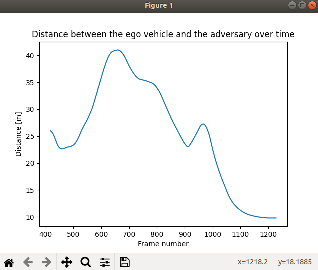
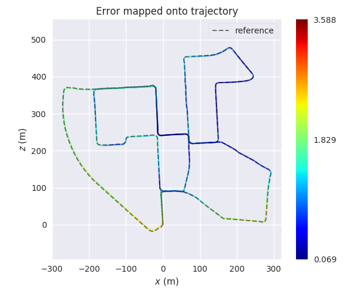

# 第44章 PPT：安全验证与系统集成

> 共 17 页，标注页码 · 图号与教学文档对应

---

## P1

# 第44章 安全验证与系统集成

> ROS2 Python 编程 · 第44章 · 2 课时（90 分钟）· 讲授 + 演示

**本章内容导览**

- 44.1 自动驾驶系统集成：闭环架构与 ROS2 接口
- 44.2 安全监控机制：碰撞 / 偏离 / AEB / 接管
- 44.3 故障注入与容错：故障模拟、延迟注入、降级策略
- 44.4 性能评估指标：指标体系、Jerk 分析、评估报告
- 44.5 仿真测试方法论：场景覆盖、边界用例、回归测试

<!-- 旁白：各位同学好，本章进入系统级视角《安全验证与系统集成》，全章共 17 页、2 课时，讲授加演示。导览五节按集成、安全监控、容错、评估、测试展开：先看闭环架构与 ROS2 接口，再学碰撞偏离与 AEB 接管机制，然后注入故障验证容错，用指标量化评估，最后以场景覆盖与回归测试收尾，构成完整的安全验证链路。 -->

---

## P2

## 学习目标

- **要点：** 理解自动驾驶系统感知-决策-规划-控制闭环架构与 ROS2 接口集成方式

1. 理解感知-决策-规划-控制闭环架构及各模块的 ROS2 通信集成方式
2. 掌握碰撞检测、偏离检测、自动紧急制动（AEB）与驾驶员接管等安全监控机制的设计方法
3. 掌握传感器故障模拟、通信延迟注入与降级策略设计，验证系统容错能力
4. 掌握性能评估指标体系、舒适度 Jerk 分析与评估报告模板等量化评估方法
5. 掌握基于 CARLA 的场景覆盖、边界用例、回归测试与 ScenarioRunner 集成的仿真测试方法论
6. 了解 ISO 26262 与 SOTIF 两份安全标准的概念框架及其对本章内容的指导作用

<!-- 旁白：本页列出六大学习目标：先理解闭环架构与 ROS2 通信集成，再掌握碰撞、偏离、AEB、接管四类安全监控机制的设计，然后是故障注入与降级策略验证容错，指标体系与 Jerk 分析量化评估，场景覆盖与回归测试的仿真方法论，最后了解 ISO 26262 与 SOTIF 两份安全标准的指导作用。逐条自检即可把握本章主线。 -->

---

## P3

## 44.1.1 感知→决策→规划→控制闭环架构

- **要点：** 自动驾驶系统是典型的感知-决策-规划-控制闭环架构，各模块通过 ROS2 通信机制紧密协作

```
        环境感知层
  LiDAR / 相机 / 毫米波雷达
  → 感知融合（目标检测 | 语义分割 | 跟踪 | 定位）
              ↓
        决策规划层
  行为决策（换道 | 跟车 | 停车 | 避让）
  → 运动规划（全局路径 | 局部路径 | 速度规划）
              ↓
        控制执行层
  车辆控制（横向 Stanley/MPC · 纵向 PID/MPC）
  → 执行器（油门 | 制动 | 转向 | 挡位）
              ↓
        反馈闭环
  CAN总线 | 里程计 | IMU | GPS → 状态估计
```

- 闭环工作流程：传感器采集原始数据 → 感知输出障碍物列表、车道线、交通标志 → 行为决策结合路由选择驾驶行为 → 运动规划生成平滑无碰撞轨迹 → 控制模块转换为油门/制动/转向指令 → 车辆执行后经里程计/IMU 反馈实际状态，形成闭环

<!-- 旁白：本页闭环架构自上而下：环境感知层融合 LiDAR、相机与毫米波雷达输出障碍物与车道线，决策规划层从行为决策到运动规划逐级细化，控制执行层用 Stanley/MPC 与 PID/MPC 输出油门制动转向，最后经里程计、IMU、GPS 反馈状态形成闭环。注意闭环二字是核心：执行结果必须反馈回状态估计，各层间通过 ROS2 话题衔接。 -->

---

## P4

## 44.1.2 ROS2 接口汇总

- **要点：** 话题承载高频数据流，服务负责请求-响应式控制，动作用于长时任务

**话题（Topic）接口**

| 话题名称 | 消息类型 | 发布者 → 订阅者 | 频率 |
|---------|---------|----------------|------|
| `/perception/objects` | `Detection3DArray` | 感知融合 → 决策规划 | 20Hz |
| `/perception/lanes` | `LaneletMap` | 车道检测 → 规划 | 20Hz |
| `/perception/traffic_signals` | `TrafficSignalArray` | 信号灯检测 → 决策 | 10Hz |
| `/planning/trajectory` | `Trajectory` | 运动规划 → 控制 | 20Hz |
| `/planning/behavior` | `String` | 行为决策 → 规划/监控 | 10Hz |
| `/control/cmd` | `ControlCommand` | 控制模块 → 车辆接口 | 50Hz |
| `/vehicle/odometry` | `Odometry` | 定位 → 所有模块 | 100Hz |
| `/safety/collision_warning` | `Bool` | 安全监控 → 紧急制动 | 20Hz |
| `/safety/deviation` | `Float32` | 安全监控 → 规划 | 20Hz |

**服务（Service）接口**：`/safety/emergency_brake` 触发紧急制动、`/control/set_mode` 切换自动驾驶/手动模式、`/planning/set_destination` 设置导航目的地、`/vehicle/get_diagnostics` 获取车辆诊断信息

**动作（Action）接口**：`/planning/follow_trajectory` 执行轨迹跟踪、`/control/park` 自动泊车、`/safety/emergency_stop` 紧急停止序列、`/perception/fuse_sensors` 传感器融合校准

<!-- 旁白：本页汇总三类 ROS2 接口：话题承载高频数据流，表格列出九个关键话题的消息类型、发布订阅关系与频率，例如感知 20Hz、控制 50Hz、里程计 100Hz；服务负责请求响应式控制，动作适合长时任务。记住三类接口的分工原则，设计系统时按数据类型选型，是集成的主要依据。 -->

---

## P5

## 44.2.1 碰撞检测（Collision Detection）

- **要点：** 碰撞检测通过多种信息来源交叉验证，核心指标是碰撞时间 TTC

```python
def check_collision(ego_pose, ego_bbox, objects, time_horizon=3.0):
    for obj in objects:
        # 预测目标运动轨迹（恒定速度模型）
        pred_traj = predict_trajectory(obj, time_horizon)
        # 计算本车与目标的时空交集
        ttc = compute_time_to_collision(ego_pose, ego_bbox, pred_traj)
        if ttc is not None and ttc < SAFETY_TTC_THRESHOLD:
            publish_collision_warning(obj.id, ttc, CollisionLevel.WARNING)
            if ttc < CRITICAL_TTC_THRESHOLD:
                publish_collision_warning(obj.id, ttc, CollisionLevel.CRITICAL)
                trigger_emergency_brake()
```

- **TTC（Time to Collision）阈值**：安全 ≥ 3.0s；警告 < 2.0s；危险 < 1.0s（触发紧急制动）
- **最小安全距离**：`d_min = v_rel * t_reaction + d_stop`（相对速度 × 反应时间 + 停车余量）

<!-- 旁白：本页碰撞检测核心：check_collision 对每个目标按恒定速度模型预测轨迹，计算碰撞时间 TTC，低于阈值发布警告、低于临界阈值触发紧急制动。TTC 阈值三档：安全 3 秒以上、警告小于 2 秒、危险小于 1 秒。最小安全距离公式含相对速度乘反应时间再加停车余量，理解公式各量的实际含义即可掌握。 -->

---

## P6

## 44.2.2 偏离检测与 44.2.3 自动紧急制动（AEB）

- **要点：** 偏离检测监控规划质量，AEB 按 TTC 分三级渐进制动

**偏离检测核心逻辑**：计算横向偏移与航向误差，横向偏移超过车道宽度 40% 即发布警告；累积偏离积分超阈值则触发驾驶员接管（`trigger_driver_handover("严重车道偏离")`）

**AEB 三级制动**

| 等级 | 触发条件 | 制动强度 | 行为 |
|------|---------|---------|------|
| Level 1 | TTC < 2.6s | 30% | 预警 + 预填充制动 |
| Level 2 | TTC < 1.8s | 60% | 部分制动 + 安全带预紧 |
| Level 3 | TTC < 0.8s | 100% | 全力制动 + 双闪开启 |

- AEB 控制循环：`get_min_ttc()` 取当前最小 TTC，按 0.8s / 1.8s / 2.6s 三档发布制动指令；Level 3 保持当前转向并同时开启双闪

<!-- 旁白：本页两个安全机制：偏离检测计算横向偏移与航向误差，超过车道宽度 40% 发警告，累积积分超阈值触发驾驶员接管；AEB 按 TTC 三级渐进制动，2.6 秒预警预填充、1.8 秒制动 60%、0.8 秒全力制动并开双闪。注意三级制动是渐进而非一步到位，表格三列对应触发条件、制动强度与行为，便于记忆。 -->

---

## P7

## 44.2.4 驾驶员接管（Driver Handover）

- **要点：** 接管机制确保系统失效时安全移交控制权，过渡分三个阶段

```
┌─────────────┐    接管控件条件    ┌─────────────┐
│  自动驾驶状态  │ ──────────────→  │  手动驾驶状态  │
│ (ADS Active) │                   │   (Manual)   │
└─────────────┘                   └─────────────┘
      ↑                                │
      │   条件恢复(系统自检OK)           │ 触发条件:
      └────────────────────────────────┘  ① 碰撞风险(TTC<0.5s)
                                          ② 系统故障(感知丢失>500ms)
                                          ③ 严重偏离(偏离>1.0m)
                                          ④ 用户主动请求
```

- **接管过渡三阶段**：预警阶段（0-1s）声光警报提示准备接管 → 过渡阶段（1-3s）逐渐降低车速、保持车道 → 移交完成，系统进入监控模式
- ISO 26262 关注「电子电气系统功能性故障」（对应失效安全状态机）；ISO 21448（SOTIF）关注「性能不足」的长尾场景——两者共同确立「安全是从需求、设计、验证到运行监控的全流程论证」


<!-- 旁白：本页驾驶员接管机制：状态图显示自动驾驶与手动驾驶之间的切换，触发条件有四类——碰撞风险、系统故障、严重偏离与用户请求，系统自检 OK 后条件恢复。过渡分预警、过渡、移交三阶段逐步降速保持车道。下方说明两份安全标准：ISO 26262 管功能性故障，SOTIF 管性能不足的长尾场景，安全是全流程论证而非单点措施。 -->

---

## P8

## 44.3.1 传感器故障模拟

- **要点：** 通过注入典型故障类型，检验下游模块的看门狗与容错路径

| 故障类型 | 模拟方式 | 持续时间 | 影响评估 |
|---------|---------|---------|---------|
| 感知丢帧 | 跳过话题发布 | 100-500ms | 跟踪中断，可卡尔曼滤波预测补偿 |
| 信号噪声 | 高斯噪声 (σ=0.1~0.5) | 连续 | 检测精度下降，需自适应阈值 |
| 数据偏置 | 叠加固定偏移 | 持续 | 定位漂移，需多传感器校验 |
| 完全失效 | 停止发布 | 直至恢复 | 触发降级策略 |
| 延迟注入 | 引入 50-500ms 延时 | 持续 | 控制滞后，需补偿 |

```python
class SensorFaultFactory:
    def create_fault(self, fault_type, sensor_topic):
        if fault_type == "drop":     return DropFrameFault(sensor_topic, drop_interval=0.1)
        elif fault_type == "noise":  return NoiseFault(sensor_topic, stddev=0.3)
        elif fault_type == "bias":   return BiasFault(sensor_topic, offset=1.5)
        elif fault_type == "stall":  return StallFault(sensor_topic, duration=2.0)
        elif fault_type == "latency": return LatencyFault(sensor_topic, delay_ms=200)
```

<!-- 旁白：本页传感器故障模拟：表格列出五类典型故障——丢帧、噪声、偏置、完全失效与延迟注入，以及各自的模拟方式、持续时间与影响评估。SensorFaultFactory 用工厂模式按类型创建故障对象，drop、noise、bias、stall、latency 五类与表格一一对应。故障注入的目的不是破坏，而是检验下游看门狗与容错路径真实可用。 -->

---

## P9

## 44.3.2 通信延迟注入 与 44.3.3 降级策略

- **要点：** 延迟沿控制回路放大风险；检测到故障后按评分执行分级降级

**延迟影响分析**

| 延迟时间 | 控制系统影响 | 安全风险 |
|---------|------------|---------|
| 50ms | 可忽略 | 无 |
| 100ms | 轻微超调 | 低 |
| 200ms | 明显震荡 | 中 |
| 500ms | 失稳可能 | 高 |
| 1000ms+ | 完全失稳 | 极高 |

- 延迟注入器 `LatencyInjector`：订阅 `/perception/traffic_signals`，按 `delay_ms` 参数用一次性 Timer 延后转发消息

**分级降级策略**：Level 0 全功能运行 → Level 1 感知降级（仅 LiDAR，禁用 Camera）→ Level 2 规划降级（限速 30km/h，禁用自动换道）→ Level 3 控制降级（最小风险策略，靠边停车）→ Level 4 安全停车（立即制动、双闪、请求远程协助）

- 降级评分逻辑：Camera 失效 +1、LiDAR 失效 +2、延迟 >200ms +1、>500ms +2、定位失效 +3；总分 ≥5 安全停车、≥3 有限功能、≥1 降级、否则正常

<!-- 旁白：本页延迟注入与降级策略：延迟表显示 50ms 可忽略、500ms 可能失稳、一千毫秒以上完全失稳，LatencyInjector 用一次性 Timer 延后转发消息。降级策略从 Level 0 全功能逐级收缩到 Level 4 安全停车。评分逻辑把各故障加权相加：总分大于等于 5 安全停车、大于等于 3 有限功能、大于等于 1 降级，抓住评分阈值即可设计容错逻辑。 -->

---

## P10

## 44.4.1 评估指标体系

- **要点：** 量化评估覆盖安全、效率、舒适、可靠、实时、精度六个维度

| 指标 | 公式 | 理想值 | 评估维度 |
|-----|------|-------|---------|
| 碰撞率 | `N_collision / N_test × 100%` | 0% | 安全性 |
| 路线偏离率 | `T_deviation / T_total × 100%` | < 5% | 安全性 |
| 平均速度 | `Σv_i / N` | 符合限速 | 效率 |
| 舒适度（Jerk） | `\|da/dt\|` 的均方根 | < 2.0 m/s³ | 舒适性 |
| 任务完成率 | `N_completed / N_attempted × 100%` | > 95% | 可靠性 |
| 平均TTC | `min(TTC)` 的平均值 | > 3.0s | 安全性 |
| 规划耗时 | `t_planning` 的 95 分位值 | < 50ms | 实时性 |
| 控制误差 | `RMSE(trajectory_error)` | < 0.3m | 精度 |



自动驾驶系统量化评估指标可视化示例（来源：GitHub）

<!-- 旁白：本页评估指标体系覆盖六个维度：安全看碰撞率、偏离率与平均 TTC，效率看平均速度，舒适性看 Jerk 均方根，可靠性看任务完成率，实时性看规划耗时 95 分位，精度看控制误差 RMSE。表格给出每个指标的公式与理想值，例如碰撞率必须 0%、Jerk 小于 2.0、规划耗时小于 50 毫秒。图为指标可视化示例。 -->

---

## P11

## 44.4.2 舒适度评估（Jerk 分析）

- **要点：** 舒适度用加速度变化率（Jerk）量化，RMS Jerk < 2.0 m/s³ 为可接受上限

```python
def compute_comfort_metrics(velocity_log, time_log):
    acc = np.diff(velocity_log) / np.diff(time_log)       # 加速度 = 速度变化率
    jerk = np.diff(acc) / np.diff(time_log[1:])           # Jerk = 加速度变化率
    metrics = {
        'mean_jerk': np.mean(np.abs(jerk)),
        'max_jerk':  np.max(np.abs(jerk)),
        'rms_jerk':  np.sqrt(np.mean(jerk**2)),
        'jerk_95th': np.percentile(np.abs(jerk), 95)
    }
    return metrics
```

- **Jerk 等级划分**：优秀 RMS Jerk < 1.0 m/s³（舒适如豪华轿车）；良好 1.0-2.0 m/s³（可接受）；一般 2.0-4.0 m/s³（乘客感到不适）；较差 > 4.0 m/s³（对应急加速、急刹车）



轨迹绝对位姿误差（APE）分析图示例（来源：GitHub）

<!-- 旁白：本页舒适度评估：Jerk 是加速度的变化率，代码中用速度日志差分求加速度再差分求 Jerk，输出均值、最大值、均方根与 95 分位四个统计量。等级划分以 RMS Jerk 为界：小于 1.0 优秀、1 到 2 良好可接受、2 到 4 乘客不适、大于 4 对应急加速急刹车。下方 APE 图为轨迹绝对位姿误差分析示例。 -->

---

## P12

## 44.4.3 评估报告模板

- **要点：** 评估报告将指标、故障注入记录与结论固化为可归档的 JSON

```json
{
  "test_id": "ch44_eval_001",
  "scenario": "城市拥堵路段",
  "weather": "晴天",
  "duration_s": 300,
  "metrics": {
    "collision_rate": 0.0,
    "deviation_rate": 2.3,
    "avg_speed_ms": 8.5,
    "rms_jerk": 1.2,
    "task_completion": true,
    "avg_ttc": 4.2,
    "planning_latency_ms": 35,
    "control_rmse_m": 0.18
  },
  "fault_injection": {
    "lidar_drop_rate": 0.05,
    "camera_latency_ms": 150,
    "recovery_time_s": 1.2
  },
  "assessment": "PASS",
  "notes": "在5%激光雷达丢帧率下系统表现稳定，控制精度满足要求"
}
```

- 报告同时记录故障注入参数（丢帧率、延迟、恢复时间），使「指标结果」与「注入条件」一一对应，便于复现

<!-- 旁白：本页评估报告模板：JSON 结构包含测试标识、场景与天气等元信息、metrics 八项指标、fault_injection 注入参数与 assessment 结论。关键思路是指标结果与注入条件一一对应，例如 5% 丢帧率下控制误差 0.18 米，这样任何结果都能复现验证，是工程化评估的归档规范。 -->

---

## P13

## 44.5.1 场景覆盖 与 44.5.2 边界用例

- **要点：** 场景按类别保证覆盖数量，边界用例重点攻击系统薄弱环节

**基于 CARLA 的场景测试分类**

| 场景类别 | 具体场景 | 测试数量 |
|---------|---------|---------|
| 正常行驶 | 直行、转弯、跟车、换道 | ≥ 20 |
| 交通参与者 | 行人横穿、非机动车、动物出现 | ≥ 15 |
| 交通规则 | 红绿灯、停止线、让行、限速 | ≥ 10 |
| 恶劣天气 | 雨、雾、雪、夜间、逆光 | ≥ 10 |
| 道路结构 | 隧道、环岛、匝道、施工区 | ≥ 10 |
| 紧急场景 | 前车急刹、儿童冲出、抛锚车 | ≥ 15 |
| 故障场景 | 传感器失效、通信中断、GPS丢失 | ≥ 10 |

**需要重点覆盖的边界用例**

- 感知边界：远距离小目标（< 10 像素）、遮挡目标、反射/眩光
- 决策边界：多目标冲突（同时避让行人和车辆）、无明确路权场景
- 控制边界：高速急弯、低附着力路面（湿滑/冰雪）
- 系统边界：高 CPU 负载实时性、内存不足处理、节点崩溃恢复
- 时序边界：消息时序错乱、时间戳跳跃、异步到达

<!-- 旁白：本页场景覆盖与边界用例：场景按七类保证数量，正常行驶至少 20 个、紧急与交通参与者也至少 15 个，覆盖广度是统计可信的前提。边界用例则重点攻击薄弱环节：感知边界看小目标与遮挡、决策边界看多目标冲突、控制边界看高速急弯与低附着路面、系统边界看负载与崩溃恢复、时序边界看消息乱序与时间戳跳跃。 -->

---

## P14

## 44.5.3 回归测试 与 44.5.4 CARLA ScenarioRunner 集成

- **要点：** 把关键场景固化为自动化回归测试，每次代码变更后重放全部历史场景

**回归测试流程**：加载场景集（`regression_v2.yaml`）→ 启动 CARLA 仿真 → 部署自动驾驶栈 → 运行场景 → 评估指标 → 与基线对比，输出通过/失败与指标差值

- **回归触发条件**：代码提交时 pre-commit hook 运行快速测试子集；PR 创建时运行完整测试集（约 30 分钟）；nightly build 运行全部场景与故障注入（约 2 小时）
- **「可复现失败」文化**：把「失败场景 + bag 录制 + 复现步骤」归档成 issue——可复现的失败是集成阶段最宝贵的资产

```bash
# 运行单个 OpenSCENARIO 场景
python scenario_runner.py --openscenario scenarios/city_junction.xosc

# 运行批量测试
python scenario_runner.py --route towns/route_01.xml --reload --output-dir results/ch44_test

# 与 ROS2 桥接运行
ros2 launch carla_ros_bridge carla_ros_bridge.launch.py
ros2 run scenario_runner scenario_runner_node.py --scenario ch44_emergency_brake
```

- OpenSCENARIO（ASAM 标准，XML 方言）用「故事板 = 初始条件 + 触发条件 + 动作序列」描述场景，`<Storyboard><Story><Act><Maneuver><Event>` 层级编排，是场景化测试的行业通用表达

<!-- 旁白：本页回归测试与 ScenarioRunner 集成：回归流程先加载场景集再部署栈运行评估，与基线对比输出指标差值，触发条件分层——提交跑快速子集、PR 跑完整测试、夜间构建含故障注入。三条命令行展示单场景、批量与 ROS2 桥接三种运行方式。可复现失败文化强调把失败场景与 bag 录制归档，是最宝贵的集成资产。 -->

---

## P15

## 本章要点

- **要点：** 从闭环集成、安全监控、容错验证到量化评估与仿真测试，构成完整的安全验证链路

1. 感知-决策-规划-控制闭环是自动驾驶系统集成的骨架，各模块以话题/服务/动作三类 ROS2 接口协作
2. 安全监控四件套：碰撞检测（TTC 阈值分级）、偏离检测（横向偏移 + 累积积分）、AEB 三级制动、驾驶员接管三阶段过渡
3. 故障注入覆盖丢帧、噪声、偏置、失效、延迟五类；容错逻辑必须「在注入实验中真实触发过」才算验证
4. 降级策略按评分分级执行：从仅 LiDAR、限速到靠边停车、安全停车逐级收缩功能
5. 性能评估八项指标横跨安全/效率/舒适/可靠/实时/精度，Jerk 的 RMS 值是舒适度的量化核心
6. 回归测试 + ScenarioRunner：场景即测试用例，同一场景多次运行的统计分布比单次成绩更可信

<!-- 旁白：本页按闭环集成、安全监控、容错验证、量化评估、仿真测试五条主线总结：闭环是骨架、三类接口协作；安全监控四件套覆盖碰撞、偏离、AEB 与接管；五类故障注入必须真实触发容错逻辑；降级按评分逐级收缩；八项指标横跨六个维度。最后强调场景即测试用例，多次运行的统计分布比单次成绩更可信。 -->

---

## P16

## 练习题

- **要点：** 试着动手验证与实现本章机制，完成后可与同学互相评审

1. 修改 AEB 控制循环，将三级制动阈值从 2.6s / 1.8s / 0.8s 调整为更保守的取值，并在 CARLA 中复现前车急刹场景，对比碰撞率与平均速度的变化
2. 为 `LatencyInjector` 增加按正态分布随机抖动的延迟模式，测试 200ms 均值、±50ms 抖动下控制回路是否出现震荡，并记录评估报告
3. 实现 `evaluate_degradation` 的降级评分函数，构造「Camera 失效 + 延迟 300ms」的组合，验证系统应进入哪一级降级
4. 编写一个 OpenSCENARIO 场景片段：本车以 60 km/h 接近路口时，行人从侧方以 1.4 m/s 横穿，要求在 15m 距离处触发
5. 从评估指标体系中选择三个指标，为它们编写与基线对比的回归检查函数，说明失败时如何输出指标差值

<!-- 旁白：本页五道练习题覆盖本章机制：改动 AEB 阈值对比碰撞率与速度、给 LatencyInjector 加正态抖动观察震荡、实现降级评分函数验证组合故障、写 OpenSCENARIO 场景片段触发行人横穿、为指标编写回归检查函数。第三题 Camera 失效加 300 毫秒延迟按评分应进入有限功能级，可对照 P9 验证。 -->

---

## P17

## 下章预告：第45章 综合项目

- **要点：** 第45章将把全课程所学融为一个完整的自动驾驶综合项目

1. 综合运用感知、决策、规划、控制各章成果，搭建完整自动驾驶软件栈
2. 在 CARLA 仿真环境中完成从建图定位到轨迹跟踪的全流程联调
3. 应用本章的安全监控与故障注入方法，为项目做集成验证与演示验收
4. 撰写项目评估报告并汇报答辩，形成课程学习成果的最终闭环

<!-- 旁白：本页预告下一章：第 45 章综合项目将把全课程所学融为完整的城区自动驾驶系统，综合运用感知、决策、规划、控制各章成果搭建软件栈，在 CARLA 中全流程联调，再应用本章安全监控与故障注入方法做集成验证与演示验收，最终撰写报告汇报答辩，形成学习成果的最终闭环。 -->