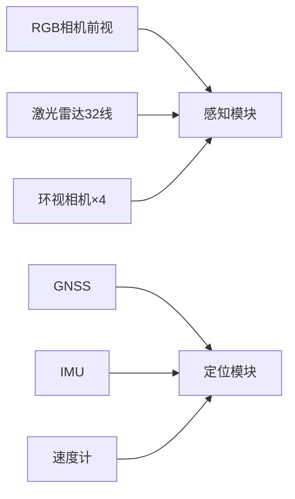

# 幻灯片1：封面

```
╔══════════════════════════════════════════════╗
║     第45章 综合项目：城区自动驾驶           ║
║                                            ║
║     CARLA Town03 · Tesla Model 3           ║
║     1.8km · 6路口 · 10+ NPC              ║
║                                            ║
║     ROS2编程技术课程 · 综合项目             ║
╚══════════════════════════════════════════════╝
```

---

# 幻灯片2：项目总览

| 项目 | 内容 |
|------|------|
| **场景** | CARLA Town03 城区道路 |
| **车辆** | Tesla Model 3 + 传感器套件 |
| **路线** | A[-80, -10] → B[130, -120] (1.8km) |
| **难点** | 红绿灯×6, 人行横道×3, 动态交通流 |
| **天气** | 默认晴朗（加分：雨天/黄昏） |
| **模块数** | 6大模块，12+ ROS2节点 |

**核心目标**：零碰撞、全路权遵守、全程自动

---

# 幻灯片3：传感器配置



| 传感器 | 数量 | 关键参数 |
|--------|------|---------|
| RGB相机 | 1前视+4环视 | 1920×1080, 90° FOV |
| 深度相机 | 1 | 1920×1080, 90° FOV |
| 语义分割相机 | 1 | 1920×1080, 90° FOV |
| LiDAR | 1 | 32线, 40m, 20Hz |
| GNSS/IMU | 1 | 20Hz/100Hz |

---

# 幻灯片4：系统架构

```
┌───────────────────────────────────────────┐
│              安全监控模块                   │
│  (碰撞预警 | 偏离预警 | 紧急制动 | 诊断)  │
└───────────────────────────────────────────┘
      ↑          ↑          ↑          ↑
┌────┐ ┌────┐ ┌────┐ ┌────┐ ┌────┐
│传感│→│感知│→│定位│→│规划│→│控制│→CARLA
│驱动│ │模块│ │模块│ │模块│ │模块│
└────┘ └────┘ └────┘ └────┘ └────┘
```

**数据流方向**：传感器→感知/定位→规划→控制
**监控流方向**：安全模块并行监控所有模块状态

---

# 幻灯片5：模块通信拓扑

```
/sensor/camera/rgb/image   ──→  /perception_node
/sensor/lidar/pointcloud   ──→  /perception_node
/sensor/gnss/data          ──→  /localization_node
/sensor/imu/data           ──→  /localization_node
/perception/obstacles      ──→  /planning_node
/perception/traffic_lights ──→  /planning_node
/localization/ego_pose     ──→  /planning_node → /control_node
/planning/trajectory       ──→  /control_node
/control/throttle          ──→  CARLA VehicleControl
```

**共20+话题、12+节点协同工作**

---

# 幻灯片6：模块接口定义 - 感知

| 输入 | 输出 |
|------|------|
| `/sensor/camera/rgb/image` | `/perception/obstacles` |
| `/sensor/lidar/pointcloud` | `/perception/lane_markers` |
| `/sensor/camera/depth/image` | `/perception/traffic_lights` |
| | `/perception/occupancy_grid` |

**感知模块职责**：
- 障碍物检测（车辆/行人/骑行者）
- 车道线检测与拟合
- 交通灯检测与颜色识别
- 局部占据栅格地图构建

---

# 幻灯片7：模块接口定义 - 定位/规划/控制

**定位模块**
- 输入：GNSS + IMU + 车速
- 输出：`/localization/ego_pose` (20Hz), `/localization/ego_twist`
- 方法：扩展卡尔曼滤波（EKF）

**规划模块**
- 输入：自车位姿 + 障碍物 + 交通灯 + 占据栅格
- 输出：`/planning/trajectory` (未来5s路径点), `/planning/behavior`
- 方法：Frenet坐标系轨迹优化

**控制模块**
- 输入：参考轨迹 + 自车位姿
- 输出：油门/刹车/转向
- 方法：Pure Pursuit(横向) + PID(纵向)

---

# 幻灯片8：坐标帧变换树

```
map
 └── odom (起始点)
      └── base_link (后轴中心)
           ├── camera_front (前挡风)
           ├── lidar (车顶)
           ├── gnss_antenna (车顶)
           └── imu_link (质心)
```

**关键原则**：
- 所有空间消息必须附带 `frame_id`
- 使用 `tf2` 维护树结构
- 数据融合时间戳差 < 100ms

---

# 幻灯片9：迭代开发 - 四阶段

```
阶段1 ──→ 阶段2 ──→ 阶段3 ──→ 阶段4
路径跟踪    避障      交通灯     完整闭环
  │          │          │          │
  ▼          ▼          ▼          ▼
基础能力   动态能力   交规遵守   系统集成
```

**推荐时间分配**：
- 阶段1: 30% (基础，打好基础)
- 阶段2: 30% (核心，算法复杂)
- 阶段3: 20% (关键，安全攸关)
- 阶段4: 20% (集成，打磨优化)

---

# 幻灯片10：阶段1 - 路径跟踪

**子任务清单**：
1. ✅ 启动CARLA + 配置传感器
2. ✅ 传感器驱动验证（rviz2可视化）
3. ✅ GNSS+IMU EKF定位
4. ✅ 全局路径生成（车道中心线）
5. ✅ Pure Pursuit + PID控制器
6. ✅ PID参数调试

**交付标准**：
- 直道跟踪误差 < 0.3m
- 弯道跟踪误差 < 0.5m
- 平均速度 ≥ 15 km/h

**调试工具**：`rqt_reconfigure` 在线调参

---

# 幻灯片11：阶段2 - 避障

**子任务清单**：
1. ✅ LiDAR地面分割 + 聚类
2. ✅ 视觉车道线检测
3. ✅ 局部占据栅格地图
4. ✅ 行为规划（跟随/停车/变道）
5. ✅ Frenet轨迹优化
6. ✅ 避障验证

**关键技术**：
- DBSCAN聚类 + 3D包围框
- 语义分割网络 (LaneNet)
- Frenet坐标 + 五次样条优化

**交付标准**：
- 碰撞次数 = 0
- 跟车时距 ≥ 2秒

---

# 幻灯片12：阶段3 - 交通灯

**子任务清单**：
1. ✅ 交通灯检测（YOLOv5/颜色分割）
2. ✅ 交通灯-车道关联
3. ✅ 红灯停车策略
4. ✅ 绿灯通行逻辑
5. ✅ 多路口连续通行

**停车策略**：
```
检测到红灯
  → 30m处开始减速 (3m/s²)
  → 距停止线5m时速度 < 5km/h
  → 距停止线3m精确停车
  → 等待绿灯
  → 绿灯 + 3m缓冲空间后起步
```

**交付标准**：
- 红灯停车率 100%
- 停车位置误差 < 1.0m

---

# 幻灯片13：阶段4 - 完整系统集成

**子任务清单**：
1. ✅ 安全监控模块集成
2. ✅ 系统诊断与健康检查
3. ✅ ROS bag数据录制
4. ✅ 传感器降级模拟
5. ✅ 多场景验证
6. ✅ 性能优化与调优

**集成测试矩阵**：

| 场景 | 天气 | 交通流量 | 预期结果 |
|------|------|---------|---------|
| 标准 | 晴朗 | 中 | 稳定完成 |
| 雨天 | 雨天 | 中 | 降速完成 |
| 黄昏 | 黄昏 | 中 | 降速完成 |
| 高峰 | 晴朗 | 高 | 谨慎通过 |
| 鲁棒性 | 晴朗 | 中 | 传感器降级后安全停车 |

---

# 幻灯片14：验收标准与评分

**一票否决（任何不达标即不及格）**：
- ❌ 碰撞 > 0次
- ❌ 红灯未停车

**评分构成**：

| 维度 | 占比 | 关键指标 |
|------|------|---------|
| 代码质量 | 20% | 架构、风格、注释、测试 |
| 功能完整 | 30% | 6模块全部实现 |
| 性能指标 | 30% | 误差、速度、完成率 |
| 文档报告 | 10% | 设计文档、测试报告 |
| 演示答辩 | 10% | 现场演示、问答 |

**加分**：雨天适应(+10)、无保护左转(+10)、环岛(+15)、可视化(+5)

---

# 幻灯片15：项目时间线与提交物

**建议时间安排**（4周）：
- 第1周：阶段1（搭建 + 路径跟踪）
- 第2周：阶段2（避障）
- 第3周：阶段3（交通灯）
- 第4周：阶段4（集成 + 调试 + 报告）

**提交物**：
1. 完整代码仓库（含所有ROS2包）
2. 一键启动脚本 `town_demo.sh`
3. 自动化测试脚本 `run_all_tests.sh`
4. 项目技术报告（PDF）
5. 演示视频（3~5分钟）

---

# 幻灯片16：Q&A

```
╔══════════════════════════════════════════════╗
║            Q & A                             ║
║                                            ║
║     第45章 综合项目：城区自动驾驶           ║
║                                            ║
║     ROS2编程技术课程 · 综合项目             ║
╚══════════════════════════════════════════════╝
```

**参考资料**：
- CARLA文档：https://carla.readthedocs.io/
- Autoware文档：https://autoware.org/
- ROS2文档：https://docs.ros.org/
