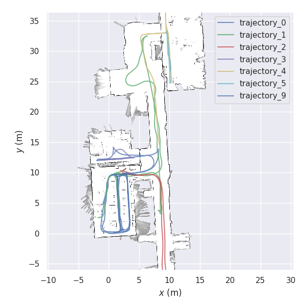
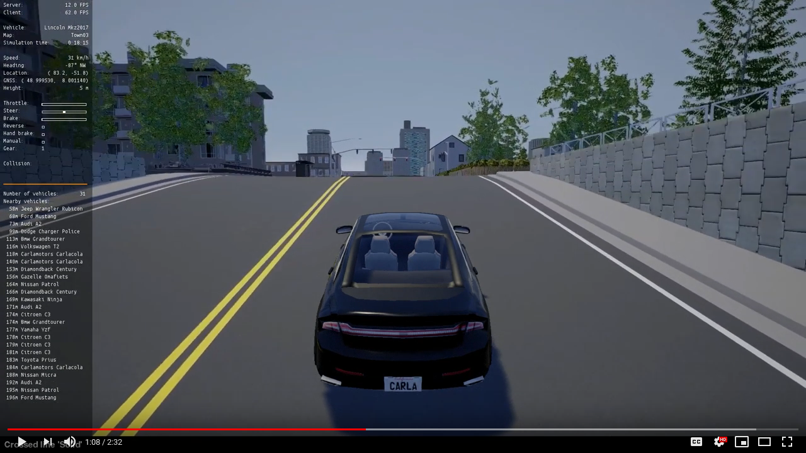

# 第45章 PPT：综合项目：城区自动驾驶

> 共 17 页，标注页码 · 图号与教学文档对应

---

## P1 标题页

# 第45章 综合项目：城区自动驾驶

- **课程定位：** 全课程收官章 · 综合实战
- **课时安排：** 2 课时（90 分钟）· 讲授 + 演示
- **仿真平台：** CARLA Town03 · Tesla Model 3
- **任务规模：** 1.8km 城区路线 · 6 组红绿灯 · 10+ NPC 车辆
- **先修章节：** 第 36–44 章全部内容

<!-- 旁白：各位同学好，欢迎来到全课程收官章《第45章 综合项目：城区自动驾驶》。本章是综合实战，在 CARLA Town03 仿真平台上用 Tesla Model 3 完成 1.8 公里城区路线，途经 6 组红绿灯与 10 辆以上 NPC 车辆，先修章节是第 36 到 44 章全部内容。建议怀抱整合心态学习：把前期所学感知、决策、规划、控制各模块组装成完整系统。 -->

---

## P2 学习目标

- **要点：** 完成本章学习后，你将能够：
- 综合运用第 36–44 章知识，搭建完整的城区自动驾驶系统
- 完成系统架构设计与模块间接口定义
- 在仿真中实现感知、定位、规划、控制的闭环联动
- 集成安全监控与故障降级处理机制
- 按验收标准完成系统评估、测试与现场演示
- 理解工程化项目从原型到验收的完整流程

<!-- 旁白：本页列出综合项目的学习目标：搭建完整系统、设计架构与接口、闭环联动、集成安全监控与故障降级，以及按验收标准完成评估与演示。目标不是单点算法而是工程集成：从原型到验收的完整流程。逐条对照自检完成度，即可判断本章是否真正收官。 -->

---

## P3 项目目标

- **要点：** 45.1.1 项目目标——在 CARLA Town03 中完成一次完整的城区自动驾驶

```
起点 A [-80, -10, 0]  ──── 1.8 km ────>  终点 B [130, -120, 0]
        │                                        │
   6 组红绿灯                              3 处人行横道
   动态交通流（10+ NPC）                    全程限速 30 km/h
```

- 车型：Tesla Model 3（CARLA 蓝图）
- 任务：从 A 点自主行驶至 B 点，全程无人工接管
- 考核：安全、舒适、合规三个维度


CARLA Town03 城区地图与 A→B 全局路线示意（来源：GitHub）

<!-- 旁白：本页项目目标：在 Town03 中从 A 点自主行驶到 B 点，全程无人工接管，考核安全、舒适、合规三个维度。ASCII 中起点终点坐标与 1.8 公里路程，途中 6 组红绿灯、3 处人行横道、10 辆以上 NPC，全程限速 30 公里。记住三词考核维度：安全零碰撞、舒适无急加速急刹、合规严格限速。地图图示为 A 到 B 全局路线。 -->

---

## P4 场景与传感器配置

- **要点：** 45.1.2 场景描述——城区混合交通是本项目最难的环境设定

| 场景要素 | 设定 | 难点 |
|---|---|---|
| 道路 | 城区双向车道 | 路口多、车道线复杂 |
| 交通流 | 10+ NPC 车辆随机出现 | 意图不可预测 |
| 红绿灯 | 6 组，含黄灯切换 | 识别与决策联动 |
| 行人 | 3 处人行横道 | 减速礼让逻辑 |

- 45.1.3 传感器配置（8 类）：RGB 相机、深度相机、语义分割相机、环视相机 ×4、32 线 LiDAR、GNSS、IMU、速度计
- 设计原则：感知冗余 + 定位冗余，任一单传感器失效不致系统瘫痪

<!-- 旁白：本页场景与传感器：城区双向车道、10 辆以上 NPC 随机出现、6 组带黄灯切换的红绿灯与 3 处人行横道，每个要素对应一个技术难点，如红绿灯考验识别与决策联动、人行横道考验减速礼让。传感器共 8 类含各类相机与 32 线 LiDAR 等，设计原则是感知与定位双冗余：任一单传感器失效不致系统瘫痪。 -->

---

## P5 完整软件栈

- **要点：** 45.2.1 系统架构——六层软件栈自底向上支撑闭环

```
┌──────────────────────────────────────────────┐
│  L6  安全监控（碰撞/TTC/接管/降级）            │
├──────────────────────────────────────────────┤
│  L5  规划层（全局路径 + 行为决策 + 局部轨迹）  │
├──────────────────────────────────────────────┤
│  L4  控制层（横向转向 + 纵向速度）             │
├──────────────────────────────────────────────┤
│  L3  感知层（目标检测/跟踪/红绿灯识别）        │
├──────────────────────────────────────────────┤
│  L2  定位层（GNSS/IMU 融合 + 车道级定位）      │
├──────────────────────────────────────────────┤
│  L1  传感器驱动 + CARLA 仿真接口（ros2 bridge）│
└──────────────────────────────────────────────┘
```

- 每层均为独立 ROS 2 节点包，可单独开发、测试、替换

<!-- 旁白：本页六层软件栈自底向上：L1 传感器驱动与 CARLA 桥接，L2 定位层融合 GNSS 与 IMU，L3 感知层做目标检测跟踪与红绿灯识别，L4 控制层分横向转向与纵向速度，L5 规划层含全局路径与局部轨迹，L6 安全监控贯穿。每层是独立 ROS 2 包，可单独开发测试，这是模块化集成的骨架。 -->

---

## P6 节点通信图

- **要点：** 45.2.2 节点间通信——以话题为主干、服务/动作为辅

| 节点 | 订阅 | 发布 |
|---|---|---|
| sensor_node | /carla/raw | /image_raw, /points, /imu, /gnss |
| perception_node | /image_raw, /points | /obstacles, /traffic_lights |
| localization_node | /imu, /gnss | /odom, /pose |
| planning_node | /pose, /obstacles | /trajectory |
| control_node | /trajectory | /vehicle_cmd |
| safety_node | 全部关键话题 | /e_stop, /degrade_level |

- 通信约定：感知→规划 10Hz，控制 50Hz，安全监控 50Hz

<!-- 旁白：本页节点通信图，六节点分工清晰：sensor_node 输出图像点云 IMU 与 GNSS，perception_node 输出障碍物与红绿灯，localization_node 发布里程计与位姿，planning_node 发轨迹，control_node 收轨迹发控制指令，safety_node 订阅全部关键话题发布急停。频率约定：感知到规划 10 赫兹，控制 50 赫兹，安全监控 50 赫兹。 -->

---

## P7 数据流与官方范式

- **要点：** 45.2.3 数据流时序——各层频率错配必须经缓冲队列解耦

```
传感器 20Hz → 感知 10Hz → 定位 20Hz → 规划 10Hz → 控制 50Hz → 安全 50Hz
```

- 频率不一致时用 message_filters 或时间戳对齐，禁止跨层直连
- 45.2.4 官方 Capstone 范式：参考 Udacity/CARLA capstone 项目结构——感知、规划、控制三件套 + 主题式话题命名
- 本章项目即该范式的 ROS 2 化实现

<!-- 旁白：本页数据流与时序：波形图显示各层频率从传感器的 20 赫兹到控制安全的 50 赫兹不等，频率错配必须经缓冲队列解耦，禁止跨层直连，可用 message_filters 或时间戳对齐。本项目的接口风格参考 Udacity CARLA Capstone 范式：感知、规划、控制三件套加主题式命名，是官方项目结构的 ROS 2 化实现。 -->

---

## P8 话题接口协议

- **要点：** 45.3.1 接口先于实现——先冻结话题与消息类型再动手写节点

| 话题 | 消息类型 | 频率 | 说明 |
|---|---|---|---|
| /trajectory | nav_msgs/Path | 10Hz | 局部轨迹 |
| /obstacles | derived_object_msgs | 10Hz | 障碍物列表 |
| /pose | geometry_msgs/PoseStamped | 20Hz | 自车位姿 |
| /vehicle_cmd | carla_msgs/CarlaEgoVehicleControl | 50Hz | 控制指令 |
| /e_stop | std_msgs/Bool | 事件 | 急停触发 |

- 新增话题需走评审：命名、类型、频率、QoS 四要素齐全

<!-- 旁白：本页话题接口协议：五个关键话题及其消息类型与频率，例如 /trajectory 用 nav_msgs/Path 10 赫兹、/vehicle_cmd 用 carla_msgs 50 赫兹、/e_stop 事件触发。接口先于实现是本章工程纪律：先冻结话题与消息类型再写节点，新增话题须经评审，命名、类型、频率、QoS 四要素齐全。 -->

---

## P9 坐标帧与依赖契约

- **要点：** 45.3.2 坐标帧约定——统一 TF 树是团队协作的前提

```
map ── odom ── base_link ── camera_rgb
                          ├ camera_depth
                          ├ lidar
                          └ imu
```

- map→odom 由定位模块发布，odom→base_link 由里程计发布
- 45.3.3 依赖契约（5 条）：消息类型只增不改；接口变更需全员同步；坐标帧命名遵循 REP-105；第三方库版本锁定；每组对外只暴露约定话题

<!-- 旁白：本页坐标帧与依赖契约：TF 树从 map 到 odom 到 base_link 再到各传感器帧，map 到 odom 由定位模块发布，odom 到 base_link 由里程计发布。五条契约是团队协作前提：消息类型只增不改、接口变更全员同步、坐标帧遵循 REP-105、第三方库版本锁定、只暴露约定话题。这些约束避免联调时互相踩接口。 -->

---

## P10 工程化组织与接口契约实践

- **要点：** 45.3.4/45.3.5 把接口契约落到工程层面

- 工程组织：每模块独立 ROS 2 包，`launch/` 统一入口，参数集中在 YAML
- 生命周期节点（lifecycle）管理启停顺序，避免话题半途丢失
- `ros2 doctor` + 启动自检脚本：开机 30 秒内验证全部关键话题有数据
- 接口契约实践：msg/srv 定义放独立 `interfaces` 包，编译期强制一致
- 评审方式：接口变更必须提交 PR 并通知全部依赖方

<!-- 旁白：本页工程化组织把接口契约落到工程层面：每模块独立 ROS 2 包、launch 统一入口、参数集中 YAML；生命周期节点管理启停顺序，避免话题半途丢失；启动自检脚本在 30 秒内验证关键话题有数据。消息定义放独立 interfaces 包实现编译期强制一致，接口变更提交 PR 并通知全部依赖方。 -->

---

## P11 迭代开发流程

- **要点：** 45.4 四阶段迭代——每阶段有明确目标与交付物

| 阶段 | 目标 | 交付物 |
|---|---|---|
| 一：单模块 | 各节点独立跑通 | 模块级单元测试 |
| 二：链路打通 | 传感→控制闭环联通 | 直道低速演示 |
| 三：功能完整 | 红灯停车/避障/横道礼让 | 全功能 1.8km 跑通 |
| 四：优化验收 | 指标达标 + 演示打磨 | 验收报告 + 现场演示 |

- 每阶段结束做一次集成回归，防止后端修改破坏前端功能

<!-- 旁白：本页展示四阶段迭代开发流程：单模块先独立跑通交付单元测试，链路打通实现传感到控制闭环联通交付直道低速演示，功能完整实现红灯停车避障礼让交付全功能跑通，最后优化验收交付验收报告与现场演示。每阶段结束做一次集成回归，防止后端修改破坏前端功能。 -->

---

## P12 验收指标与质量标准

- **要点：** 45.5.1 必达指标——全部达标才算验收通过

| 指标 | 必达标准 |
|---|---|
| 轨迹跟踪误差 | 直道 < 0.3m，弯道 < 0.5m |
| 碰撞次数 | 0 |
| 红灯停车 | 6 组红绿灯 100% 合规 |
| 端到端延迟 | 感知到控制 ≤ 150ms |
| 全程完成率 | A→B 无接管完成 |

- 45.5.2 质量标准：加速度平稳（无急加急减）、停车位置距停止线 0.5–2m、连续 3 次运行结果一致

<!-- 旁白：本页必达指标，全部达标才算验收通过：直道跟踪误差小于 0.3 米、弯道小于 0.5 米，碰撞次数零，6 组红绿灯 100% 合规，端到端延迟不大于 150 毫秒，A 到 B 无接管完成。质量标准还要加速度平稳、停车位置距停止线 0.5 到 2 米、连续三次运行结果一致，体现可重复性。 -->

---

## P13 加分项与评分构成

- **要点：** 45.5.3 加分项与 45.5.4 评分构成——在必达基础上争取更高上限

- 加分项（任选）：
  - 故障注入下的安全降级演示（第 44 章内容落地）
  - 变道超车等行为决策扩展
  - 自动生成运行评估报告与可视化
- 评分构成（总分 100）：

```
功能完成(40) + 安全指标(25) + 代码质量(15) + 演示答辩(10) + 加分项(10)
```

- 加分不超过 10 分，总分封顶 100

<!-- 旁白：本页在必达指标之上给加分项：故障注入下的安全降级演示把第 44 章内容落地、变道超车等行为决策扩展、自动生成评估报告与可视化，任选即可。评分构成满分 100：功能完成 40 分、安全指标 25 分、代码质量 15 分、演示答辩 10 分、加分项 10 分且封顶 100。 -->

---

## P14 演示验收流程

- **要点：** 45.5.5 演示验收——现场运行 + 答辩，共 45 分钟内完成

| 环节 | 时长 | 内容 |
|---|---|---|
| 系统启动 | 15 分钟 | 从零启动 + 话题自检 |
| 功能演示 | 5 分钟 | 指定场景一键复现 |
| 全程运行 | 10 分钟 | A→B 无接管行驶 |
| 答辩 | 5 分钟 | 架构讲解与提问 |
| 评分汇总 | 10 分钟 | 指标复核与评议 |

- 45.5.6 验收文化：验收不是考试，是用外部标准检验系统真实水平
- 演示数据全程录屏留档，作为回归测试基线


ScenarioRunner 场景运行与评估演示画面（来源：GitHub）

<!-- 旁白：本页演示验收流程共 45 分钟：系统启动 15 分钟从零启动加话题自检，功能演示 5 分钟一键复现指定场景，全程运行 10 分钟无接管行驶，答辩 5 分钟架构讲解，评分汇总 10 分钟复核评议。验收文化强调验收不是考试，而是用外部标准检验真实水平；演示全程录屏留档作回归基线。 -->

---

## P15 本章要点

- **要点：** 综合项目的核心是「接口先行、迭代推进、指标说话」
- 架构设计先行：六层软件栈、节点分工、话题协议全部冻结后再编码
- 接口即契约：消息类型、坐标帧、频率、QoS 是团队协作的公共语言
- 数据流解耦：不同频率模块间必须用缓冲与时间戳对齐
- 四阶段迭代：单模块 → 链路打通 → 功能完整 → 优化验收
- 验收靠指标：碰撞 0、红灯 100%、误差达标、延迟 ≤ 150ms
- 安全能力是第 36–44 章所有知识的最终落点

<!-- 旁白：本页总结综合项目核心三句话：接口先行、迭代推进、指标说话。架构设计先行要求六层栈、节点分工与话题协议冻结后再编码；接口即契约，消息类型、坐标帧、频率、QoS 是团队公共语言；数据流解耦靠缓冲与时间戳对齐；四阶段迭代逐级推进；验收靠碰撞零、红灯百分之百与延迟达标。安全能力是前九章知识的最终落点。 -->

---

## P16 练习题

- **要点：** 课后完成以下任务，巩固综合项目能力
- 在 Town03 中绘制并发布 A→B 的全局路径，验证路径点数量与平滑度
- 实现红灯停车逻辑，并构造一个黄灯突变的边界用例进行测试
- 为控制模块注入 200ms 延迟，观察轨迹跟踪误差变化并给出结论
- 编写 launch 文件实现一键启动全部节点，并用 `ros2 doctor` 输出自检报告
- 选做：在验收演示中加入故障降级流程，编写对应的评估报告

<!-- 旁白：本页课后任务巩固综合能力：发布 A 到 B 全局路径并验证平滑度，实现红灯停车并构造黄灯突变边界用例，注入 200 毫秒延迟观察跟踪误差变化，写 launch 一键启动并用 ros2 doctor 自检。选做在验收演示中加入第 44 章故障降级流程并写评估报告，正好对应加分项。 -->

---

## P17 课程总结

- **要点：** 全课程回顾——从 ROS 2 基础到城区自动驾驶综合项目
- 基础篇：掌握节点、话题、服务、动作与 launch 系统等 ROS 2 核心机制
- 仿真篇：搭建 CARLA + ROS 2 联合仿真环境，打通传感器数据链路
- 系统篇：完成感知、定位、规划、控制四大模块的原理学习与工程实现
- 安全篇：建立碰撞检测、故障注入、降级策略与指标评估的完整安全体系
- 实战篇：以 1.8km 城区自动驾驶项目完成全部知识的综合验收
- 寄语：自动驾驶是系统工程——希望这套方法学伴随你的下一个项目

<!-- 旁白：本页是全课程收尾：基础篇掌握节点、话题、服务、动作与 launch 机制，仿真篇搭建 CARLA 与 ROS 2 联合环境打通数据链路，系统篇完成感知、定位、规划、控制四大模块，安全篇建立碰撞检测、故障注入、降级与评估体系，实战篇以 1.8 公里项目收关。自动驾驶是系统工程，希望这套方法学伴随大家的后续项目。 -->