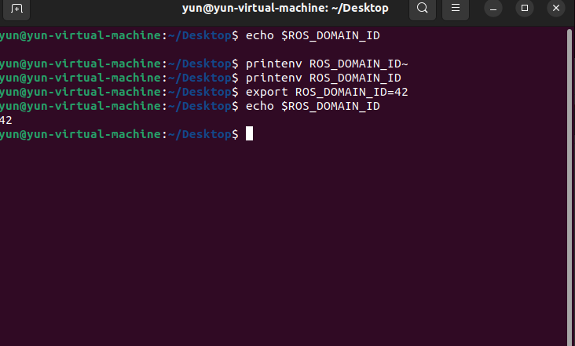
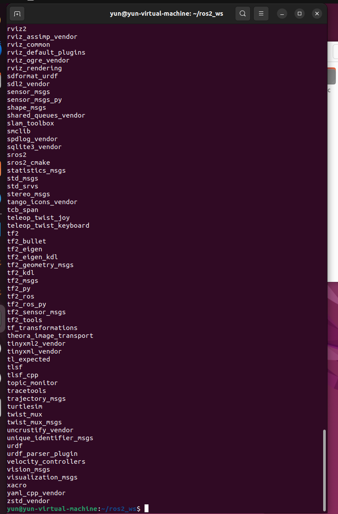
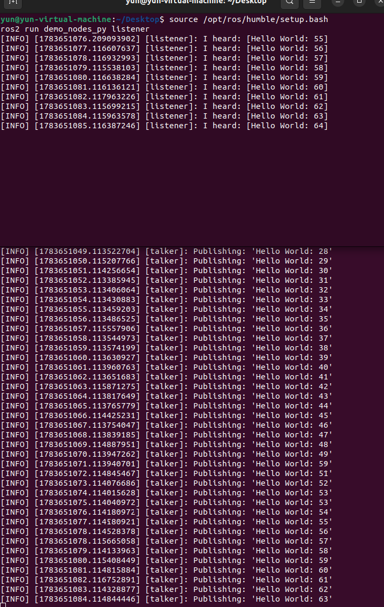

# 第1章：ROS 2 概述与架构设计

> **课程**：ROS2 Python 编程  
> **章节**：第1章  
> **课时**：2 课时（90 分钟）  
> **教学方式**：讲授 + 演示  

---

## 1.1 ROS 2 发展背景与设计目标

### 知识点 1.1.1：从 ROS 1 到 ROS 2

ROS（Robot Operating System）最初由 Willow Garage 于 2007 年发布，旨在为机器人软件开发提供统一的分布式框架。ROS 1 在学术界和工业界获得了广泛采用，但随着应用场景从实验室扩展到工业级产品，ROS 1 的局限性逐渐暴露：

- **单点故障**：Master 节点（roscore）是所有通信的中枢，一旦崩溃整个系统瘫痪
- **实时性不足**：基于 TCP 的通信无法满足硬实时控制需求
- **安全性缺失**：无内置的认证、授权和加密机制
- **嵌入式支持弱**：对资源受限的微控制器支持有限

2014 年，Open Robotics 启动了 ROS 2 项目，完全重新设计了通信架构。

### 知识点 1.1.2：ROS 2 版本演进

| 版本名 | 代号 | 发布日期 | 状态 |
|--------|------|---------|------|
| Ardent | Apalone | 2017.12 | EOL |
| Bouncy | Bolson | 2018.07 | EOL |
| Crystal | Clemmys | 2018.12 | EOL |
| Dashing | Diademata | 2019.05 | EOL |
| Eloquent | Elusor | 2019.11 | EOL |
| Foxy | Fitzroy | 2020.06 | EOL |
| Galactic | Geochelone | 2021.05 | EOL |
| **Humble** | Hawksbill | 2022.05 | **LTS (推荐)** |
| Iron | Irwini | 2023.05 | EOL |
| **Jazzy** | Jalisco | 2024.05 | **LTS (最新)** |

本课程基于 **ROS 2 Humble** (Ubuntu 22.04) 或 **ROS 2 Jazzy** (Ubuntu 24.04)。

---

## 1.2 DDS 中间件架构

### 知识点 1.2.1：DDS 概念模型

DDS（Data Distribution Service）是 OMG 制定的分布式实时通信标准。ROS 2 采用 DDS 替换了 ROS 1 的自定义 TCP/UDP 协议。

**DDS 核心概念对应关系**：

```
DDS 概念          →    ROS 2 概念
━━━━━━━━━━━━━━━━━━━━━━━━━━━━━━━━━
DomainParticipant →    Node (通过 context)
DataWriter        →    Publisher
DataReader        →    Subscription
Topic             →    Topic
Domain            →    ROS_DOMAIN_ID
```

```
图 1-1：DDS 去中心化架构
┌─────────────┐                    ┌─────────────┐
│   Node A    │                    │   Node B    │
│             │                    │             │
│ ┌─────────┐ │    DDS Domain     │ ┌─────────┐ │
│ │Publisher│ │◄════Topic════════►│ │Subscribe│ │
│ └─────────┘ │    (自动发现)      │ └─────────┘ │
└─────────────┘                    └─────────────┘
        │                                  │
        └────────── 去中心化 ───────────────┘
               (无Master节点)
```

说明：ROS 2 使用 DDS 的自动发现机制，节点可直接对等通信，无需中心化的 Master 节点。

### 知识点 1.2.2：RMW 抽象层

ROS 2 通过 RMW（ROS MiddleWare）接口抽象不同的 DDS 实现：

```
┌──────────────────┐
│  rclcpp / rclpy  │  ← 用户代码 API
├──────────────────┤
│       RCL        │  ← ROS Client Library
├──────────────────┤
│       RMW        │  ← 中间件抽象层 (可替换)
├──────────────────┤
│  Fast DDS /      │
│  Cyclone DDS /   │  ← DDS 实现 (可切换)
│  RTI Connext     │
├──────────────────┤
│   UDP / SHMEM    │  ← 传输层
└──────────────────┘
```

图 1-2：ROS 2 分层架构。RMW 层允许用户在不修改应用代码的情况下切换不同的 DDS 实现。

---

## 1.3 Quality of Service (QoS) 策略

### 知识点 1.3.1：QoS 策略维度

QoS 定义了数据传输的质量保证，ROS 2 提供以下核心策略：

| 策略维度 | 选项 | 含义 |
|---------|------|------|
| **Reliability** | RELIABLE / BEST_EFFORT | 可靠传输（重传） / 尽力传输（允许丢包） |
| **Durability** | VOLATILE / TRANSIENT_LOCAL | 不保存历史 / 保存历史给后来者 |
| **History** | KEEP_LAST(n) / KEEP_ALL | 保留最后 n 条 / 保留所有 |
| **Depth** | 正整数 | 队列深度 |
| **Deadline** | 时间间隔 | 消息更新的最大间隔 |
| **Lifespan** | 时间间隔 | 消息的有效期 |
| **Liveliness** | AUTOMATIC / MANUAL | 发布者存活检测 |

### 知识点 1.3.2：预定义 QoS 配置文件

```python
# ROS 2 预定义 QoS 配置文件
from rclpy.qos import QoSProfile, qos_profile_sensor_data, qos_profile_services_default

# 传感器数据：高频，允许丢包
qos_sensor = qos_profile_sensor_data  # BEST_EFFORT, KEEP_LAST(5)

# 服务通信：可靠传输
qos_service = qos_profile_services_default  # RELIABLE, KEEP_LAST(10)

# 自定义 QoS
qos_custom = QoSProfile(
    reliability=rclpy.qos.ReliabilityPolicy.RELIABLE,
    durability=rclpy.qos.DurabilityPolicy.TRANSIENT_LOCAL,
    depth=10
)
```

---

## 1.4 节点生命周期管理

### 知识点 1.4.1：生命周期状态机

ROS 2 为节点引入了标准化的生命周期状态机：

```
                              configure()
Unconfigured ─────────────────────────► Inactive
     ▲                                      │
     │                                      │ activate()
     │ cleanup()                            ▼
     │                                   Active
     │                                      │
     └────────────────── deactivate() ──────┘

           shutdown() (从任意状态进入 Finalized)
```

图 1-3：ROS 2 生命周期节点状态转换图。通过状态机管理节点的初始化和资源分配，确保确定的启动和关闭流程。

### 知识点 1.4.2：生命周期 Python API

```python
import rclpy
from rclpy.lifecycle import LifecycleNode, State, TransitionCallbackReturn

class MyLifecycleNode(LifecycleNode):
    def __init__(self):
        super().__init__('my_lifecycle_node')

    def on_configure(self, state: State):
        # 分配资源、设置参数
        self.get_logger().info('on_configure() called')
        return TransitionCallbackReturn.SUCCESS

    def on_activate(self, state: State):
        # 开始处理数据
        self.get_logger().info('on_activate() called')
        return TransitionCallbackReturn.SUCCESS

    def on_deactivate(self, state: State):
        # 停止处理
        self.get_logger().info('on_deactivate() called')
        return TransitionCallbackReturn.SUCCESS

    def on_cleanup(self, state: State):
        # 释放资源
        self.get_logger().info('on_cleanup() called')
        return TransitionCallbackReturn.SUCCESS
```

---

## 1.5 安装与环境搭建

### 知识点 1.5.1：安装 ROS 2 Humble

```bash
# 设置 locale
sudo apt update && sudo apt install locales
sudo locale-gen en_US en_US.UTF-8
sudo update-locale LC_ALL=en_US.UTF-8 LANG=en_US.UTF-8
export LANG=en_US.UTF-8

# 添加 ROS 2 仓库
sudo apt install software-properties-common
sudo add-apt-repository universe
sudo apt update && sudo apt install curl -y
sudo curl -sSL https://raw.githubusercontent.com/ros/rosdistro/master/ros.key \
  -o /usr/share/keyrings/ros-archive-keyring.gpg

echo "deb [arch=$(dpkg --print-architecture) signed-by=/usr/share/keyrings/ros-archive-keyring.gpg] \
  http://packages.ros.org/ros2/ubuntu $(. /etc/os-release && echo $UBUNTU_CODENAME) main" \
  | sudo tee /etc/apt/sources.list.d/ros2.list > /dev/null

# 安装 ROS 2 Humble 完整版
sudo apt update
sudo apt install ros-humble-desktop-full

# 安装开发工具
sudo apt install python3-colcon-common-extensions python3-rosdep python3-vcstool
```

### 知识点 1.5.2：配置开发环境

```bash
# 将 ROS 2 环境变量添加到 ~/.bashrc
echo "source /opt/ros/humble/setup.bash" >> ~/.bashrc
source ~/.bashrc

# 初始化 rosdep（用于安装包依赖）
sudo rosdep init
rosdep update
```

### 知识点 1.5.3：工作空间与 colcon 构建

```bash
# 创建工作空间
mkdir -p ~/ros2_ws/src
cd ~/ros2_ws

# 编译工作空间
colcon build --symlink-install

# 加载工作空间环境
source install/setup.bash

# 验证安装
ros2 run demo_nodes_cpp talker
# 在另一个终端：
ros2 run demo_nodes_py listener
```

---

## 1.6 本章小结

本章核心知识点回顾：

1. ROS 2 是为解决 ROS 1 的单点故障、实时性和安全性问题而重新设计的
2. DDS 中间件提供了去中心化的自动发现通信，通过 RMW 层实现可替换
3. QoS 策略提供细粒度的通信质量保证（Reliability、Durability、History 等）
4. 生命周期节点使用状态机管理初始化、激活和关闭流程
5. ROS 2 Humble/Jazzy 通过 apt 安装，colcon 是标准构建工具

---

## 1.7 练习题

**练习 1.1**：简述 ROS 1 的三个主要局限性和 ROS 2 对应的解决方案。

ros1依赖master，存在中心节点————ros2使用dds通信机制，节点之间可以自动发现彼此
ros1不太能实时控制并传输，通信策略单一————Qos通信，根据不同数据类型设置可靠性队列深度。。。
ros1多机器人、多实验环境相互干扰————通过ROS_DOMAIN_ID划分通信领域

**练习 1.2**：DDS 域 ID（ROS_DOMAIN_ID）的作用是什么？如果两台机器上的域 ID 不同，它们的节点能通信吗？

作用是隔离通信环境。id不同一般不会互相发现和通信

**练习 1.3**：以下 QoS 配置能否匹配通信？  

- Publisher: RELIABLE, VOLATILE  
- Subscriber: BEST_EFFORT, VOLATILE
可以。Publisher 使用 RELIABLE，提供可靠传输能力；Subscriber 使用 BEST_EFFORT，只要求尽力接收，因此发布者能力满足订阅者需求。两者 Durability 都为 VOLATILE，也能够匹配。

**练习 1.4**：查看当前 ROS_DOMAIN_ID 环境变量值，将其修改为 42 并验证。



**练习 1.5**：创建一个 ROS 2 工作空间，使用 colcon build 编译，并验证 setup.bash 加载。



**练习 1.6**：运行 talker/listener 示例节点，使用 `ros2 node list` 和 `ros2 topic list` 查看运行状态。


