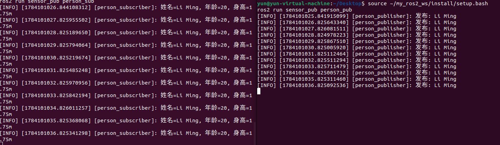
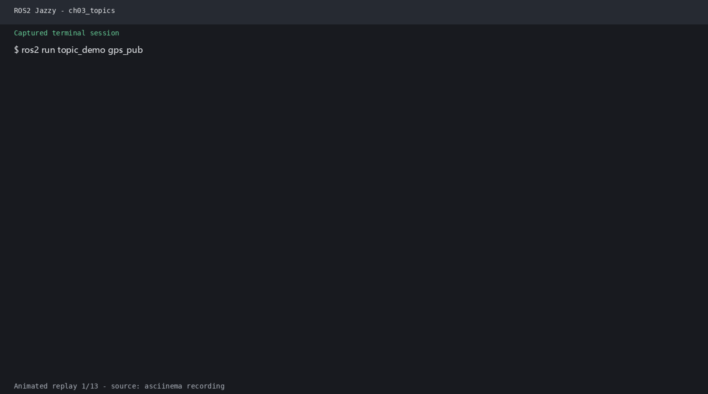

# 第3章：话题通信（Topics）

> **课程**：ROS2 Python 编程  
> **章节**：第3章  
> **课时**：2 课时（90 分钟）  
> **教学方式**：讲授 + 演示  

---

## 3.1 发布-订阅模型原理

### 知识点 3.1.1：话题通信架构

话题通信是 ROS 2 中最基本的通信方式，采用**异步、多对多**的发布-订阅模式：

```
Publisher 1 ─────┐
                 ├──►  Topic: "/camera/image"  ──► Subscriber A
Publisher 2 ─────┘                                  Subscriber B
                                                    Subscriber C
```

图 3-1：话题通信的多对多发布-订阅模型。发布者与订阅者完全解耦，互不知晓对方的存在。

### 知识点 3.1.2：Python Publisher API

```python
import rclpy
from rclpy.node import Node
from std_msgs.msg import String           # 标准消息类型

class TalkerNode(Node):
    def __init__(self):
        super().__init__('talker')
        # 创建发布者：话题名 "chatter"，队列深度 10
        self.publisher = self.create_publisher(
            String,                        # 消息类型
            'chatter',                     # 话题名称
            10)                            # QoS 队列深度
        # 创建定时器：每 0.5 秒发布一次
        self.timer = self.create_timer(0.5, self.timer_callback)
        self.count = 0

    def timer_callback(self):
        msg = String()                     # 创建消息对象
        msg.data = f'Hello ROS 2: {self.count}'  # 设置消息内容
        self.publisher.publish(msg)        # 发布消息
        self.get_logger().info(f'发布: "{msg.data}"')
        self.count += 1

def main(args=None):
    rclpy.init(args=args)
    rclpy.spin(TalkerNode())
    rclpy.shutdown()
```

程序 3-1：Python Publisher 完整示例。`create_publisher` 的三个核心参数：消息类型、话题名称、QoS 队列深度。

### 知识点 3.1.3：Python Subscriber API

```python
from std_msgs.msg import String

class ListenerNode(Node):
    def __init__(self):
        super().__init__('listener')
        # 创建订阅者：话题名 "chatter"，队列深度 10
        self.subscription = self.create_subscription(
            String,                        # 消息类型
            'chatter',                     # 话题名称
            self.listener_callback,        # 回调函数
            10)                            # QoS 队列深度

    def listener_callback(self, msg):
        """收到消息时自动调用此函数"""
        self.get_logger().info(f'收到: "{msg.data}"')

def main(args=None):
    rclpy.init(args=args)
    rclpy.spin(ListenerNode())
    rclpy.shutdown()
```

程序 3-2：Python Subscriber 完整示例。`create_subscription` 的回调函数签名必须为 `callback(msg)`，`msg` 为消息对象。

### 知识点 3.1.4：官方要点——编写发布者与订阅者

官方 Python 教程的 talker/listener 是核心范例：发布端用 `create_publisher(String, 'topic', 10)` 创建发布者，`create_timer(0.5, timer_callback)` 以 0.5 秒周期发布；订阅端用 `create_subscription(String, 'topic', listener_callback, 10)` 注册回调。教程特别指出两点：一是回调用例中的 `msg` 对象在回调返回后即失效，切勿保存引用；二是 `String` 属于 `std_msgs`，自定义类型需要在接口包中定义（见 3.3 节）。

初学者最常见的错误是把 `create_timer` 写成 while 循环加 `time.sleep`——这会导致节点阻塞、无法处理回调，官方教程通过「timer_callback + spin」的模式强调回调驱动的编程范式。对比 C++ 版本（`rclcpp`）可以体会到，相同话题两端可用不同语言实现，跨语言互通是 ROS 2 中间件层的天然能力。

---

## 3.2 标准消息类型

### 知识点 3.2.1：常用标准消息

ROS 2 提供丰富的标准消息类型，按功能包分类：

```
std_msgs/                 # 基础类型
├── String                # 字符串 (data: string)
├── Int32, Int64          # 整数
├── Float32, Float64      # 浮点数
├── Bool                  # 布尔值
├── Empty                 # 空消息（用作信号）
└── Header                # 标准头 (stamp: time, frame_id: string)

sensor_msgs/              # 传感器消息
├── Image                 # 图像（rgb, depth）
├── LaserScan             # 激光雷达扫描
├── PointCloud2           # 3D 点云
├── Imu                   # IMU 数据
└── Joy                   # 手柄数据

geometry_msgs/            # 几何消息
├── Twist                 # 速度指令 (linear + angular)
├── Pose                  # 位姿 (position + orientation)
├── Vector3               # 三维向量
└── Quaternion            # 四元数
```

### 知识点 3.2.2：查看消息定义

```bash
# 查看消息类型定义
ros2 interface show std_msgs/msg/String
# 输出：string data

ros2 interface show geometry_msgs/msg/Twist
# 输出：
# Vector3 linear
#   float64 x
#   float64 y
#   float64 z
# Vector3 angular
#   float64 x
#   float64 y
#   float64 z

# 查看消息属性
ros2 interface proto std_msgs/msg/String
# 输出：string data
```

### 知识点 3.2.3：官方要点——话题模型与命令行工具

官方 Understanding ROS 2 topics 教程以小乌龟记乌龟位置为例说明：话题（Topic）是节点之间传递消息的通道，消息类型是通信双方的唯一协议，发布者与订阅者互不知晓对方存在。Articulated Robotics 用「广播电台」作类比——发布者只负责播音，订阅者只负责收听，频道（话题名）与节目单（消息类型）必须一致才能收到内容。

教程要求掌握的话题命令与本章 3.2 节完全一致：`ros2 topic list -t`（含类型）、`ros2 topic echo`（查看消息流）、`ros2 topic info`（查看发布/订阅计数与 QoS）、`ros2 topic hz`（测频率）、`ros2 topic bw`（测带宽）。其中 `info` 输出的 QoS 行是排查「订阅不到数据」问题的关键——若发布端为 RELIABLE 而订阅端为 BEST_EFFORT，传感器数据可能通、控制指令可能丢，这正是本章练习 3.5 的实验动机。

---

## 3.3 自定义消息接口

### 知识点 3.3.1：创建自定义 .msg 文件

自定义消息接口需要单独创建一个包（仅支持 CMake 构建）：

```
custom_interfaces/
├── CMakeLists.txt
├── package.xml
└── msg/
    └── SensorData.msg     # 自定义消息定义文件
```

```cmake
# CMakeLists.txt 关键配置
cmake_minimum_required(VERSION 3.8)
project(custom_interfaces)

find_package(rosidl_default_generators REQUIRED)

# 声明消息文件
rosidl_generate_interfaces(${PROJECT_NAME}
  "msg/SensorData.msg"
)
```

```python
# msg/SensorData.msg 内容
float64 temperature    # 温度 (℃)
float64 humidity       # 湿度 (%)
float64 pressure       # 气压 (hPa)
string device_id       # 设备ID
```

### 知识点 3.3.2：在 Python 中使用自定义消息

```python
# 在 package.xml 中添加依赖
# <exec_depend>custom_interfaces</exec_depend>

from custom_interfaces.msg import SensorData

# 创建并发布自定义消息
msg = SensorData()
msg.temperature = 25.5
msg.humidity = 60.0
msg.pressure = 1013.25
msg.device_id = 'sensor_01'
self.publisher.publish(msg)
```

### 知识点 3.3.3：官方要点——自定义消息类型与接口包

官方 Creating custom msg and srv files 教程以自定义消息为例，演示完整的接口包工作流：在 `msg/` 目录编写 `.msg` 文件（如 `Person.msg`：`string name, uint8 age, float32 height`），在 `package.xml` 声明 `rosidl_default_generators` 依赖，在 `CMakeLists.txt` 调用 `rosidl_generate_interfaces()`，编译后即可用 `ros2 interface show` 查看、被其他包 `import`。

值得注意的是，ROS 2 的接口定义语言（IDL）支持默认值、数组与嵌套类型，`.msg` 中还允许引用其他接口包的类型（如 `geometry_msgs/Point position`）。这与本章 3.3 节及练习 3.3 自定义 `Person.msg` 的流程一致；Articulated Robotics 强调接口包应单独建包、独立编译，避免「接口改动导致功能包连锁重编译」的浪费。

---

## 3.4 QoS 配置实战

### 知识点 3.4.1：QoS 兼容性规则

```
           Publisher ╲ Subscriber │ RELIABLE │ BEST_EFFORT
           ───────────────────────┼──────────┼─────────────
           RELIABLE               │    ✓     │     ✓
           BEST_EFFORT            │    ✗     │     ✓
```

图 3-2：QoS Reliability 兼容性矩阵。Publisher 的可靠级别必须 >= Subscriber 的可靠级别。

### 知识点 3.4.2：Python 中配置 QoS

```python
from rclpy.qos import QoSProfile, ReliabilityPolicy, DurabilityPolicy, HistoryPolicy

# 方式1：使用预定义配置
from rclpy.qos import qos_profile_sensor_data
self.publisher = self.create_publisher(
    Image, 'camera/image', qos_profile_sensor_data)

# 方式2：自定义 QoS
custom_qos = QoSProfile(
    reliability=ReliabilityPolicy.BEST_EFFORT,   # 传感器数据可丢包
    durability=DurabilityPolicy.VOLATILE,        # 不保存历史
    history=HistoryPolicy.KEEP_LAST,             # 保留最后 N 条
    depth=5)                                     # 队列深度 5

self.subscription = self.create_subscription(
    LaserScan, 'scan', self.callback, custom_qos)
```

### 知识点 3.4.3：官方要点——QoS 深入：可靠性、历史深度与生命周期

官方 About QoS 页面定义了五类策略：可靠性（Reliability，RELIABLE 保证送达/BEST_EFFORT 尽力而为）、历史记录（History，KEEP_LAST + depth 队列长度或 KEEP_ALL）、持久性（Durability，消息是否在节点迟到时补发）、期限（Deadline）与活跃度（Liveness）。ROS 2 还公开预置了三种默认档案：`sensor_data`（BEST_EFFORT + KEEP_LAST(5)，适合激光、图像）、`system_default`（RELIABLE + KEEP_LAST(10)）、`params`（参数用）。

The Construct 的课程用「电话通话 vs 对讲机」比喻两种可靠性：控制指令像电话需要保证接通（RELIABLE），传感器流像对讲机一条条播报，丢一条接着听（BEST_EFFORT）。若日志出现 `Dropped X messages` 或 `Incompatible QoS policies` 警告，即代表两端 QoS 不兼容——`ros2 topic info -v` 可直接查看双方的 QoS 详情用于排障。

---

## 3.5 多线程执行器与回调组

### 知识点 3.5.1：执行器类型

```python
from rclpy.executors import SingleThreadedExecutor, MultiThreadedExecutor

# 单线程执行器（默认）：顺序执行所有回调
executor = SingleThreadedExecutor()
executor.add_node(node)
executor.spin()

# 多线程执行器：并行执行回调
executor = MultiThreadedExecutor(num_threads=4)  # 4 个工作线程
executor.add_node(node)
executor.spin()
```

### 知识点 3.5.2：回调组

```python
from rclpy.callback_groups import MutuallyExclusiveCallbackGroup, ReentrantCallbackGroup

# 互斥回调组：组内回调串行执行（默认行为）
group1 = MutuallyExclusiveCallbackGroup()

# 可重入回调组：组内回调可并行执行
group2 = ReentrantCallbackGroup()

# 将订阅者绑定到指定回调组
self.sub = self.create_subscription(
    Image, 'camera', self.callback, 10,
    callback_group=group2)
```

---

## 3.6 本章小结

本章的核心知识点包括六个方面：话题通信采用异步多对多的发布-订阅模型，发布者与订阅者完全解耦；`create_publisher(msg_type, topic, qos)` 创建发布者，`create_subscription(msg_type, topic, callback, qos)` 创建订阅者；ROS 2 提供丰富的标准消息类型（std_msgs、sensor_msgs、geometry_msgs 等）；自定义消息接口需要在独立的 CMake 包中定义 .msg 文件；QoS 兼容性取决于可靠性策略，RELIABLE 发布者可与 BEST_EFFORT 订阅者通信，反之不行；多线程执行器和回调组可实现并行消息处理，提高吞吐量。

---

## 3.7 练习题

**练习 3.1**：编写 Publisher 节点发布 Twist 消息控制机器人运动，包含线速度和角速度设置。

**练习 3.2**：编写 Subscriber 节点订阅 /cmd_vel 话题，打印收到的速度指令。

**练习 3.3**：创建一个自定义消息接口包，定义包含姓名、年龄、身高字段的 Person.msg。

**练习 3.4**：基于 Person.msg 编写发布者和订阅者节点。

创建发布者：
nano ~/my_ros2_ws/src/sensor_pub/sensor_pub/person_publisher.py
输入：
import rclpy
from rclpy.node import Node
from sensor_interfaces.msg import Person


class PersonPublisher(Node):
    def __init__(self):
        super().__init__('person_publisher')
        self.publisher = self.create_publisher(Person, '/person_info', 10)
        self.timer = self.create_timer(1.0, self.publish_person)

    def publish_person(self):
        msg = Person()
        msg.name = 'Li Ming'
        msg.age = 20
        msg.height = 1.75
        self.publisher.publish(msg)
        self.get_logger().info(f'发布: {msg.name}')


def main(args=None):
    rclpy.init(args=args)
    rclpy.spin(PersonPublisher())
    rclpy.shutdown()
创建订阅者：
nano ~/my_ros2_ws/src/sensor_pub/sensor_pub/person_subscriber.py
输入：
import rclpy
from rclpy.node import Node
from sensor_interfaces.msg import Person


class PersonSubscriber(Node):
    def __init__(self):
        super().__init__('person_subscriber')
        self.subscription = self.create_subscription(
            Person, '/person_info', self.callback, 10)

    def callback(self, msg):
        self.get_logger().info(
            f'姓名={msg.name}, 年龄={msg.age}, 身高={msg.height:.2f}m')


def main(args=None):
    rclpy.init(args=args)
    rclpy.spin(PersonSubscriber())
    rclpy.shutdown()
在 sensor_pub/setup.py 中添加：
'person_pub = sensor_pub.person_publisher:main',
'person_sub = sensor_pub.person_subscriber:main',
检查、编译：
cd ~/my_ros2_ws/src/sensor_pub
python3 setup.py --name
cd ~/my_ros2_ws
colcon build --packages-select sensor_interfaces sensor_pub --symlink-install
source install/setup.bash
终端1：
source ~/my_ros2_ws/install/setup.bash
ros2 run sensor_pub person_sub
终端2：
source ~/my_ros2_ws/install/setup.bash
ros2 run sensor_pub person_pub

**练习 3.5**：测试 RELIABLE 和 BEST_EFFORT 兼容性，验证不同 QoS 组合下的通信结果。

·B
终端1
ros2 run topic_demo qos_pub
终端2
ros2 topic echo /qos_reliable --qos-reliability best_effort

**练习 3.6**：使用 MultiThreadedExecutor 同时运行 2 个 Publisher + 2 个 Subscriber，验证并发性能。

创建：
nano ~/my_ros2_ws/src/topic_demo/topic_demo/multi_topic_demo.py
输入：
import threading
import time

import rclpy
from rclpy.callback_groups import ReentrantCallbackGroup
from rclpy.executors import MultiThreadedExecutor, SingleThreadedExecutor
from rclpy.node import Node
from std_msgs.msg import String


class DemoPublisher(Node):
    def __init__(self, name, topic, label):
        super().__init__(name)
        self.publisher = self.create_publisher(String, topic, 10)
        self.label = label
        self.count = 0
        self.timer = self.create_timer(1.0, self.publish_message)

    def publish_message(self):
        msg = String()
        msg.data = f'{self.label}-{self.count}'
        self.publisher.publish(msg)
        self.count += 1


class DemoSubscriber(Node):
    def __init__(self, name, topic, label):
        super().__init__(name)
        self.label = label
        self.group = ReentrantCallbackGroup()
        self.subscription = self.create_subscription(
            String, topic, self.callback, 10,
            callback_group=self.group)

    def callback(self, msg):
        thread = threading.get_ident()
        start = time.monotonic()
        self.get_logger().info(
            f'{self.label} 开始 thread={thread}, msg={msg.data}')
        time.sleep(0.8)
        elapsed = time.monotonic() - start
        self.get_logger().info(
            f'{self.label} 结束 thread={thread}, 用时={elapsed:.2f}s')


def run(use_multi):
    rclpy.init()
    nodes = [
        DemoPublisher('publisher_a', '/multi_a', 'PUB-A'),
        DemoPublisher('publisher_b', '/multi_b', 'PUB-B'),
        DemoSubscriber('subscriber_a', '/multi_a', 'SUB-A'),
        DemoSubscriber('subscriber_b', '/multi_b', 'SUB-B'),
    ]
    executor = (
        MultiThreadedExecutor(num_threads=4)
        if use_multi else SingleThreadedExecutor()
    )
    for node in nodes:
        executor.add_node(node)
    try:
        executor.spin()
    except KeyboardInterrupt:
        pass
    finally:
        executor.shutdown()
        for node in nodes:
            node.destroy_node()
        rclpy.shutdown()


def main_single(args=None):
    run(False)


def main_multi(args=None):
    run(True)
在 topic_demo/setup.py 添加：
'executor_single = topic_demo.multi_topic_demo:main_single',
'executor_multi = topic_demo.multi_topic_demo:main_multi',
检查并编译：
cd ~/my_ros2_ws/src/topic_demo
python3 setup.py --name
cd ~/my_ros2_ws
colcon build --packages-select topic_demo --symlink-install
source install/setup.bash
先运行单线程：
ros2 run topic_demo executor_single
再运行多线程：
ros2 run topic_demo executor_multi
另开终端验证四个节点：
ros2 node list
应包含：
/publisher_a
/publisher_b
/subscriber_a
/subscriber_b

---

## 仿真结合实例（当前仓库）：订阅 Gazebo 机器人话题验证发布-订阅模型

### 目标与知识点对应

第3章讲解 Publisher/Subscriber 的异步多对多模型、自定义消息与 QoS。这里使用 `robot_sim_demo` 启动的 Gazebo 仿真作为真实数据源，订阅底盘的 `/cmd_vel`、里程计 `/odom`、激光雷达 `/scan`，直接观察"仿真 → Bridge → ROS 2 话题 → 你自己的订阅节点"这条链路，把第3章的 API 应用到真实传感器数据。

### 运行命令

```bash
source /opt/ros/jazzy/setup.bash
source install/setup.bash

# 终端 1：启动 Gazebo 并让机器人自动巡航，便于观察话题消息
ros2 launch robot_sim_demo gazebo2.launch.py gui:=true rviz:=true drive:=true

# 终端 2：直观查看传感器话题（对应 3.2 节 ros2 topic 工具）
ros2 topic list
ros2 topic echo /odom --once | head
ros2 topic info /scan
ros2 topic hz /camera/image_raw
```

在自己创建的订阅节点（参考 3.1.3 节 `ListenerNode` 模板）中订阅 `/scan`，把 `sensor_msgs/msg/LaserScan` 的 `angle_min`/`angle_max`/`ranges` 长度打印出来：

```python
self.sub = self.create_subscription(
    LaserScan, '/scan', self.cb, qos_profile_sensor_data)
```

### 需要观察到的现象

运行上述命令后应重点观察三类现象：其一，`/odom` 的 `position.x/y` 随时间变化（或在 `drive:=false` 时基本为 0），体现发布的持续消息流；其二，`ros2 topic info /scan` 显示 `sensor_msgs/msg/LaserScan` 与 "Publisher count: 1"，由 `gazebo2_bridge` 桥接（发布端来自 Gazebo 侧）；其三，你的订阅节点回调不断打印扫描帧，与 `ros2 topic hz` 测到的频率一致，验证 QoS 深度和传感器高频话题的订阅关系。

### 源码与相关位置

仿真入口位于 `src/robot_sim_demo/launch/gazebo2.launch.py`；桥接话题配置位于 `src/robot_sim_demo/config/gazebo2_bridge.yaml`（含 `/scan`、`/odom`、`/tf`、`/clock`）；相机内参发布器位于 `src/robot_sim_demo/robot_sim_demo/camera_info_publisher.py`（`/camera/camera_info`）；巡航驱动示例（订阅/发布 Twist 逻辑）位于 `src/robot_sim_demo/robot_sim_demo/patrol_driver.py`。

> 说明：`/scan` 等话题的桥接证据见 `lab_manuals/images/runtime/ch09_gazebo_headless.png`。



---

> 参考来源：
> - ROS 2 Documentation (Humble) —— Understanding ROS 2 topics：https://docs.ros.org/en/humble/Tutorials/Beginner-CLI-Tools/Understanding-ROS2-Topics.html
> - ROS 2 Documentation (Humble) —— Writing a simple publisher and subscriber (Python)：https://docs.ros.org/en/humble/Tutorials/Beginner-Client-Libraries/Writing-A-Simple-Py-Publisher-And-Subscriber.html
> - ROS 2 Documentation (Humble) —— About Quality of Service settings：https://docs.ros.org/en/humble/Concepts/About-Quality-of-Service-Settings.html
> - ROS 2 Documentation (Humble) —— Creating custom msg and srv files：https://docs.ros.org/en/humble/Tutorials/Beginner-Client-Libraries/Custom-ROS2-Interfaces.html
> - The Construct —— ROS 2 Basics in 5 Days：https://www.theconstructsim.com/
> - Articulated Robotics —— ROS 2 Basics 系列视频：https://www.youtube.com/@ArticulatedRobotics