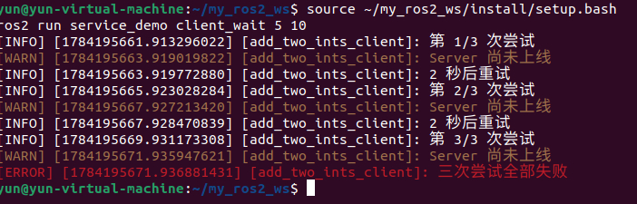

# 第4章：服务通信（Services）

> **课程**：ROS2 Python 编程  
> **章节**：第4章  
> **课时**：2 课时（90 分钟）  
> **教学方式**：讲授 + 演示  

---

## 4.1 请求-响应模型

### 知识点 4.1.1：服务通信架构

服务通信采用 **同步请求-响应** 模式，适用于需要立即获取结果的一次性操作：

```
Client                                   Server
  │                                         │
  │ ──── Request (call_id, args) ────────►  │
  │                                         │ process_request()
  │ ◄──── Response (call_id, result) ────   │
  │                                         │
```

图 4-1：服务通信请求-响应时序图。一个 Server 可并发处理多个 Client 请求。

### 知识点 4.1.2：服务接口定义 (.srv 文件)

```python
# AddTwoInts.srv — 两整数相加服务
int64 a                  # 请求：第一个加数
int64 b                  # 请求：第二个加数
---                      # 分隔线（上：请求，下：响应）
int64 sum                # 响应：相加结果
string message           # 响应：附加消息
```

> 分隔线 `---` 上方定义 **Request** 字段，下方定义 **Response** 字段。

### 知识点 4.1.3：Python Server API

```python
import rclpy
from rclpy.node import Node
from example_interfaces.srv import AddTwoInts

class AddTwoIntsServer(Node):
    def __init__(self):
        super().__init__('add_two_ints_server')
        # 创建服务：服务名 "add_two_ints"，类型 AddTwoInts
        self.srv = self.create_service(
            AddTwoInts,                    # 服务类型
            'add_two_ints',                # 服务名称
            self.handle_add_two_ints)      # 回调函数

    def handle_add_two_ints(self, request, response):
        """处理服务请求 — request包含a,b; response包含sum"""
        response.sum = request.a + request.b
        response.message = f'{request.a} + {request.b} = {response.sum}'
        self.get_logger().info(
            f'收到请求: {request.a} + {request.b} = {response.sum}')
        return response                    # 必须返回 response 对象
```

程序 4-1：Service Server 完整示例。

### 知识点 4.1.4：Python Client API

```python
from example_interfaces.srv import AddTwoInts

class AddTwoIntsClient(Node):
    def __init__(self):
        super().__init__('add_two_ints_client')
        # 创建客户端：服务名 "add_two_ints"，类型 AddTwoInts
        self.client = self.create_client(
            AddTwoInts, 'add_two_ints')

    def send_request(self, a, b):
        """发送异步服务请求"""
        # 等待服务上线
        while not self.client.wait_for_service(timeout_sec=1.0):
            self.get_logger().info('等待服务上线...')

        # 构造请求
        request = AddTwoInts.Request()
        request.a = a
        request.b = b

        # 异步发送请求
        future = self.client.call_async(request)
        return future
```

程序 4-2：Service Client 异步调用示例。使用 `call_async` 发送异步请求，返回 `future` 对象。

### 知识点 4.1.5：官方要点——服务模型与命令行工具

官方 Understanding ROS 2 services 以小乌龟的 `/spawn`、`/clear`、`/set_pen` 等服务为例说明：服务（Service）是一种请求-响应的同步通信模式，适合「查询状态、触发一次性动作」这类短任务，与长时程的任务型动作（Action）形成互补。教程要求掌握 `ros2 service list`（列出服务）、`ros2 service type`（查询类型）、`ros2 service find`（按类型找服务）与 `ros2 service call`（命令行直接调用）。

命令行调用是调试服务端最快捷的手段：`ros2 service call /spawn turtlesim/srv/Spawn "{x: 2.0, y: 2.0, theta: 0.0, name: ''}"` 会立即生成一只新乌龟——不写一行代码即可验证服务端逻辑。Articulated Robotics 强调：服务适合「一问一答」；如果任务耗时数秒且有进度，就该改用第 5 章的动作通信。

### 知识点 4.1.6：官方要点——自定义服务消息与接口包

Creating custom msg and srv files 教程补充了 `.srv` 文件的写法：文件内用 `---` 分隔请求（上半部分）与响应（下半部分），例如 `int64 a\nint64 b\n---\nint64 sum`。这与本章 4.1.2 节 `.srv` 文件的定义方式一致。接口包编译后即可被服务端与客户端共同引用，跨包引用其他包定义的类型（如 `sensor_msgs/Image`）也在此教程中示范。

一个实用细节：接口类型定义改动后，所有依赖它的包都必须重新 `colcon build`，否则运行时会出现「接口不匹配」的隐晦错误。因此官方建议接口包保持独立、少量高频改动，这是大型团队协作的基本约定。

---

## 4.2 同步调用 vs 异步调用

### 知识点 4.2.1：同步调用

```python
# 同步调用 — 阻塞主线程直到收到响应
req = AddTwoInts.Request()
req.a = 10; req.b = 20
future = self.client.call_async(req)      # 发送异步请求
rclpy.spin_until_future_complete(         # 同步等待完成
    self, future, timeout_sec=5.0)
result = future.result()                  # 获取结果
self.get_logger().info(f'Result: {result.sum}')
```

### 知识点 4.2.2：异步调用

```python
# 异步调用 — 通过回调处理结果，不阻塞
def send_request_async(self, a, b):
    req = AddTwoInts.Request()
    req.a = a; req.b = b
    future = self.client.call_async(req)
    future.add_done_callback(self.response_callback)

def response_callback(self, future):
    try:
        result = future.result()
        self.get_logger().info(f'Result: {result.sum}')
    except Exception as e:
        self.get_logger().error(f'调用失败: {e}')
```

### 知识点 4.2.3：官方要点——编写 Service 与 Client

官方 Python 教程以 add_two_ints 为例：服务端构造 `create_service(AddTwoInts, 'add_two_ints', callback)`，回调接收请求并返回响应；客户端构造 `create_client` 后先 `wait_for_service(timeout_sec)` 等待服务上线，再 `call_async(request)` 发起异步调用，最后用 `spin_until_future_complete` 等待结果。教程强调客户端在服务端未启动时调用会立即报错，因此「先等待、再调用」是标准姿势。

官方还演示了在回调中记日志的规范写法：服务回调运行在 `spin` 的执行线程内，复杂工作应移到独立线程或使用 Action，避免阻塞其他回调——这一点与本章 4.2 节关于同步/异步调用阻塞行为的说明完全对应。

---

## 4.3 服务超时与重试机制

### 知识点 4.3.1：超时处理

```python
import time

def call_with_timeout(self, a, b, timeout=5.0):
    req = AddTwoInts.Request()
    req.a = a; req.b = b

    future = self.client.call_async(req)
    start_time = time.time()

    # 带超时的轮询
    while rclpy.ok():
        rclpy.spin_once(self, timeout_sec=0.1)
        if future.done():
            return future.result()
        if time.time() - start_time > timeout:
            self.get_logger().error('服务调用超时！')
            future.cancel()
            return None

    return None
```

程序 4-3：服务调用超时处理模式。

### 知识点 4.3.2：重试机制

```python
def call_with_retry(self, a, b, max_retries=3):
    """带重试的服务调用"""
    for attempt in range(max_retries):
        if self.client.wait_for_service(timeout_sec=2.0):
            req = AddTwoInts.Request()
            req.a = a; req.b = b
            future = self.client.call_async(req)
            rclpy.spin_until_future_complete(self, future, timeout_sec=5.0)
            if future.result() is not None:
                return future.result()

        self.get_logger().warn(
            f'重试 {attempt + 1}/{max_retries}...')

    self.get_logger().error('所有重试均失败！')
    return None
```

### 知识点 4.3.3：官方要点——调用模式与容错实践

rclpy 客户端库文档系统介绍了 Future 的用法：`call_async` 返回的 Future 可通过 `add_done_callback` 注册完成回调，也可以配合 `spin_until_future_complete` 阻塞等待。在真实机器人系统中，服务端可能未启动、网络可能抖动，因此工程实践普遍要求在调用侧实现「超时 + 重试 + 降级」三层容错：第一层是超时，`spin_until_future_complete(future, timeout_sec)` 超过时限即放弃（对应本章 4.3.1 节的超时处理）；第二层是重试，对超时或网络错误进行有限次退避重试（对应 4.3.2 节的 `call_with_retry`）；第三层是降级，多次失败后切换到备用策略（如本地默认值），避免任务中断。

The Construct 的课程将这层设计称为「健壮服务客户端模式（Robust Service Client Pattern）」，并指出它在导航、机械臂等真实应用中被大量使用；建议读者将本章练习 4.5 的并发测试与上述模式结合，观察服务端在并发请求下的行为。

---

## 4.4 本章小结

本章围绕服务通信总结了六个要点：服务通信是同步请求-响应模式，Client 发送 Request，Server 返回 Response；`.srv` 文件包含 Request（`---` 上方）和 Response（`---` 下方）两部分；Server 使用 `create_service(type, name, callback)`，回调签名为 `fn(request, response)`；Client 使用 `create_client(type, name)`，通过 `call_async()` 发送请求；同步调用使用 `spin_until_future_complete()`，异步调用使用 `add_done_callback()`；生产环境必须处理超时和重试，提高系统鲁棒性。

---

## 4.5 练习题

**练习 4.1**：基于 `example_interfaces/srv/AddTwoInts` 编写 Server 和 Client 节点，验证加法功能。

**练习 4.2**：设计一个 `.srv` 文件 `WeatherQuery.srv`（输入：城市名 string，输出：温度 float64 + 天气 string），实现查询服务。

**练习 4.3**：测试服务超时：Client 设置 1 秒超时，Server 处理时间设为 3 秒，观察超时行为。

**练习 4.4**：编写带重试机制的 Client，当 Server 不在线时自动重试 3 次。
# 新建client_wait.py
将 call() 改为：
```python
def call(self, a, b, max_retries=3):
    for attempt in range(1, max_retries + 1):
        self.get_logger().info(
            f'第 {attempt}/{max_retries} 次检查服务')

        if self.client.wait_for_service(timeout_sec=2.0):
            request = AddTwoInts.Request()
            request.a = a
            request.b = b

            future = self.client.call_async(request)
            rclpy.spin_until_future_complete(
                self, future, timeout_sec=5.0)

            if future.done():
                try:
                    response = future.result()
                    if response is not None:
                        return response.sum
                except Exception as error:
                    self.get_logger().error(
                        f'服务调用失败：{error}')
            else:
                future.cancel()
                self.get_logger().warning('等待服务响应超时')
        else:
            self.get_logger().warning('Server 尚未上线')

        if attempt < max_retries:
            self.get_logger().info('2 秒后重试')
            time.sleep(2.0)

    self.get_logger().error('3 次尝试均失败')
    return None
```
# 编译：
```bash
cd ~/my_ros2_ws
colcon build --packages-select service_demo --symlink-install
source install/setup.bash
```
# 先不启动server，只启动client_wait
```bash
ros2 run service_demo client_wait 5 10
```



# 再启动server
```bash
source ~/my_ros2_ws/install/setup.bash
ros2 run service_demo server
```


**练习 4.5**：测试多个 Client 同时向同一个 Server 发送请求时的并发处理行为。

**练习 4.6**：使用 `ros2 service call` 命令行调用服务，验证 Server 响应。

---

## 仿真结合实例（当前仓库）：服务节点与 Gazebo 巡检仿真并行运行

### 目标与知识点对应

服务适合执行一次性的请求-响应操作。本实例让服务客户端/服务器与 `robot_sim_demo` 处于同一个 ROS 2 图中：Gazebo 持续发布机器人传感器数据，服务节点完成一次任务请求，借此区分持续的 Topic 数据流和一次性的 Service 调用。

### 运行步骤

在工作区根目录分别打开三个终端：

```bash
# 每个终端都先执行
source /opt/ros/jazzy/setup.bash
source install/setup.bash
```

```bash
# 终端 1：启动 Gazebo 仿真，不自动巡航
ros2 launch robot_sim_demo gazebo2.launch.py gui:=false rviz:=false drive:=false
```

```bash
# 终端 2：启动服务端
ros2 run service_demo_cpp server
```

```bash
# 终端 3：查询服务并发送请求
ros2 service list | grep greetings
ros2 run service_demo_cpp client
```

### 观察结果

运行后应看到三类现象：`ros2 service list` 能发现 `/greetings`，客户端返回服务器的响应文本；Gazebo 仍独立发布 `/scan`、`/odom` 和 `/tf`，服务调用不会替代传感器话题；将 C++ 命令替换为 `ros2 run service_demo_py server_demo` 和 `ros2 run service_demo_py client_demo`，可对比两种语言的 Client/Server API。

### 源码与边界

服务实现位于 `src/service_demo_cpp/src/server.cpp`、`src/service_demo_cpp/src/client.cpp`；Python 实现位于 `src/service_demo_py/service_demo_py/server_demo.py`、`client_demo.py`；仿真入口位于 `src/robot_sim_demo/launch/gazebo2.launch.py`。

该实例验证服务通信和仿真系统的并行集成；`/greetings` 是教学服务，不代表已经为 Gazebo 增加了业务服务接口。


---

学习材料：
- ROS 2 Documentation (Humble) —— Understanding ROS 2 services：https://docs.ros.org/en/humble/Tutorials/Beginner-CLI-Tools/Understanding-ROS2-Services.html
- ROS 2 Documentation (Humble) —— Writing a simple service and client (Python)：https://docs.ros.org/en/humble/Tutorials/Beginner-Client-Libraries/Writing-A-Simple-Py-Service-And-Client.html
- ROS 2 Documentation (Humble) —— Creating custom msg and srv files：https://docs.ros.org/en/humble/Tutorials/Beginner-Client-Libraries/Custom-ROS2-Interfaces.html
- ROS 2 API 文档 —— rclpy 客户端库：https://docs.ros2.org/humble/api/rclpy/
- The Construct —— ROS 2 Basics in 5 Days：https://www.theconstructsim.com/
- Articulated Robotics —— ROS 2 Basics 系列视频：https://www.youtube.com/@ArticulatedRobotics