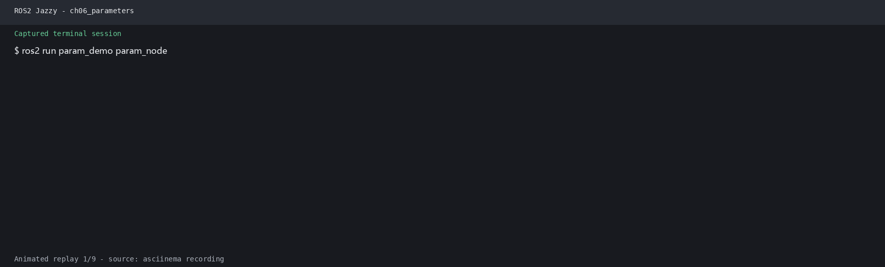

# 第6章：参数系统与 Launch 文件

> **课程**：ROS2 Python 编程  
> **章节**：第6章  
> **课时**：2 课时（90 分钟）  
> **教学方式**：讲授 + 演示  

---

## 6.1 参数系统

### 知识点 6.1.1：参数声明与获取

```python
import rclpy
from rclpy.node import Node

class ParamDemoNode(Node):
    def __init__(self):
        super().__init__('param_demo')

        # 声明参数：名称、默认值、描述
        self.declare_parameter('robot_name', 'xbot')
        self.declare_parameter('max_speed', 2.0)
        self.declare_parameter('enable_logging', True)
        self.declare_parameter('sensor_list', ['lidar', 'camera'])

        # 获取参数值
        name = self.get_parameter('robot_name').value
        speed = self.get_parameter('max_speed').value
        self.get_logger().info(
            f'机器人: {name}, 最大速度: {speed}m/s')

    def read_param_dynamic(self):
        """运行时动态读取参数"""
        # 方式1：直接读取
        speed = self.get_parameter('max_speed').get_parameter_value().double_value

        # 方式2：通过 property 语法
        name = self.get_parameter('robot_name')._value

        return speed
```

### 知识点 6.1.2：参数回调与动态重配置

```python
class DynamicParamNode(Node):
    def __init__(self):
        super().__init__('dynamic_param')
        self.declare_parameter('speed', 1.0)

        # 注册参数变化回调
        self.add_on_set_parameters_callback(self.param_callback)

    def param_callback(self, params):
        """参数变化时自动调用 — 验证并应用新值"""
        from rclpy.parameter import Parameter
        for param in params:
            if param.name == 'speed':
                if param.value < 0 or param.value > 10.0:
                    self.get_logger().error(
                        f'速度必须在 [0.0, 10.0] 范围内, '
                        f'收到: {param.value}')
                    return SetParametersResult(successful=False)
                self.get_logger().info(
                    f'速度已更新: {self.current_speed} → {param.value}')
                self.current_speed = param.value

        return SetParametersResult(successful=True)
```

程序 6-1：参数动态回调模式。回调返回 `SetParametersResult` 告知验证结果。

### 知识点 6.1.3：YAML 参数文件

```yaml
# config/robot_params.yaml
param_demo:
  ros__parameters:
    robot_name: 'xbot'
    max_speed: 2.0
    enable_logging: true
    sensor_list: ['lidar', 'camera', 'imu']
```

```bash
# 通过 Launch 文件加载 YAML 参数
# 或命令行直接加载
ros2 run my_pkg param_demo \
  --ros-args --params-file config/robot_params.yaml
```

### 知识点 6.1.4：官方要点——参数机制与命令行工具

官方 Understanding ROS 2 parameters 教程将参数定义为「每个节点的键值对配置项」，类型涵盖布尔、整数、浮点、字符串及四者的数组，可携带描述与默认值。命令行工具与本章 6.1 节对应：`ros2 param list` 列出参数、`ros2 param get <node> <name>` 读取、`ros2 param set <node> <name> <value>` 运行时修改、`ros2 param dump` 将参数快照保存为 YAML 文件。教程用小乌龟 `background_b`（背景蓝色分量）演示了「set 之后画面立即变色」的动态生效过程。

The Construct 的课程把参数分成两类理解：启动时静态配置（如分辨率、串口号）与运行时可调项（如速度上限）。前者求稳，后者求灵活——`param set` 让调试无需重启节点，而 `dump/load` 则保证调好的参数可固化复现。

### 知识点 6.1.5：官方要点——在节点类中使用参数

官方 Using parameters in a class (Python) 教程演示了参数编程的标准套路：节点初始化时 `declare_parameter('my_parameter', 'world')` 声明（带默认值与类型），随后 `get_parameter('my_parameter').value` 读取；还展示了 `ParameterDescriptor` 添加人类可读的描述，以及用 `set_parameters_callback` 拦截非法写入实现「只读参数」效果。教程末尾的「添加回调并自动改背景色」实验，正好对应本章 6.1.2 节的参数回调函数。

工程实践建议（官方与 Articulated Robotics 均强调）：参数命名用蛇形小写；声明放在 `__init__` 中集中完成；对关键参数使用描述符标注取值范围；不要在回调里反复 `get_parameter`——高频循环中应缓存参数值，监听变更事件再刷新。

---

## 6.2 Launch 文件系统

### 知识点 6.2.1：Python Launch 文件基础结构

```python
from launch import LaunchDescription
from launch_ros.actions import Node

def generate_launch_description():
    return LaunchDescription([
        # 启动 talker 节点
        Node(
            package='demo_nodes_py',       # 包名
            executable='talker',           # 可执行文件
            name='my_talker',              # 节点名（可选重映射）
            output='screen',               # 输出到屏幕
        ),
        # 启动 listener 节点
        Node(
            package='demo_nodes_py',
            executable='listener',
            name='my_listener',
            output='screen',
        ),
    ])
```

程序 6-2：Python Launch 文件最小示例。

### 知识点 6.2.2：高级 Launch 功能

```python
from launch import LaunchDescription
from launch.actions import DeclareLaunchArgument, LogInfo
from launch.substitutions import LaunchConfiguration
from launch.conditions import IfCondition
from launch_ros.actions import Node

def generate_launch_description():
    # 声明可配置参数
    use_rviz = LaunchConfiguration('use_rviz', default='false')
    robot_speed = LaunchConfiguration('robot_speed', default='1.0')

    return LaunchDescription([
        # 声明命令行参数
        DeclareLaunchArgument('use_rviz', default_value='false',
                              description='是否启动 RViz'),
        DeclareLaunchArgument('robot_speed', default_value='1.0',
                              description='机器人最大速度'),

        # 条件启动：仅当 use_rviz=true 时启动 RViz
        Node(
            package='rviz2',
            executable='rviz2',
            condition=IfCondition(use_rviz),
        ),

        # 启动节点并传入参数
        Node(
            package='my_pkg',
            executable='controller',
            name='robot_controller',
            parameters=[{'max_speed': robot_speed}],
            output='screen',
        ),

        # 启动信息日志
        LogInfo(msg=['启动完成，速度=', robot_speed]),
    ])
```

### 知识点 6.2.3：IncludeLaunchDescription 组合启动

```python
from launch.actions import IncludeLaunchDescription
from launch.launch_description_sources import PythonLaunchDescriptionSource
from ament_index_python.packages import get_package_share_directory

# 引用另一个 Launch 文件
def generate_launch_description():
    return LaunchDescription([
        # 先启动机器人仿真
        IncludeLaunchDescription(
            PythonLaunchDescriptionSource([
                get_package_share_directory('robot_sim_demo_ros2'),
                '/launch/sim_bringup.launch.py'
            ]),
            launch_arguments={'use_gazebo': 'true'}.items(),
        ),
        # 再启动导航
        Node(
            package='my_pkg',
            executable='navigator',
        ),
    ])
```

### 知识点 6.2.4：官方要点——Launch 基础与参数文件

官方 Creating a launch file 教程介绍了 Launch 系统的三种语法（Python 为首选）与核心概念：`Node` 动作描述单个节点（package、executable、name、namespace、parameters、remappings 六大常用项），`LaunchDescription` 容纳全部启动动作，`launch_ros` 提供节点级封装。教程特别演示了把参数直接写在 `parameters=[{'background_r': 150, ...}]` 里传入节点的方式。

批量参数推荐 YAML 文件方案：`parameters=['path/to/params.yaml']`。官方给出了 YAML 结构约定——首层为节点名（或 `/**` 通配），其下 `ros__parameters:` 键再列参数，且需在 `Node` 中用 `name` 指定节点名以匹配。这与本章 6.1.3 节的 `robot_params.yaml` 结构完全一致；`ros2 param dump` 生成的文件即可直接复用为启动参数文件。

### 知识点 6.2.5：官方要点——Launch 进阶与工程化实践

进阶用法集中在官方 Using launch files 系列与 `launch` 包 API 文档中：`IncludeLaunchDescription` 组合多个 launch 文件（如「驱动 + SLAM + RViz」拼装为系统级启动）；`DeclareLaunchArgument` + `LaunchConfiguration` 实现命令行传参 `ros2 launch pkg file.launch.py map:=warehouse.yaml`；`IfCondition`/`UnlessCondition` 控制节点启停；`RegisterEventHandler` 监听进程退出等事件实现失败重启。本章 6.2.2~6.2.3 节的高级 Launch 功能正是这些特性的综合运用。

Articulated Robotics 总结的分工模式值得记住：参数解决「节点的内部配置」，Launch 解决「系统的组合编排」，二者合用即可做到一份仓库适配仿真与实机多套场景。建议读者在完成练习 6.6 后，尝试用 `param dump` 导出调好的参数，再写一个带 `DeclareLaunchArgument` 的启动文件把参数文件路径开放为启动选项。

---

## 6.3 本章小结

本章总结了参数与 Launch 的五个要点：参数声明用 `declare_parameter(name, default)`，获取用 `get_parameter(name).value`；参数回调 `add_on_set_parameters_callback()` 实现动态重配置和验证；YAML 文件存储参数，通过 `--params-file` 或 Launch 加载；Python Launch 文件使用 `Node()` 启动节点，`LaunchConfiguration()` 传递参数；`IfCondition` 实现条件启动，`IncludeLaunchDescription` 组合多个 Launch。

---

## 6.4 练习题

**练习 6.1**：编写节点 `param_demo`，声明 name、speed、mode 三个参数，每秒输出参数值。

**练习 6.2**：实现参数回调验证：speed 必须在 0.0~10.0 范围内，mode 只能是 "auto"/"manual"/"hybrid"。

**练习 6.3**：编写 YAML 参数文件，通过 `--params-file` 加载覆盖默认参数。

**练习 6.4**：编写 Python Launch 文件，同时启动 talker、listener 两个节点。

**练习 6.5**：在 Launch 中添加条件启动参数 `use_rviz`，控制 RViz 是否启动。

**练习 6.6**：使用 `ros2 param list/get/set` 命令行操作节点参数。

---

## 仿真结合实例（当前仓库）：用 Launch 参数切换 Gazebo、RViz 和巡航驱动

### 目标与知识点对应

`robot_sim_demo` 的 Launch 文件把 `gui`、`rviz`、`drive`、世界文件和生成位姿暴露为 Launch 参数。通过同一个入口切换运行模式，可以直接观察 `LaunchConfiguration`、条件启动和参数传递的效果。

### 运行步骤

在工作区根目录执行：

```bash
source /opt/ros/jazzy/setup.bash
source install/setup.bash

# 查看当前入口支持的参数
ros2 launch robot_sim_demo gazebo2.launch.py --show-args
```

分别测试两种配置：

```bash
# 终端 1：无 GUI、无 RViz、无自动巡航，适合检查话题
ros2 launch robot_sim_demo gazebo2.launch.py gui:=false rviz:=false drive:=false
```

```bash
# 终端 2：Gazebo + RViz，启用巡航驱动
ros2 launch robot_sim_demo gazebo2.launch.py gui:=true rviz:=true drive:=true \
  drive_linear_speed:=0.12 drive_angular_speed:=0.45
```

### 观察结果

运行后可观察三类现象：`drive:=false` 时不会启动 `patrol_driver`，机器人保持静止，`drive:=true` 时 `/cmd_vel` 出现巡航指令；`rviz:=true` 会条件启动 `museum_rviz`，可同时查看 RobotModel、TF 和 LaserScan；修改 `spawn_x`、`spawn_y` 或速度参数后重新启动，比较参数对仿真行为的影响。

### 源码与相关配置

Launch 文件位于 `src/robot_sim_demo/launch/gazebo2.launch.py`；参数节点位于 `src/robot_sim_demo/robot_sim_demo/patrol_driver.py`；RViz 配置位于 `src/robot_sim_demo/rviz/museum.rviz`。

该实例使用的是 Gazebo Launch 参数，不等同于 ROS 节点运行时参数；二者分别由 Launch 系统和节点参数 API 管理。



---

> 参考来源：
> - ROS 2 Documentation (Humble) —— Understanding ROS 2 parameters：https://docs.ros.org/en/humble/Tutorials/Beginner-CLI-Tools/Understanding-ROS2-Parameters.html
> - ROS 2 Documentation (Humble) —— Using parameters in a class (Python)：https://docs.ros.org/en/humble/Tutorials/Beginner-Client-Libraries/Using-Parameters-In-A-Class-Python.html
> - ROS 2 Documentation (Humble) —— Creating a launch file：https://docs.ros.org/en/humble/Tutorials/Intermediate/Launch/Creating-Launch-Files.html
> - ROS 2 Documentation (Humble) —— Using launch files for large projects（Launch 系统主页）：https://docs.ros.org/en/humble/Tutorials/Intermediate/Launch/Launch-Main.html
> - The Construct —— ROS 2 Basics in 5 Days：https://www.theconstructsim.com/
> - Articulated Robotics —— ROS 2 Basics 系列视频：https://www.youtube.com/@ArticulatedRobotics