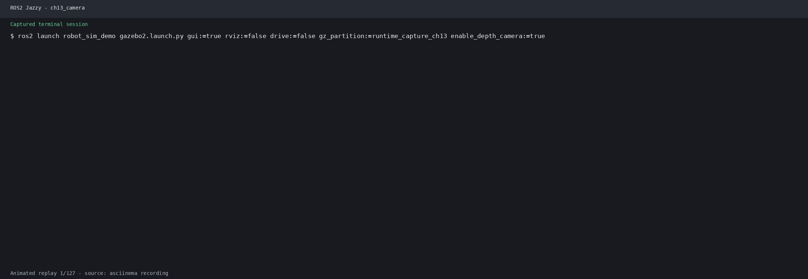

# 第13章 YOLO + ROS 2 目标检测

## 仿真结合实例（当前仓库）：从 Gazebo 相机接入 YOLO 节点

### 目标与知识点对应

使用 `robot_sim_demo` 提供的模拟相机替代 USB 摄像头，验证 ROS 2 图像话题、`cv_bridge`/推理节点的输入和检测结果话题连接。当前仓库没有可直接运行的 YOLO 模型节点，因此本例只验证图像输入链路。

### 运行步骤

```bash
source /opt/ros/jazzy/setup.bash
source install/setup.bash
ros2 launch robot_sim_demo gazebo2.launch.py \
  gui:=true rviz:=true drive:=false
```

```bash
ros2 topic info /camera/image_raw
ros2 topic echo /camera/camera_info --once
ros2 run rqt_image_view rqt_image_view /camera/image_raw
```

将本章的 YOLO 节点订阅话题设为 `/camera/image_raw`，再用 `ros2 topic echo` 检查其检测结果话题。

### 观察结果

应能看到 Gazebo 相机图像和 `CameraInfo`（320x180）；节点能否输出检测框取决于本地模型、`ultralytics`/ONNX 依赖及推理代码。

### 源码与边界

- 相机桥接：`src/robot_sim_demo/launch/gazebo2.launch.py`
- 内参发布：`src/robot_sim_demo/robot_sim_demo/camera_info_publisher.py`
- 桥配置：`src/robot_sim_demo/config/gazebo2_bridge.yaml`

本实例不声称完成 YOLO 训练或检测精度验证。



## 13.1 知识要点

### 13.1.1 YOLOv8 模型架构

YOLO (You Only Look Once) 是单阶段目标检测的标杆算法, v8 进一步优化了速度和精度:

```
网络结构:
  Backbone (C2f 模块) → 多尺度特征图
  Head (解耦检测头)  → 分类 + 回归分支

输出张量:
  [batch, anchors, 4 + 1 + num_classes]
    │         │        │   │       └─ 分类概率
    │         │        │   └─ 目标置信度
    │         │        └─ bbox (cx, cy, w, h) 归一化
    │         └─ 锚点数 (每格 3 个)
    └─ 批次大小
```

```python
# YOLOv8 推理核心流程 (简化版)
import numpy as np

def yolo_inference(model_output, input_size=640, confidence_thresh=0.5,
                   nms_iou_thresh=0.45):
    """
    YOLO 推理后处理
    模型输出 → 解码 → NMS → 最终检测框
    参数:
        model_output: 模型原始输出 [1, 84, 8400]
        input_size: 网络输入尺寸
    返回:
        detections: [(class_id, confidence, x1, y1, x2, y2), ...]
    """
    # 转置: [1, 8400, 84]
    output = model_output[0].T
    # 提取 bbox (前 4 通道) 和类别 (后 80 通道)
    boxes = output[:, :4]
    scores = output[:, 4:84]
    class_ids = np.argmax(scores, axis=1)
    confidences = np.max(scores, axis=1)

    # nms 非极大值抑制
    keep = nms(boxes, confidences, class_ids, nms_iou_thresh,
               confidence_thresh)
    return keep

def nms(boxes, confidences, class_ids, iou_thresh, conf_thresh):
    """非极大值抑制 (简化实现)"""
    mask = confidences > conf_thresh
    boxes = boxes[mask]
    confidences = confidences[mask]
    class_ids = class_ids[mask]

    indices = []
    sorted_idx = np.argsort(confidences)[::-1]

    while len(sorted_idx) > 0:
        best = sorted_idx[0]
        indices.append(best)
        if len(sorted_idx) == 1:
            break
        ious = compute_iou(boxes[best], boxes[sorted_idx[1:]])
        sorted_idx = sorted_idx[1:][ious < iou_thresh]

    return [(class_ids[i], confidences[i], *boxes[i]) for i in indices]

def compute_iou(box, boxes):
    """计算 IoU (Intersection over Union)"""
    x1 = np.maximum(box[0], boxes[:, 0])
    y1 = np.maximum(box[1], boxes[:, 1])
    x2 = np.minimum(box[2], boxes[:, 2])
    y2 = np.minimum(box[3], boxes[:, 3])
    inter = np.maximum(0, x2 - x1) * np.maximum(0, y2 - y1)
    area_box = (box[2] - box[0]) * (box[3] - box[1])
    area_boxes = (boxes[:, 2] - boxes[:, 0]) * (boxes[:, 3] - boxes[:, 1])
    union = area_box + area_boxes - inter
    return inter / (union + 1e-6)
```

### 13.1.2 模型导出与 ONNX/TensorRT 推理

```python
# 导出 YOLOv8 到 ONNX
from ultralytics import YOLO

def export_yolo_for_ros2():
    """导出 YOLO 模型为 ONNX 格式 (ROS 2 部署用)"""
    model = YOLO('yolov8n.pt')  # 加载预训练模型
    model.export(
        format='onnx',
        imgsz=640,
        opset=12,
        half=False,    # FP32 (ROS 2 标准部署)
        simplify=True,
        dynamic=False,
    )
    # 生成: yolov8n.onnx
    print('模型已导出: yolov8n.onnx')


# ONNX Runtime 推理节点
import onnxruntime as ort
import cv2

class ONNXYoloDetector:
    """基于 ONNX Runtime 的 YOLO 推理器"""
    def __init__(self, model_path: str, conf_thresh: float = 0.5,
                 nms_thresh: float = 0.45):
        self.session = ort.InferenceSession(model_path)
        self.input_name = self.session.get_inputs()[0].name
        self.conf_thresh = conf_thresh
        self.nms_thresh = nms_thresh
        # COCO 类别名称
        self.class_names = [
            'person', 'bicycle', 'car', 'motorcycle', 'airplane', 'bus',
            'train', 'truck', 'boat', 'traffic light', 'fire hydrant',
            'stop sign', 'parking meter', 'bench', 'bird', 'cat', 'dog',
            'horse', 'sheep', 'cow', 'elephant', 'bear', 'zebra', 'giraffe',
            'backpack', 'umbrella', 'handbag', 'tie', 'suitcase', 'frisbee',
            'skis', 'snowboard', 'sports ball', 'kite', 'baseball bat',
            'baseball glove', 'skateboard', 'surfboard', 'tennis racket',
            'bottle', 'wine glass', 'cup', 'fork', 'knife', 'spoon', 'bowl',
            'banana', 'apple', 'sandwich', 'orange', 'broccoli', 'carrot',
            'hot dog', 'pizza', 'donut', 'cake', 'chair', 'couch',
            'potted plant', 'bed', 'dining table', 'toilet', 'tv', 'laptop',
            'mouse', 'remote', 'keyboard', 'cell phone', 'microwave', 'oven',
            'toaster', 'sink', 'refrigerator', 'book', 'clock', 'vase',
            'scissors', 'teddy bear', 'hair drier', 'toothbrush',
        ]

    def preprocess(self, img: np.ndarray, input_size: int = 640):
        """图像预处理: resize + normalize"""
        original_h, original_w = img.shape[:2]
        img_resized = cv2.resize(img, (input_size, input_size))
        img_normalized = img_resized.astype(np.float32) / 255.0
        img_transposed = np.transpose(img_normalized, (2, 0, 1))
        img_batch = np.expand_dims(img_transposed, axis=0)
        return img_batch, original_w, original_h

    def postprocess(self, output: np.ndarray, orig_w: int, orig_h: int):
        """后处理: 解析检测结果 (带坐标缩放)"""
        detections = []
        output = output[0].T  # [8400, 84]

        for row in output:
            class_scores = row[4:84]
            class_id = np.argmax(class_scores)
            confidence = class_scores[class_id]

            if confidence < self.conf_thresh:
                continue

            cx, cy, w, h = row[:4]
            # 归一化坐标 → 原始图像坐标
            x1 = int((cx - w / 2) * orig_w / 640)
            y1 = int((cy - h / 2) * orig_h / 640)
            x2 = int((cx + w / 2) * orig_w / 640)
            y2 = int((cy + h / 2) * orig_h / 640)

            detections.append((class_id, confidence, x1, y1, x2, y2))

        return detections

    def detect(self, image: np.ndarray) -> list:
        """执行检测"""
        input_tensor, ow, oh = self.preprocess(image)
        outputs = self.session.run(None, {self.input_name: input_tensor})
        return self.postprocess(outputs[0], ow, oh)
```

### 13.1.3 cv_bridge 图像转换

`cv_bridge` 是 ROS 图像消息 (sensor_msgs/Image) 与 OpenCV cv::Mat 之间的桥梁:

```python
from sensor_msgs.msg import Image
from cv_bridge import CvBridge, CvBridgeError
import cv2
import numpy as np


class ImageBridge:
    """ROS 2 图像 ↔ OpenCV 转换器"""
    def __init__(self):
        self.bridge = CvBridge()

    def imgmsg_to_cv2(self, msg: Image, encoding: str = 'bgr8') -> np.ndarray:
        """
        ROS Image 消息 → OpenCV 图像
        参数:
            msg: sensor_msgs/Image
            encoding: 目标编码 (bgr8, rgb8, mono8)
        返回:
            OpenCV 图像 (numpy 数组)
        """
        try:
            cv_image = self.bridge.imgmsg_to_cv2(
                msg, desired_encoding=encoding
            )
            return cv_image
        except CvBridgeError as e:
            print(f'cv_bridge 转换失败: {e}')
            return None

    def cv2_to_imgmsg(self, cv_image: np.ndarray,
                      encoding: str = 'bgr8') -> Image:
        """
        OpenCV 图像 → ROS Image 消息
        参数:
            cv_image: OpenCV 图像
            encoding: 源编码
        返回:
            sensor_msgs/Image 消息
        """
        try:
            msg = self.bridge.cv2_to_imgmsg(cv_image, encoding=encoding)
            return msg
        except CvBridgeError as e:
            print(f'cv_bridge 转换失败: {e}')
            return None

    def compress_image(self, cv_image: np.ndarray, quality: int = 80):
        """JPEG 压缩 (用于网络传输优化)"""
        import base64
        ret, jpeg = cv2.imencode('.jpg', cv_image,
                                 [cv2.IMWRITE_JPEG_QUALITY, quality])
        return jpeg.tobytes()
```

### 13.1.4 ROS 2 YOLO 推理节点

```python
#!/usr/bin/env python3
"""
完整的 ROS 2 YOLO 推理节点
Camera → YOLO ONNX → /detections 话题
"""
import rclpy
from rclpy.node import Node
from sensor_msgs.msg import Image, CameraInfo
from vision_msgs.msg import Detection2DArray, Detection2D, ObjectHypothesisWithPose
from cv_bridge import CvBridge
import onnxruntime as ort
import numpy as np
import cv2


class YoloDetectorNode(Node):
    """YOLOv8 ONNX 推理节点"""
    def __init__(self):
        super().__init__('yolo_detector')

        # 声明参数
        self.declare_parameter('model_path', 'yolov8n.onnx')
        self.declare_parameter('conf_threshold', 0.5)
        self.declare_parameter('nms_threshold', 0.45)
        self.declare_parameter('input_size', 640)
        self.declare_parameter('image_topic', '/camera/image_raw')

        model_path = self.get_parameter('model_path').value
        self.conf_thresh = self.get_parameter('conf_threshold').value
        self.nms_thresh = self.get_parameter('nms_threshold').value
        self.input_size = self.get_parameter('input_size').value

        # 加载 ONNX 模型
        self.get_logger().info(f'加载模型: {model_path}')
        self.session = ort.InferenceSession(model_path)
        self.input_name = self.session.get_inputs()[0].name
        self.bridge = CvBridge()
        self.get_logger().info('YOLO 模型已加载')

        # 订阅相机图像
        self.image_sub = self.create_subscription(
            Image,
            self.get_parameter('image_topic').value,
            self.image_callback,
            10
        )
        # 发布检测结果
        self.detection_pub = self.create_publisher(
            Detection2DArray, '/detections', 10
        )
        # 发布标注图像
        self.annotated_pub = self.create_publisher(
            Image, '/detections/annotated', 10
        )

        # COCO 类别名称 (80 类)
        self.class_names = [  # 完整 80 类
            'person', 'bicycle', 'car', 'motorcycle', 'airplane', 'bus',
            'train', 'truck', 'boat', 'traffic light', 'fire hydrant',
            'stop sign', 'parking meter', 'bench', 'bird', 'cat', 'dog',
            'horse', 'sheep', 'cow', 'elephant', 'bear', 'zebra', 'giraffe',
            'backpack', 'umbrella', 'handbag', 'tie', 'suitcase', 'frisbee',
            'skis', 'snowboard', 'sports ball', 'kite', 'baseball bat',
            'baseball glove', 'skateboard', 'surfboard', 'tennis racket',
            'bottle', 'wine glass', 'cup', 'fork', 'knife', 'spoon', 'bowl',
            'banana', 'apple', 'sandwich', 'orange', 'broccoli', 'carrot',
            'hot dog', 'pizza', 'donut', 'cake', 'chair', 'couch',
            'potted plant', 'bed', 'dining table', 'toilet', 'tv', 'laptop',
            'mouse', 'remote', 'keyboard', 'cell phone', 'microwave', 'oven',
            'toaster', 'sink', 'refrigerator', 'book', 'clock', 'vase',
            'scissors', 'teddy bear', 'hair drier', 'toothbrush',
        ]

        # 帧率统计
        self.frame_count = 0
        self.timer = self.create_timer(5.0, self.report_fps)

    def report_fps(self):
        """报告推理帧率"""
        fps = self.frame_count / 5.0
        self.get_logger().info(f'推理 FPS: {fps:.1f}')
        self.frame_count = 0

    def image_callback(self, msg: Image):
        """图像回调: 推理 + 发布结果"""
        try:
            cv_image = self.bridge.imgmsg_to_cv2(msg, desired_encoding='bgr8')
        except Exception as e:
            self.get_logger().error(f'cv_bridge 转换失败: {e}')
            return

        # 执行推理
        detections = self.detect(cv_image)
        self.frame_count += 1

        # 发布 Detection2DArray
        det_msg = self.build_detection_msg(detections, msg.header)
        self.detection_pub.publish(det_msg)

        # 发布标注图像
        annotated = self.draw_detections(cv_image, detections)
        ann_msg = self.bridge.cv2_to_imgmsg(annotated, encoding='bgr8')
        ann_msg.header = msg.header
        self.annotated_pub.publish(ann_msg)

    def detect(self, image: np.ndarray) -> list:
        """YOLO 推理"""
        h, w = image.shape[:2]
        # 预处理
        img_resized = cv2.resize(image, (self.input_size, self.input_size))
        img_norm = img_resized.astype(np.float32) / 255.0
        img_chw = np.transpose(img_norm, (2, 0, 1))
        img_batch = np.expand_dims(img_chw, axis=0)

        # 推理
        outputs = self.session.run(None, {self.input_name: img_batch})
        output = outputs[0][0].T  # [8400, 84]

        # 解析
        detections = []
        for row in output:
            scores = row[4:84]
            class_id = np.argmax(scores)
            conf = scores[class_id]
            if conf < self.conf_thresh:
                continue

            cx, cy, bw, bh = row[:4]
            x1 = int((cx - bw / 2) * w / self.input_size)
            y1 = int((cy - bh / 2) * h / self.input_size)
            x2 = int((cx + bw / 2) * w / self.input_size)
            y2 = int((cy + bh / 2) * h / self.input_size)

            detections.append((class_id, float(conf), x1, y1, x2, y2))

        return detections

    def build_detection_msg(self, detections: list,
                            header) -> Detection2DArray:
        """构建 ROS 2 标准检测消息"""
        msg = Detection2DArray()
        msg.header = header

        for class_id, conf, x1, y1, x2, y2 in detections:
            det = Detection2D()
            # bbox 中心 + 尺寸
            det.bbox.center.position.x = (x1 + x2) / 2.0
            det.bbox.center.position.y = (y1 + y2) / 2.0
            det.bbox.size_x = float(x2 - x1)
            det.bbox.size_y = float(y2 - y1)
            # 检测结果
            hyp = ObjectHypothesisWithPose()
            hyp.hypothesis.class_id = str(class_id)
            hyp.hypothesis.score = conf
            det.results.append(hyp)
            msg.detections.append(det)

        return msg

    def draw_detections(self, image: np.ndarray,
                        detections: list) -> np.ndarray:
        """在图像上绘制检测框"""
        result = image.copy()
        colors = [
            (0, 255, 0), (255, 0, 0), (0, 0, 255), (255, 255, 0),
            (255, 0, 255), (0, 255, 255), (128, 0, 128), (128, 128, 0),
        ]

        for class_id, conf, x1, y1, x2, y2 in detections:
            color = colors[class_id % len(colors)]
            name = self.class_names[class_id] if class_id < len(self.class_names) else f'cls_{class_id}'
            label = f'{name} {conf:.2f}'

            cv2.rectangle(result, (x1, y1), (x2, y2), color, 2)
            cv2.putText(result, label, (x1, y1 - 5),
                        cv2.FONT_HERSHEY_SIMPLEX, 0.5, color, 1)

        return result


def main():
    rclpy.init()
    node = YoloDetectorNode()
    rclpy.spin(node)
    rclpy.shutdown()


if __name__ == '__main__':
    main()
```

### 13.1.5 检测结果 3D 定位

通过深度相机将 2D bbox 投影到 3D 空间:

```python
import numpy as np


def bbox_to_3d_position(bbox: tuple, depth_image: np.ndarray,
                        camera_info) -> tuple:
    """
    将 2D bbox + 深度图投影为 3D 位置
    参数:
        bbox: (x1, y1, x2, y2) 检测框
        depth_image: 深度图 (米)
        camera_info: CameraInfo (含内参)
    返回:
        (x, y, z) 物体在 camera_frame 中的 3D 位置
    """
    x1, y1, x2, y2 = bbox

    # bbox 中心点
    cx_bbox = (x1 + x2) // 2
    cy_bbox = (y1 + y2) // 2

    # 提取 bbox 区域的深度值 (取中位数过滤噪声)
    depth_roi = depth_image[y1:y2, x1:x2]
    valid_depths = depth_roi[depth_roi > 0]
    if len(valid_depths) == 0:
        return None
    depth = np.median(valid_depths)

    # 像素 → 3D (使用相机内参)
    fx = camera_info.k[0]  # [fx, 0, cx]
    fy = camera_info.k[4]  # [ 0, fy, cy]
    cx_cam = camera_info.k[2]
    cy_cam = camera_info.k[5]

    x = (cx_bbox - cx_cam) * depth / fx
    y = (cy_bbox - cy_cam) * depth / fy
    z = depth

    return (x, y, z)
```

### 13.1.6 目标跟随控制

基于 YOLO 检测结果的机器人跟随:

```python
class YoloFollower(Node):
    """基于 YOLO 检测的目标跟随控制器"""
    def __init__(self):
        super().__init__('yolo_follower')
        self.detection_sub = self.create_subscription(
            Detection2DArray, '/detections', self.detection_cb, 10
        )
        self.depth_sub = self.create_subscription(
            Image, '/depth/image_raw', self.depth_cb, 10
        )
        self.cmd_pub = self.create_publisher(Twist, '/cmd_vel', 10)
        self.bridge = CvBridge()

        self.target_class = 'person'  # 跟随目标类别
        self.target_distance = 1.5     # 期望跟随距离 (m)
        self.max_linear = 0.5          # 最大线速度
        self.max_angular = 1.0         # 最大角速度

        self.current_detection = None
        self.current_depth = None

    def detection_cb(self, msg: Detection2DArray):
        """筛选目标检测"""
        for det in msg.detections:
            class_id = det.results[0].hypothesis.class_id
            if class_id == self.target_class:
                self.current_detection = det
                return
        self.current_detection = None

    def depth_cb(self, msg: Image):
        self.current_depth = self.bridge.imgmsg_to_cv2(
            msg, desired_encoding='passthrough'
        )

    def control_loop(self):
        """PID 跟随控制"""
        if self.current_detection is None:
            self.publish_velocity(0.0, 0.0)
            return

        # 目标偏离像中心的角偏差
        image_width = 640  # 假设图像宽度
        bbox_center = self.current_detection.bbox.center.position.x
        angular_error = (bbox_center - image_width / 2) / (image_width / 2)

        # 距离误差 (从 bbox 大小估算, 简化为固定值)
        distance_error = self.bbox_size_to_distance(
            self.current_detection.bbox.size_x,
            self.current_detection.bbox.size_y
        ) - self.target_distance

        # PID 控制
        linear = min(max(distance_error * 0.5, -self.max_linear), self.max_linear)
        angular = min(max(-angular_error * 2.0, -self.max_angular), self.max_angular)

        self.publish_velocity(linear, angular)

    def bbox_size_to_distance(self, w: float, h: float) -> float:
        """粗略距离估计 (基于 bbox 大小)"""
        return 1.0 / (max(w, h) + 0.01) * 100

    def publish_velocity(self, linear: float, angular: float):
        cmd = Twist()
        cmd.linear.x = linear
        cmd.angular.z = angular
        self.cmd_pub.publish(cmd)
```

### 13.1.7 自定义检测消息

```python
# 自定义检测接口定义
# 文件: yolo_detector_interfaces/msg/YoloDetection.msg

# std_msgs/Header header
# uint16 class_id
# string class_name
# float32 confidence
# uint16 x1
# uint16 y1
# uint16 x2
# uint16 y2
# float32 center_x
# float32 center_y
# float32 width
# float32 height

# 自定义服务定义
# YoloDetectorInterfaces/srv/SetClasses.srv
# string[] classes   # 要检测的类别
# ---
# bool success
# string message
```

### 13.1.8 完整启动流程

```bash
# 1. 启动相机 (仿真或真实)
ros2 launch usb_cam camera.launch.py

# 2. 启动 YOLO 推理节点
python3 yolo_detector_node.py --ros-args -p model_path:=yolov8n.onnx

# 3. 启动跟随控制节点
python3 yolo_follower.py

# 4. 查看结果
ros2 topic echo /detections
rviz2 -d src/courseware/rviz/yolo_detection.rviz
```

---

## 13.2 练习题

**1. 原理解析题:** 解释 YOLO 的 "单阶段" 检测含义, 与 Faster R-CNN 的两阶段方法对比优势和劣势。

**2. 模型题:** 编写脚本将 YOLOv8 模型导出为 ONNX 格式, 并在 Python 中用 cv2.dnn 或 onnxruntime 加载并推理, 输出一张测试图片的检测结果。

**3. ROS 2 节点题:** 编写一个完整的 ROS 2 节点, 订阅 /camera/image_raw, 使用 ONNX Runtime 进行 YOLO 推理, 将检测结果发布为自定义 Detection2DArray 消息。

**4. 3D 定位题:** 将 YOLO 检测框中心点结合深度图 (来自 /depth/image_raw) 投影到 3D 空间, 发布为 geometry_msgs/PointStamped 话题。

**5. 控制题:** 实现基于 YOLO 检测的 "人跟随" 控制器: 当检测到 person 类别时, 计算角偏差和距离误差, 通过 PID 控制 cmd_vel 使机器人保持在目标后方 1.5 米。

**6. 综合题:** 设计一个安保巡逻场景: 机器人按预设航点巡逻, 途中使用 YOLO 检测 "异常物体" (如背包、行李箱), 发现后发布警告并在 rviz 中高亮标记。写出完整系统架构和 ROS 2 多节点通信方案。
