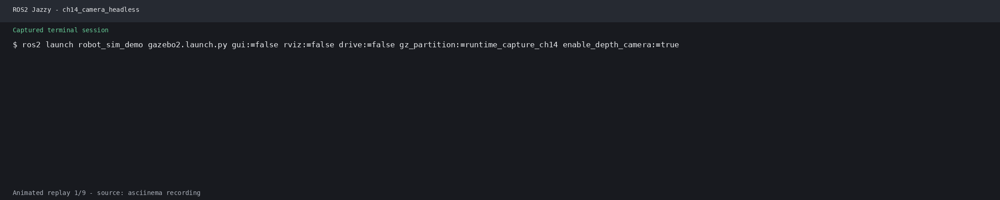

# 第14章 视觉大模型 + ROS 2

## 仿真结合实例（当前仓库）：模拟相机到 VLM 服务的输入链路

### 目标与知识点对应

将 Gazebo 相机图像作为视觉大模型服务的输入，验证图像话题订阅、请求/响应服务边界和任务结果发布流程。当前仓库没有真实 VLM provider，不能把接口连通写成模型推理成功。

### 运行步骤

```bash
source /opt/ros/jazzy/setup.bash
source install/setup.bash
ros2 launch robot_sim_demo gazebo2.launch.py \
  gui:=false rviz:=false drive:=false
```

```bash
ros2 topic echo /camera/image_raw --once
ros2 topic echo /camera/camera_info --once
```

将本章节点的图像订阅配置为 `/camera/image_raw`；无 API Key 时使用本地 mock 服务，检查其结构化结果是否能通过 ROS 2 服务/话题返回。

### 观察结果

可验证相机帧和内参话题存在；真实模型描述、目标识别和任务规划结果需要配置 OpenAI、Qwen 或 Ollama provider 后再单独验收。

### 源码与边界

- 相机节点：`src/robot_sim_demo/robot_sim_demo/camera_info_publisher.py`
- 相机桥：`src/robot_sim_demo/config/gazebo2_bridge.yaml`
- mock/服务设计参考：`src/lab_code/ch20_lab/`

不要将固定 mock JSON 当作 VLM 的实际视觉识别结果。



## 14.1 知识要点

### 14.1.1 LLM 任务规划节点

将大语言模型 (LLM) 集成到 ROS 2 中, 实现自然语言驱动机器人任务规划。

```python
#!/usr/bin/env python3
"""
LLM 任务规划 ROS 2 节点
将自然语言指令解析为机器人任务序列
"""
import rclpy
from rclpy.node import Node
from std_msgs.msg import String
from geometry_msgs.msg import PoseStamped
import openai
import json


class LLMTaskPlanner(Node):
    """
    LLM 任务规划器
    接收自然语言指令 → 调用 LLM → 输出结构化任务序列
    """
    def __init__(self):
        super().__init__('llm_task_planner')

        # API 配置 (支持 OpenAI / Qwen / 本地模型)
        self.declare_parameter('api_key', '')
        self.declare_parameter('model', 'gpt-4o-mini')
        self.declare_parameter('api_base', 'https://api.openai.com/v1')

        self.api_key = self.get_parameter('api_key').value
        self.model = self.get_parameter('model').value
        self.api_base = self.get_parameter('api_base').value

        self.client = openai.OpenAI(
            api_key=self.api_key,
            base_url=self.api_base
        )

        # 订阅自然语言指令
        self.cmd_sub = self.create_subscription(
            String, '/llm/command', self.command_callback, 10
        )
        # 发布解析后的任务序列
        self.task_pub = self.create_publisher(
            String, '/llm/task_sequence', 10
        )
        # 发布结构化导航目标
        self.goal_pub = self.create_publisher(
            PoseStamped, '/llm/nav_goal', 10
        )

        self.get_logger().info('LLM 任务规划器已就绪')

    def command_callback(self, msg: String):
        """处理自然语言指令"""
        self.get_logger().info(f'收到指令: {msg.data}')
        task_json = self.parse_command(msg.data)
        if task_json:
            self.task_pub.publish(String(data=json.dumps(task_json)))
            self.execute_tasks(task_json)

    def parse_command(self, instruction: str) -> dict:
        """
        调用 LLM 解析自然语言指令为结构化任务
        使用 Function Calling / Tool Use
        """
        system_prompt = """
你是一个机器人任务规划器。将用户的自然语言指令解析为机器人可执行的任务序列。
环境信息: 仓库场景, 坐标范围 x:[-5,5], y:[-5,5]。
已知地点: entrance(0, 0), shelf_a(2, 2), shelf_b(-2, 2),
          charging_station(0, -3), desk(3, -1).

输出 JSON 格式:
{
  "tasks": [
    {"action": "navigate", "target": "地点名", "params": {}},
    {"action": "detect", "target": "物体类别", "params": {}},
    {"action": "pick", "target": "物体名", "params": {}},
    {"action": "place", "target": "地点名", "params": {}}
  ]
}
"""
        try:
            response = self.client.chat.completions.create(
                model=self.model,
                messages=[
                    {"role": "system", "content": system_prompt},
                    {"role": "user", "content": instruction}
                ],
                temperature=0.2,
                response_format={"type": "json_object"},
            )
            result = json.loads(response.choices[0].message.content)
            self.get_logger().info(f'任务解析: {json.dumps(result, ensure_ascii=False)}')
            return result
        except Exception as e:
            self.get_logger().error(f'LLM 调用失败: {e}')
            return None

    def execute_tasks(self, task_json: dict):
        """依次执行任务序列"""
        known_locations = {
            'entrance': (0.0, 0.0),
            'shelf_a': (2.0, 2.0),
            'shelf_b': (-2.0, 2.0),
            'charging_station': (0.0, -3.0),
            'desk': (3.0, -1.0),
        }

        for task in task_json.get('tasks', []):
            action = task['action']
            target = task['target']
            self.get_logger().info(f'执行: {action} → {target}')

            if action == 'navigate':
                if target in known_locations:
                    x, y = known_locations[target]
                    self.publish_nav_goal(x, y)
                    self.get_logger().info(f'导航目标: {target} ({x}, {y})')
                else:
                    self.get_logger().warn(f'未知地点: {target}')
                    # 尝试让 LLM 估计坐标
                    x, y = self.llm_estimate_location(target)
                    self.publish_nav_goal(x, y)

            elif action == 'detect':
                # 触发视觉检测任务 (通过参数配置)
                self.get_logger().info(f'检测目标: {target}')
                # 可发布到 /yolo/classes 设置检测类别

            elif action == 'pick':
                self.get_logger().info(f'抓取: {target}')

            elif action == 'place':
                self.get_logger().info(f'放置: {target}')

    def llm_estimate_location(self, location_name: str) -> tuple:
        """让 LLM 估计未知位置的坐标"""
        prompt = f"""
仓库场景坐标范围 x:[-5,5], y:[-5,5]。
已知: entrance(0,0), shelf_a(2,2), shelf_b(-2,2), charging_station(0,-3), desk(3,-1)。
请估算 "{location_name}" 最可能的坐标。返回 JSON: {{"x": float, "y": float}}.
"""
        try:
            response = self.client.chat.completions.create(
                model=self.model,
                messages=[{"role": "user", "content": prompt}],
                response_format={"type": "json_object"},
            )
            result = json.loads(response.choices[0].message.content)
            return result['x'], result['y']
        except Exception:
            return 0.0, 0.0

    def publish_nav_goal(self, x: float, y: float, yaw: float = 0.0):
        """发布导航目标"""
        import math
        goal = PoseStamped()
        goal.header.frame_id = 'map'
        goal.header.stamp = self.get_clock().now().to_msg()
        goal.pose.position.x = x
        goal.pose.position.y = y
        goal.pose.orientation.z = math.sin(yaw / 2.0)
        goal.pose.orientation.w = math.cos(yaw / 2.0)
        self.goal_pub.publish(goal)


def main():
    rclpy.init()
    node = LLMTaskPlanner()
    rclpy.spin(node)
    rclpy.shutdown()


if __name__ == '__main__':
    main()
```

### 14.1.2 VLM 场景理解集成

视觉语言模型 (Vision-Language Model) 实现场景描述、物体识别和空间推理:

```python
#!/usr/bin/env python3
"""
VLM 场景理解 ROS 2 节点
接收图像 + 查询 → 生成场景描述
支持: OpenAI GPT-4V, Qwen-VL, 本地 VLM
"""
import rclpy
from rclpy.node import Node
from sensor_msgs.msg import Image
from std_msgs.msg import String
from cv_bridge import CvBridge
import openai
import base64
import numpy as np
import cv2
import json


class VLMSceneUnderstanding(Node):
    """VLM 场景理解节点"""
    def __init__(self):
        super().__init__('vlm_scene_understanding')

        self.declare_parameter('api_key', '')
        self.declare_parameter('model', 'gpt-4o')
        self.declare_parameter('query_topic', '/vlm/query')

        self.api_key = self.get_parameter('api_key').value
        self.model = self.get_parameter('model').value
        self.bridge = CvBridge()
        self.client = openai.OpenAI(api_key=self.api_key)

        # 订阅图像 + 查询
        self.image_sub = self.create_subscription(
            Image, '/camera/image_raw', self.image_cb, 10
        )
        self.query_sub = self.create_subscription(
            String, '/vlm/query', self.query_cb, 10
        )

        # 发布结果
        self.description_pub = self.create_publisher(
            String, '/vlm/description', 10
        )
        self.objects_pub = self.create_publisher(
            String, '/vlm/objects', 10
        )

        self.latest_image = None
        self.latest_query = "请描述当前场景中有什么物体。"
        self.get_logger().info('VLM 场景理解节点已就绪')

    def image_cb(self, msg: Image):
        """缓存最新图像帧"""
        try:
            self.latest_image = self.bridge.imgmsg_to_cv2(msg, 'bgr8')
        except Exception as e:
            self.get_logger().error(f'图像转换失败: {e}')

    def query_cb(self, msg: String):
        """收到查询请求, 触发 VLM 推理"""
        self.latest_query = msg.data
        if self.latest_image is not None:
            self.analyze_scene()

    def analyze_scene(self):
        """调用 VLM 分析场景"""
        # 图像编码为 base64
        ret, jpeg = cv2.imencode('.jpg', self.latest_image, [cv2.IMWRITE_JPEG_QUALITY, 85])
        img_b64 = base64.b64encode(jpeg.tobytes()).decode('utf-8')

        self.get_logger().info(f'VLM 查询: {self.latest_query}')

        try:
            response = self.client.chat.completions.create(
                model=self.model,
                messages=[
                    {
                        "role": "user",
                        "content": [
                            {
                                "type": "text",
                                "text": self.latest_query + "\n请用 JSON 格式回复: {\"description\": \"场景描述\", \"objects\": [{\"name\": \"物体名\", \"position\": \"相对位置\", \"confidence\": 0.9}]}"
                            },
                            {
                                "type": "image_url",
                                "image_url": {
                                    "url": f"data:image/jpeg;base64,{img_b64}",
                                    "detail": "low"
                                }
                            }
                        ]
                    }
                ],
                max_tokens=500,
                response_format={"type": "json_object"},
            )

            result = json.loads(response.choices[0].message.content)
            self.get_logger().info(f'场景理解: {result.get("description", "")[:80]}...')

            # 发布描述
            self.description_pub.publish(
                String(data=result.get('description', ''))
            )
            # 发布物体列表
            self.objects_pub.publish(
                String(data=json.dumps(result.get('objects', [])))
            )

        except Exception as e:
            self.get_logger().error(f'VLM 调用失败: {e}')

    def spatial_query(self, question: str) -> dict:
        """
        空间推理示例查询
        例如: "桌子左边有什么物体?"
              "红色物体距离我多远?"
        """
        if self.latest_image is None:
            return {"error": "无可用图像"}

        ret, jpeg = cv2.imencode('.jpg', self.latest_image, [cv2.IMWRITE_JPEG_QUALITY, 85])
        img_b64 = base64.b64encode(jpeg.tobytes()).decode('utf-8')

        try:
            response = self.client.chat.completions.create(
                model=self.model,
                messages=[{
                    "role": "user",
                    "content": [
                        {"type": "text", "text": f"请回答以下空间关系问题: {question}\n返回 JSON: {{\"answer\": \"回答\", \"confidence\": 0.9, \"reasoning\": \"推理过程\"}}"},
                        {"type": "image_url", "image_url": {"url": f"data:image/jpeg;base64,{img_b64}"}}
                    ]
                }],
                response_format={"type": "json_object"},
            )
            return json.loads(response.choices[0].message.content)
        except Exception as e:
            return {"error": str(e)}
```

### 14.1.3 自然语言 → ROS 2 Action 转换

```python
from rclpy.action import ActionClient
from nav2_msgs.action import NavigateToPose
from geometry_msgs.msg import Point, Quaternion
import math
import json


class NLToActionConverter(Node):
    """
    自然语言 → ROS 2 Action
    将 LLM 规划结果转换为实际的 ROS 2 Action 调用
    """
    def __init__(self):
        super().__init__('nl_to_action')
        self.nav_client = ActionClient(self, NavigateToPose, 'navigate_to_pose')

        # 订阅 LLM 任务序列
        self.task_sub = self.create_subscription(
            String, '/llm/task_sequence', self.task_cb, 10
        )

        # 注册可用的 Action 和能力
        self.available_actions = {
            'navigate': self.execute_navigation,
            'detect': self.execute_detection,
            'speak': self.execute_speak,
            'wait': self.execute_wait,
        }

    def task_cb(self, msg: String):
        task_json = json.loads(msg.data)
        self.execute_task_sequence(task_json)

    async def execute_task_sequence(self, task_json: dict):
        """顺序执行任务序列"""
        for task in task_json.get('tasks', []):
            action = task['action']
            target = task['target']
            params = task.get('params', {})

            if action in self.available_actions:
                self.get_logger().info(f'执行 Action: {action}({target})')
                await self.available_actions[action](target, params)
            else:
                self.get_logger().warn(f'未知 Action: {action}')

    async def execute_navigation(self, target: str, params: dict):
        """导航 Action"""
        # 解析目标坐标
        x, y = params.get('x', 0.0), params.get('y', 0.0)
        yaw = params.get('yaw', 0.0)

        goal = NavigateToPose.Goal()
        goal.pose.header.frame_id = 'map'
        goal.pose.pose.position = Point(x=x, y=y, z=0.0)
        goal.pose.pose.orientation = Quaternion(
            z=math.sin(yaw / 2.0), w=math.cos(yaw / 2.0)
        )

        self.get_logger().info(f'导航到: {target} ({x}, {y})')

        # 发送 Action 目标 (简化, 实际需要 async 回调)
        if self.nav_client.server_is_ready():
            future = self.nav_client.send_goal_async(goal)
            # ... feedback and result handling

    async def execute_detection(self, target: str, params: dict):
        """视觉检测 Action"""
        self.get_logger().info(f'检测: {target}')

    async def execute_speak(self, target: str, params: dict):
        """语音合成 Action"""
        self.get_logger().info(f'TTS: {target}')

    async def execute_wait(self, target: str, params: dict):
        """等待 Action"""
        duration = float(target)
        import asyncio
        await asyncio.sleep(duration)
```

### 14.1.4 Prompt Engineering 最佳实践

```python
class PromptTemplates:
    """
    ROS 2 机器人场景的 Prompt Engineering
    """

    @staticmethod
    def task_planning_prompt(instruction: str, env_context: str) -> str:
        """任务规划 Prompt"""
        return f"""你是一个仓库机器人控制专家。请将用户的指令分解为原子操作序列。

环境信息:
{env_context}

可用的原子操作:
- navigate(location): 移动到指定地点
- pick(object): 抓取物体
- place(location): 放置物体
- detect(class): 检测特定类别的物体
- scan(): 360度扫描环境
- wait(seconds): 等待指定秒数

用户指令: {instruction}

请输出 JSON 格式的任务序列:
{{"plan": [{{"step": 1, "action": "navigate", "args": {{"location": "shelf_a"}}}}, ...]}}
"""

    @staticmethod
    def spatial_reasoning_prompt(image_description: str, query: str) -> str:
        """空间推理 Prompt"""
        return f"""场景描述: {image_description}

问题: {query}

请分析场景中的空间关系并回答。包含以下推理步骤:
1. 识别相关物体
2. 确定它们的位置关系
3. 根据位置关系得出结论

输出 JSON: {{"analysis": "逐步推理", "answer": "最终答案", "confidence": 0.9}}
"""

    @staticmethod
    def robot_code_generation_prompt(task_spec: str) -> str:
        """Code as Policies: 根据任务生成 Python 代码"""
        return f"""你是一个 ROS 2 机器人编程专家。请根据任务描述生成 Python 代码。

任务: {task_spec}

要求:
- 使用 nav2_simple_commander 进行导航
- 使用 MoveItPy 进行机械臂控制
- 包含错误处理和日志输出
- 代码可直接运行

请直接输出 Python 代码 (不要包含 markdown 说明):
"""

# 最佳实践总结:
# 1. System Prompt: 明确角色、能力和限制
# 2. Few-shot Examples: 提供 2-3 个格式示例
# 3. Chain-of-Thought: 引导逐步推理
# 4. Structured Output: 要求 JSON / 特定格式
# 5. Constraint Specification: 明确安全和物理限制
# 6. Error Handling: 定义异常情况的响应模式

class PromptEngineeringGuide:
    """Prompt 工程最佳实践速查"""
    rules = {
        "角色设定": "你是仓库机器人专家，只控制一台轮式机器人。",
        "能力声明": "你可以: 导航到指定坐标, 抓取/放置物体, 检测目标。",
        "限制声明": "不能爬楼梯, 不能进入禁区, 最大速度0.5m/s。",
        "输出格式": "必须返回合法 JSON, 不可有注释或额外文字。",
        "安全规则": "优先保证人机安全, 碰撞前必须停止。",
        "环境语境": "坐标范围 x:[-5,5], y:[-5,5], 已知位置: ...",
        "Few-shot": "示例输入 → 示例输出 (2-3组)",
        "CoT": "请逐步推理: 1)理解意图 2)分析可行性 3)生成计划。",
    }
```

### 14.1.5 Code as Policies 实现范式

Google "Code as Policies" 范式: LLM 直接生成控制代码而非规划序列。

```python
#!/usr/bin/env python3
"""
Code as Policies (CaP) 实现
LLM 直接生成可执行的 Python 代码来控制机器人
"""
import rclpy
from rclpy.node import Node
from std_msgs.msg import String
import openai
import json
import tempfile
import os
import subprocess
import sys


class CodeAsPolicies(Node):
    """
    CaP 节点: 自然语言 → 可执行 Python 机器人代码
    """
    def __init__(self):
        super().__init__('code_as_policies')
        self.declare_parameter('api_key', '')
        self.client = openai.OpenAI(
            api_key=self.get_parameter('api_key').value
        )
        self.cmd_sub = self.create_subscription(
            String, '/cap/command', self.command_cb, 10
        )
        self.result_pub = self.create_publisher(
            String, '/cap/result', 10
        )

        # 预定义 API 库 (供 LLM 调用)
        self.api_library = """
# 机器人 API 库

from nav2_simple_commander import BasicNavigator
from geometry_msgs.msg import PoseStamped
import math

class Robot:
    def __init__(self):
        self.nav = BasicNavigator()
        self.nav.waitUntilNav2Active()

    def move_to(self, x: float, y: float, yaw: float = 0.0) -> bool:
        pose = PoseStamped()
        pose.header.frame_id = 'map'
        pose.pose.position.x = x
        pose.pose.position.y = y
        pose.pose.orientation.z = math.sin(yaw / 2)
        pose.pose.orientation.w = math.cos(yaw / 2)
        self.nav.goToPose(pose)
        while not self.nav.isTaskComplete():
            pass
        return self.nav.getResult()

    def spin(self, angle: float = 180.0):
        pass

# 全局实例
robot = Robot()
"""

    def command_cb(self, msg: String):
        """收到指令 → 生成代码 → 执行"""
        self.get_logger().info(f'CaP 指令: {msg.data}')

        # 1. 调用 LLM 生成代码
        code = self.generate_code(msg.data)
        if code is None:
            self.result_pub.publish(String(data='{"status": "error", "msg": "代码生成失败"}'))
            return

        # 2. 安全检查
        if not self.safety_check(code):
            self.result_pub.publish(String(data='{"status": "rejected", "msg": "安全检查不通过"}'))
            return

        # 3. 沙箱执行
        result = self.execute_code(code)
        self.result_pub.publish(String(data=json.dumps(result)))

    def generate_code(self, instruction: str) -> str:
        """LLM 生成机器人控制代码"""
        prompt = self.api_library + f"""\n# 任务: {instruction}
# 生成执行上述任务的 Python 代码 (仅使用 robot 对象):
"""

        response = self.client.chat.completions.create(
            model='gpt-4o',
            messages=[
                {"role": "system", "content": "你是一个 ROS 2 机器人编程专家。只输出可运行 Python 代码, 无额外文字。"},
                {"role": "user", "content": prompt}
            ],
            temperature=0.1,
        )
        code = response.choices[0].message.content.strip()
        # 去除可能的 markdown 代码块标记
        code = code.replace('```python', '').replace('```', '').strip()
        self.get_logger().info(f'生成代码:\n{code[:200]}...')
        return code

    def safety_check(self, code: str) -> bool:
        """安全检查: 禁止危险操作"""
        forbidden = [
            'os.system', 'subprocess', 'eval(', 'exec(',
            '__import__', 'rm -rf', 'shutdown', 'delete',
        ]
        code_lower = code.lower()
        for pattern in forbidden:
            if pattern in code_lower:
                self.get_logger().error(f'安全违规: 检测到 {pattern}')
                return False
        return True

    def execute_code(self, code: str) -> dict:
        """在子进程中执行代码 (沙箱隔离)"""
        try:
            exec_globals = {}
            exec(code, exec_globals)
            return {"status": "success"}
        except Exception as e:
            self.get_logger().error(f'代码执行失败: {e}')
            return {"status": "error", "msg": str(e)}
```

### 14.1.6 端到端具身智能案例

```python
#!/usr/bin/env python3
"""
端到端具身智能案例
LLM 感知 → VLM 理解 → CaP 执行 完整管道
"""
import rclpy
from rclpy.node import Node


class EmbodiedAgent(Node):
    """
    端到端具身智能体
    整合 LLM + VLM + 机器人控制
    """
    def __init__(self):
        super().__init__('embodied_agent')

        # 状态机
        self.states = ['idle', 'observing', 'planning', 'executing', 'reflecting']
        self.current_state = 'idle'

        # 记忆 (环境知识累积)
        self.memory = {
            'observations': [],
            'object_locations': {},
            'visited_places': [],
            'task_history': [],
        }

        self.get_logger().info('具身智能体已初始化')

    def perception_loop(self):
        """感知循环: 通过 VLM 持续理解环境"""
        # 伪代码: 循环获取图像 + VLM 查询
        # while True:
        #     img = get_latest_camera_image()
        #     scene = vlm.analyze(img, "描述场景中的物体及位置")
        #     self.update_memory(scene)

    def planning_loop(self, task: str):
        """规划循环: LLM 根据当前位置 + 环境知识生成计划"""
        prompt = f"""
当前任务: {task}
已知环境: {self.memory}
可用操作: navigate, detect, pick, place, wait
请生成执行计划。
"""
        # plan = llm.generate(prompt)
        # return plan

    def execution_loop(self, plan):
        """执行循环: 逐步执行计划, 感知反馈修正"""
        for step in plan:
            success = self.execute_step(step)
            if not success:
                # 执行失败 → 重新规划
                self.replan(plan)

    def execute_step(self, step: dict) -> bool:
        """执行单个步骤"""
        action = step['action']
        # 分发到对应的执行器
        return True

    def replan(self, failed_plan):
        pass

    def update_memory(self, observation: dict):
        """更新环境记忆"""
        self.memory['observations'].append(observation)
        # 融合新观测到已知地图
```

### 14.1.7 API 配置与多种 LLM 后端支持

```python
# 支持多种 LLM 后端的统一接口
import os


class LLMBackend:
    """统一的 LLM 后端抽象"""

    @staticmethod
    def create_backend(provider: str, **kwargs):
        """工厂方法"""
        if provider == 'openai':
            return OpenAIBackend(**kwargs)
        elif provider == 'qwen':
            return QwenBackend(**kwargs)
        elif provider == 'ollama':
            return OllamaBackend(**kwargs)
        elif provider == 'vllm':
            return VLLMBackend(**kwargs)
        else:
            raise ValueError(f'不支持的 LLM 后端: {provider}')


class OpenAIBackend:
    def __init__(self, api_key: str = '', model: str = 'gpt-4o-mini'):
        self.client = openai.OpenAI(api_key=api_key or os.getenv('OPENAI_API_KEY'))

    def chat(self, messages: list, **kwargs) -> str:
        resp = self.client.chat.completions.create(
            model='gpt-4o-mini', messages=messages, **kwargs
        )
        return resp.choices[0].message.content


class QwenBackend:
    def __init__(self, api_key: str = '', model: str = 'qwen-vl-max'):
        self.client = openai.OpenAI(
            api_key=api_key or os.getenv('DASHSCOPE_API_KEY'),
            base_url='https://dashscope.aliyuncs.com/compatible-mode/v1'
        )
        self.model = model

    def chat(self, messages: list, **kwargs) -> str:
        resp = self.client.chat.completions.create(
            model=self.model, messages=messages, **kwargs
        )
        return resp.choices[0].message.content


class OllamaBackend:
    """本地 Ollama 模型"""
    def __init__(self, model: str = 'llama3.2-vision:11b'):
        self.client = openai.OpenAI(
            base_url='http://localhost:11434/v1', api_key='ollama'
        )
        self.model = model

    def chat(self, messages: list, **kwargs) -> str:
        resp = self.client.chat.completions.create(
            model=self.model, messages=messages, **kwargs
        )
        return resp.choices[0].message.content


class VLLMBackend:
    """vLLM 高性能推理 (本地)"""
    def __init__(self, base_url: str = 'http://localhost:8000/v1'):
        self.client = openai.OpenAI(base_url=base_url, api_key='not-needed')

    def chat(self, messages: list, **kwargs) -> str:
        resp = self.client.chat.completions.create(
            model='default', messages=messages, **kwargs
        )
        return resp.choices[0].message.content
```

### 14.1.8 ROS 2 大模型系统集成架构

```
┌─────────────────────────────────────────────────┐
│              具身智能系统架构                    │
│                                                   │
│  ┌──────────┐   自然语言指令                      │
│  │  用户输入  │──────────┐                       │
│  └──────────┘          │                       │
│                         ▼                       │
│  ┌─────────────────────────────────┐           │
│  │     LLM 任务规划器              │           │
│  │  (GPT-4 / Qwen / Ollama)       │           │
│  └─────────────┬───────────────────┘           │
│                │ JSON 任务序列                  │
│  ┌─────────────▼───────────────────┐           │
│  │    Action 转换器                │           │
│  │    (自然语言 → ROS 2 Action)   │           │
│  └──┬────────┬────────┬───────────┘           │
│     │        │        │                        │
│  ┌──▼──┐  ┌──▼──┐  ┌──▼──────┐               │
│  │Nav2│  │YOLO│  │MoveIt 2 │               │
│  │导航│  │检测│  │机械臂   │               │
│  └────┘  └──┬─┘  └─────────┘               │
│             │                                  │
│  ┌──────────▼────────────────────┐            │
│  │    VLM 场景理解              │            │
│  │  (视觉反馈 ↔ LLM 感知验证)   │            │
│  └───────────────────────────────┘            │
└─────────────────────────────────────────────────┘
```

---

## 14.2 练习题

**1. 原理题:** 解释 "Code as Policies" 范式中 LLM 如何将自然语言转换为可执行代码, 与传统脚本控制方式相比有哪些优势和风险?

**2. 编程题:** 编写一个 LLM 任务规划节点, 接收 "去 shelf_a 拿瓶子, 然后送到 desk" 这样的指令, 解析为 navigate→detect→pick→navigate→place 的任务序列, 并发布到 /llm/task_sequence 话题。

**3. VLM 题:** 编写 VLM 节点, 订阅相机图像, 当收到 /vlm/query="前方有什么障碍物?" 查询时, 调用 GPT-4V 分析图像并返回障碍物描述。使用 cv_bridge 和 base64 编码。

**4. Prompt 设计题:** 设计一个复杂的 System Prompt, 使 LLM 作为 "仓库管理者" 协调 3 台机器人 (搬运、分拣、巡检) 的任务分配。写出 Prompt 全文并说明各段落的设计意图。

**5. 安全性题:** 设计 LLM 生成代码的安全过滤机制, 列出至少 8 种需要禁止的危险代码模式, 并编写安全检查函数 verify_safety(code: str) -> (bool, str)。

**6. 综合题:** 设计一个 "语音指令 → LLM 规划 → Nav2 导航 → VLM 验证 → 任务报告" 的端到端仓库巡检系统。画出系统架构图, 列出各节点间的通信接口, 并估算端到端延迟 (LLM 调用 ~2s)。
