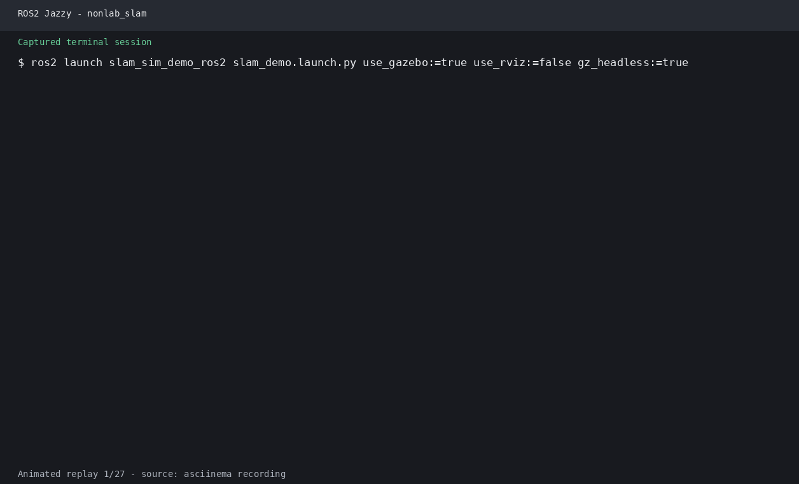
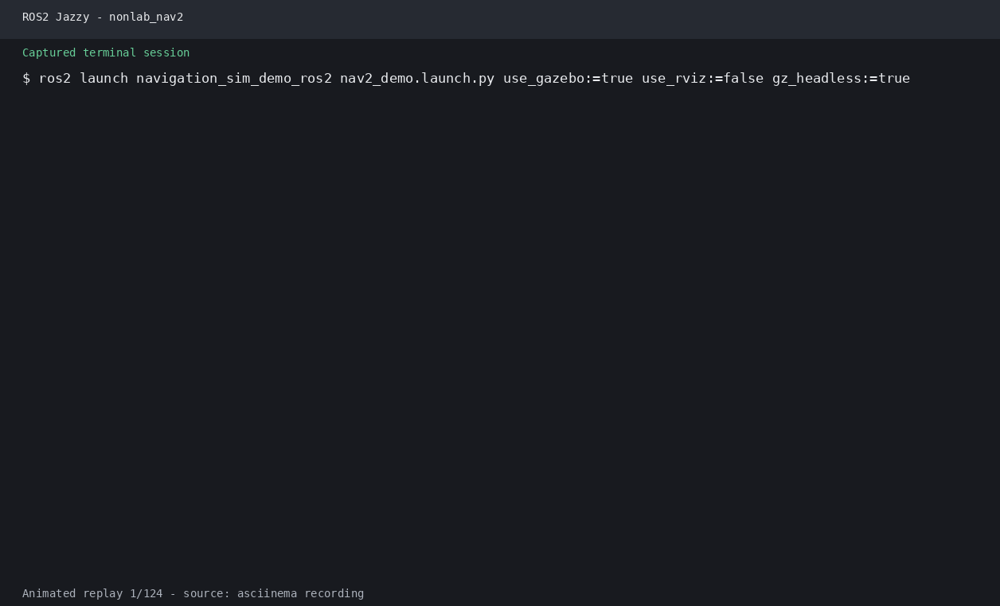

# 第23章 SLAM与导航综合实训

> **课程**：ROS2 Python 编程  
> **章节**：第23章  
> **课时**：4 课时（180 分钟）  
> **教学方式**：讲授 + 演示  

---

## 学习目标

本章学习目标包括：掌握从SLAM建图到自主导航的完整流程，能够在仿真环境中完成建图、保存地图和导航，理解多机器人调度系统的设计方法，培养项目文档编写和方案设计能力，掌握SLAM与导航系统集成的工程实践。

## 23.1 综合项目概述

### 23.1.1 项目目标

本综合实训项目将引导学生完成一个完整的机器人自主导航系统开发：

```
项目阶段:
阶段1: SLAM建图        → 使用激光雷达构建环境地图
阶段2: 地图保存与处理    → 保存PGM/YAML地图并后处理
阶段3: AMCL定位        → 在已知地图上实现定位
阶段4: Nav2自主导航    → 实现点到点自主导航
阶段5: 多机器人调度     → 多机器人协同任务执行
阶段6: 项目文档与评估    → 撰写设计文档和性能评估
```

实训环境包括：ROS 2 Jazzy、Gazebo Sim Harmonic 仿真环境、Wheeltec 机器人模型（课程包 `robot_sim_demo`）以及 Nav2 导航框架。

### 23.1.2 项目要求

基本要求包括：构建至少500m²环境的完整地图，实现稳定的自主导航（成功率>90%），支持多点导航和航点跟随，具备基本故障恢复能力。进阶要求包括：多传感器融合建图（可选IMU），自定义行为树优化导航，多机器人协同导航，以及动态避障和重规划。

## 23.2 SLAM建图实践

### 23.2.1 环境准备

```bash
# 1. 安装依赖
sudo apt install ros-jazzy-slam-toolbox ros-jazzy-nav2-bringup
sudo apt install ros-jazzy-cartographer-ros

# 2. 进入课程工作空间
mkdir -p ~/ros2_course_ws/src
cd ~/ros2_course_ws
colcon build
source install/setup.bash

# 3. 创建项目包（仅用于本综合实训的自定义节点）
cd ~/ros2_course_ws/src
ros2 pkg create slam_nav_project \
  --build-type ament_python \
  --dependencies rclpy std_msgs geometry_msgs nav2_msgs
```

### 23.2.2 使用slam_toolbox建图

```bash
# 启动课程 Wheeltec 仿真环境
ros2 launch robot_sim_demo gazebo2.launch.py drive:=false

# 启动slam_toolbox在线建图
ros2 launch slam_toolbox online_async_launch.py \
  slam_params_file:=./config/mapper_params_online_async.yaml \
  use_sim_time:=true

# 控制机器人探索
ros2 run teleop_twist_keyboard teleop_twist_keyboard

# 保存地图
ros2 run nav2_map_server map_saver_cli -f ~/maps/final_map
```

**自动探索建图脚本：**

```python
#!/usr/bin/env python3
import rclpy
from rclpy.node import Node
from geometry_msgs.msg import Twist
from sensor_msgs.msg import LaserScan
from nav_msgs.msg import OccupancyGrid
import numpy as np
import math

class AutoExplorer(Node):
    """自动探索建图节点"""
    def __init__(self):
        super().__init__('auto_explorer')
        
        self.cmd_pub = self.create_publisher(Twist, '/cmd_vel', 10)
        self.scan_sub = self.create_subscription(
            LaserScan, '/scan', self.scan_callback, 10)
        self.map_sub = self.create_subscription(
            OccupancyGrid, '/map', self.map_callback, 10)
            
        # 状态
        self.front_dist = float('inf')
        self.left_dist = float('inf')
        self.right_dist = float('inf')
        self.map_coverage = 0.0
        self.state = 'explore'  # explore, rotate, forward
        
        # 控制参数
        self.max_speed = 0.22
        self.max_rotation = 0.8
        self.safe_distance = 0.5
        
        self.timer = self.create_timer(0.1, self.control_loop)
        
    def scan_callback(self, msg: LaserScan):
        """分析激光数据"""
        ranges = np.array(msg.ranges)
        angles = np.linspace(msg.angle_min, msg.angle_max, len(ranges))
        
        # 前方区域（-30°到30°）
        n = len(ranges)
        front_idx = n // 2
        window = n // 12
        front = ranges[front_idx-window:front_idx+window]
        self.front_dist = np.min(front[np.isfinite(front)])
        
        # 左方（60°到120°）
        left_idx = n // 3
        left = ranges[left_idx-window:left_idx+window]
        self.left_dist = np.min(left[np.isfinite(left)])
        
        # 右方（-120°到-60°）
        right_idx = 2 * n // 3
        right = ranges[right_idx-window:right_idx+window]
        self.right_dist = np.min(right[np.isfinite(right)])
        
    def map_callback(self, msg: OccupancyGrid):
        """计算地图覆盖率"""
        data = np.array(msg.data)
        total = data.size
        mapped = np.sum(data >= 0)
        self.map_coverage = mapped / total * 100
        
        self.get_logger().info(
            f'地图覆盖率: {self.map_coverage:.1f}%', 
            throttle_duration_sec=5.0)
        
    def control_loop(self):
        """控制循环"""
        cmd = Twist()
        
        if self.map_coverage > 95.0:
            # 建图完成
            cmd.linear.x = 0.0
            cmd.angular.z = 0.0
            self.get_logger().info('建图完成!')
            self.timer.cancel()
            self.cmd_pub.publish(cmd)
            return
            
        if self.front_dist < self.safe_distance:
            # 前方障碍物，旋转
            if self.left_dist > self.right_dist:
                cmd.angular.z = -self.max_rotation  # 右转
            else:
                cmd.angular.z = self.max_rotation   # 左转
            cmd.linear.x = 0.0
        elif self.front_dist < self.safe_distance * 2:
            # 接近障碍物，减速转向
            cmd.linear.x = self.max_speed * 0.3
            if self.left_dist > self.right_dist:
                cmd.angular.z = -self.max_rotation * 0.5
            else:
                cmd.angular.z = self.max_rotation * 0.5
        else:
            # 安全距离，前进
            cmd.linear.x = self.max_speed
            cmd.angular.z = 0.2  # 轻微左偏探索
            
        self.cmd_pub.publish(cmd)
        
def main():
    rclpy.init()
    node = AutoExplorer()
    rclpy.spin(node)
    node.destroy_node()
    rclpy.shutdown()

if __name__ == '__main__':
    main()
```

### 23.2.3 使用Cartographer建图

```bash
# Cartographer 建图（使用课程实验包中的配置）
ros2 launch slam_lab cartographer_mapping.launch.py \
  configuration_directory:=src/lab_code/ch10_lab/slam_lab/config/cartographer \
  configuration_basename:=xbot_2d.lua \
  use_sim_time:=true

# 控制机器人
ros2 run teleop_twist_keyboard teleop_twist_keyboard

# 保存pbstream地图
ros2 service call /write_state cartographer_ros_msgs/srv/WriteState \
  "{filename: '$HOME/maps/office.pbstream'}"

# 转换为ROS标准地图
ros2 run cartographer_ros cartographer_pbstream_to_ros_map \
  -pbstream_filename $HOME/maps/office.pbstream \
  -map_filestem $HOME/maps/office
```

### 23.2.4 地图后处理

```python
import cv2
import numpy as np
import yaml

class MapPostProcessor:
    """地图后处理工具"""
    def __init__(self, pgm_path: str, yaml_path: str):
        self.pgm_path = pgm_path
        self.yaml_path = yaml_path
        
        # 读取地图
        self.image = cv2.imread(pgm_path, cv2.IMREAD_GRAYSCALE)
        
        with open(yaml_path, 'r') as f:
            self.meta = yaml.safe_load(f)
            
    def clean_noise(self, kernel_size: int = 3):
        """去除地图噪声（中值滤波）"""
        self.image = cv2.medianBlur(self.image, kernel_size)
        
    def close_holes(self, kernel_size: int = 5):
        """闭运算填补小孔"""
        kernel = cv2.getStructuringElement(cv2.MORPH_ELLIPSE, 
                                            (kernel_size, kernel_size))
        self.image = cv2.morphologyEx(self.image, cv2.MORPH_CLOSE, kernel)
        
    def inflate_obstacles(self, pixel_radius: int = 5):
        """膨胀障碍物（增加安全边界）"""
        kernel = cv2.getStructuringElement(cv2.MORPH_ELLIPSE, 
                                            (pixel_radius*2+1, pixel_radius*2+1))
        
        # 二值化：白色=空闲，黑色=障碍物
        _, binary = cv2.threshold(self.image, 200, 255, cv2.THRESH_BINARY)
        
        # 膨胀障碍物
        dilated = cv2.erode(binary, kernel)
        
        # 恢复原灰度图
        self.image[dilated == 0] = 0
        
    def crop_map(self):
        """裁剪地图空白区域"""
        # 找到非空白区域
        coords = cv2.findNonZero(self.image)
        if coords is not None:
            x, y, w, h = cv2.boundingRect(coords)
            self.image = self.image[y:y+h, x:x+w]
            
            # 更新元数据
            self.meta['origin'][0] += x * self.meta['resolution']
            self.meta['origin'][1] += y * self.meta['resolution']
            
    def save(self, output_prefix: str):
        """保存处理后的地图"""
        pgm_out = f'{output_prefix}.pgm'
        yaml_out = f'{output_prefix}.yaml'
        
        cv2.imwrite(pgm_out, self.image)
        
        self.meta['image'] = f'{output_prefix.split("/")[-1]}.pgm'
        with open(yaml_out, 'w') as f:
            yaml.dump(self.meta, f, default_flow_style=False)
            
        print(f'地图已保存: {pgm_out}, {yaml_out}')
        
    def visualize(self):
        """显示地图"""
        cv2.imshow('Map', self.image)
        cv2.waitKey(0)
        cv2.destroyAllWindows()

# 使用示例
processor = MapPostProcessor('~/maps/final_map.pgm', '~/maps/final_map.yaml')
processor.clean_noise()
processor.close_holes()
processor.inflate_obstacles(pixel_radius=3)
processor.crop_map()
processor.save('~/maps/processed_map')
```

### 23.2.5 官方要点——slam_toolbox 官方 Wiki：建图、保存与序列化

练习第 1 题的每一步在 slam_toolbox 官方 Wiki 都有对应说明：异步建图（`sync`/`async` 两种模式，后者不阻塞回调）结束后，用 `map_saver_cli -f mymap` 导出 pgm+yaml 地图对；Wiki 强调更推荐用 `/slam_toolbox/serialize_map` 服务保存 `.posegraph` 序列化文件，它保留了位姿图与原始扫描，后续可 `deserialize_map` 继续增量建图——这是"边运营边补图"的官方工作流。Wiki 还给出了占用栅格参数（resolution、map_update_interval）与建图模式（localization-only 模式加载已有位姿图）的切换方法，正好覆盖练习第 1 题从建图到定位的全链路。

## 23.3 自主导航配置

### 23.3.1 Nav2参数配置

```yaml
# nav2_params.yaml - 完整导航配置
bt_navigator:
  ros__parameters:
    default_bt_xml_filename: "navigate_to_pose.xml"
    plugin_lib_names:
      - nav2_compute_path_to_pose_action_bt_node
      - nav2_follow_path_action_bt_node
      - nav2_spin_action_bt_node
      - nav2_back_up_action_bt_node
      - nav2_wait_action_bt_node
      - nav2_clear_costmap_service_bt_node
      - nav2_recovery_node_bt_node
      - nav2_pipeline_sequence_bt_node

planner_server:
  ros__parameters:
    planner_plugins: ["GridBased"]
    GridBased:
      plugin: "nav2_navfn_planner/NavfnPlanner"
      tolerance: 0.5
      use_astar: true

controller_server:
  ros__parameters:
    controller_plugins: ["FollowPath"]
    FollowPath:
      plugin: "dwb_core::DWBLocalPlanner"
      min_vel_x: 0.0
      max_vel_x: 0.5
      max_vel_theta: 1.0
      acc_lim_x: 2.5
      acc_lim_theta: 3.2
      critics: ["RotateToGoal", "Oscillation", "BaseObstacle",
                "GoalAlign", "PathAlign", "PathDist", "GoalDist"]
      RotateToGoal.scale: 32.0
      BaseObstacle.scale: 32.0
      PathAlign.scale: 32.0
      GoalDist.scale: 24.0

local_costmap:
  local_costmap:
    ros__parameters:
      update_frequency: 5.0
      publish_frequency: 2.0
      global_frame: odom
      robot_base_frame: base_link
      rolling_window: true
      width: 4
      height: 4
      resolution: 0.05
      plugins: ["voxel_layer", "inflation_layer"]
      voxel_layer:
        plugin: "nav2_costmap_2d::VoxelLayer"
        enabled: True
        observation_sources: scan
        scan:
          topic: /scan
          max_obstacle_height: 2.0
          clearing: True
          marking: True
      inflation_layer:
        plugin: "nav2_costmap_2d::InflationLayer"
        inflation_radius: 0.55
        cost_scaling_factor: 3.0

global_costmap:
  global_costmap:
    ros__parameters:
      update_frequency: 1.0
      publish_frequency: 1.0
      global_frame: map
      robot_base_frame: base_link
      resolution: 0.05
      track_unknown_space: True
      plugins: ["static_layer", "obstacle_layer", "inflation_layer"]
      static_layer:
        plugin: "nav2_costmap_2d::StaticLayer"
        map_subscribe_transient_local: True
      obstacle_layer:
        plugin: "nav2_costmap_2d::ObstacleLayer"
        enabled: True
        observation_sources: scan
        scan:
          topic: /scan
          max_obstacle_height: 2.0
          clearing: True
          marking: True
      inflation_layer:
        plugin: "nav2_costmap_2d::InflationLayer"
        inflation_radius: 0.55
        cost_scaling_factor: 3.0

amcl:
  ros__parameters:
    max_particles: 2000
    min_particles: 500
    laser_model_type: "likelihood_field"
    update_min_a: 0.2
    update_min_d: 0.1
    z_hit: 0.95
    z_rand: 0.05
    sigma_hit: 0.2
    initial_pose.x: 0.0
    initial_pose.y: 0.0
    initial_pose.yaw: 0.0

behavior_server:
  ros__parameters:
    behavior_plugins: ["spin", "backup", "drive_on_heading", "wait"]
    spin:
      plugin: "nav2_behaviors/Spin"
      max_rotational_vel: 1.0
    backup:
      plugin: "nav2_behaviors/BackUp"
      max_linear_vel: 0.1
```

### 23.3.2 导航启动文件

```python
# bringup_navigation.py
from launch import LaunchDescription
from launch_ros.actions import Node
from launch.actions import IncludeLaunchDescription
from launch.launch_description_sources import PythonLaunchDescriptionSource
from ament_index_python.packages import get_package_share_directory
import os

def generate_launch_description():
    nav2_bringup_dir = get_package_share_directory('nav2_bringup')
    
    return LaunchDescription([
        # 1. 启动仿真环境
        IncludeLaunchDescription(
            PythonLaunchDescriptionSource(
                os.path.join(
                    get_package_share_directory('robot_sim_demo'),
                    'launch/gazebo2.launch.py'
                )
            )
        ),
        
        # 2. 启动AMCL定位
        IncludeLaunchDescription(
            PythonLaunchDescriptionSource(
                os.path.join(nav2_bringup_dir, 'launch/localization_launch.py')
            ),
            launch_arguments={
                'map': os.path.expanduser('~/maps/processed_map.yaml'),
                'use_sim_time': 'true',
            }.items()
        ),
        
        # 3. 启动Nav2导航
        IncludeLaunchDescription(
            PythonLaunchDescriptionSource(
                os.path.join(nav2_bringup_dir, 'launch/navigation_launch.py')
            ),
            launch_arguments={
                'params_file': os.path.join(
                    get_package_share_directory('slam_nav_project'),
                    'config/nav2_params.yaml'
                ),
                'use_sim_time': 'true',
            }.items()
        ),
        
        # 4. 启动RViz2
        Node(
            package='rviz2',
            executable='rviz2',
            name='rviz2',
            arguments=['-d', os.path.join(
                get_package_share_directory('nav2_bringup'),
                'rviz/nav2_default_view.rviz'
            )]
        ),
    ])
```

### 23.3.3 多点导航控制台

```python
#!/usr/bin/env python3
import rclpy
from rclpy.node import Node
from nav2_simple_commander.robot_navigator import BasicNavigator, TaskResult
from geometry_msgs.msg import PoseStamped
import math
import yaml

class NavigationConsole(Node):
    """导航控制台"""
    def __init__(self):
        super().__init__('navigation_console')
        self.navigator = BasicNavigator()
        
    def wait_for_nav2(self):
        """等待Nav2就绪"""
        self.get_logger().info('等待Nav2就绪...')
        self.navigator.waitUntilNav2Active()
        self.get_logger().info('Nav2就绪!')
        
    def create_pose(self, x: float, y: float, yaw: float = 0.0) -> PoseStamped:
        """创建位姿"""
        pose = PoseStamped()
        pose.header.frame_id = 'map'
        pose.header.stamp = self.navigator.get_clock().now().to_msg()
        pose.pose.position.x = x
        pose.pose.position.y = y
        pose.pose.orientation.z = math.sin(yaw / 2.0)
        pose.pose.orientation.w = math.cos(yaw / 2.0)
        return pose
    
    def navigate_to_pose(self, x: float, y: float, yaw: float = 0.0) -> bool:
        """导航到目标点"""
        goal = self.create_pose(x, y, yaw)
        self.get_logger().info(f'导航至: ({x:.2f}, {y:.2f}, {math.degrees(yaw):.1f}°)')
        
        self.navigator.goToPose(goal)
        
        while not self.navigator.isTaskComplete():
            feedback = self.navigator.getFeedback()
            if feedback:
                self.get_logger().info(
                    f'剩余距离: {feedback.distance_remaining:.2f}m',
                    throttle_duration_sec=2.0
                )
                
        result = self.navigator.getResult()
        if result == TaskResult.SUCCEEDED:
            self.get_logger().info('目标到达!')
            return True
        else:
            self.get_logger().error(f'导航失败: {result}')
            return False
    
    def follow_waypoints(self, waypoints: list) -> bool:
        """航点导航"""
        poses = [self.create_pose(x, y, yaw) for x, y, yaw in waypoints]
        self.get_logger().info(f'开始航点导航: {len(poses)}个目标')
        
        self.navigator.followWaypoints(poses)
        
        while not self.navigator.isTaskComplete():
            feedback = self.navigator.getFeedback()
            if feedback:
                self.get_logger().info(
                    f'前往航点 #{feedback.current_waypoint}/{len(poses)}',
                    throttle_duration_sec=2.0
                )
                
        result = self.navigator.getResult()
        return result == TaskResult.SUCCEEDED
    
    def patrol(self, waypoints: list, loops: int = 3):
        """巡逻任务"""
        for loop in range(loops):
            self.get_logger().info(f'--- 巡逻第 {loop+1}/{loops} 轮 ---')
            for x, y, yaw in waypoints:
                if not self.navigate_to_pose(x, y, yaw):
                    self.get_logger().error('巡逻中断')
                    return
        self.get_logger().info('巡逻任务完成!')
    
    def load_mission(self, yaml_file: str):
        """从YAML加载任务"""
        with open(yaml_file, 'r') as f:
            mission = yaml.safe_load(f)
            
        self.get_logger().info(f'加载任务: {mission["name"]}')
        
        for task in mission['tasks']:
            if task['type'] == 'navigation':
                self.navigate_to_pose(
                    task['x'], task['y'], task.get('yaw', 0.0)
                )
            elif task['type'] == 'wait':
                self.get_logger().info(f'等待 {task["duration"]}s')
                rclpy.spin_once(self, timeout_sec=task['duration'])
            elif task['type'] == 'patrol':
                self.patrol(task['waypoints'], task.get('loops', 3))
                
def main():
    rclpy.init()
    console = NavigationConsole()
    console.wait_for_nav2()
    
    # 示例：多点导航
    waypoints = [
        (1.0, 0.5, 0.0),
        (2.0, 1.0, math.radians(45)),
        (1.5, 2.0, math.radians(90)),
        (0.0, 1.5, math.radians(180)),
    ]
    console.patrol(waypoints, loops=2)
    
    rclpy.shutdown()
```

### 23.3.4 官方要点——Nav2 官方：从建图到导航的误差控制

Nav2 官方调优文档把练习第 4 题的"误差来源"拆成了三层：建图层—— slam_toolbox 的 `minimum_travel_distance`（关键帧间距）过大导致局部细节缺失，官方建议在拐角处降低阈值；定位层——AMCL 的 `set_initial_pose` 未设时首帧需人工给位姿，`laser_model_type` 与 `max_beams` 直接决定粒子发散速度（官方文档建议室内 360° 雷达用 likelihood_field 模型）；规划层——代价地图 inflation_radius 取值过小会造成贴墙路径，过大则狭窄通道不可达，官方调优指南给出" inflation = 机器人半径 + 动态余量"的经验公式。三层误差会相乘式放大，官方因此强调"每层单独验证"（先 rosbag 回放定位精度，再全链路导航）。

## 23.4 多机器人调度

### 23.4.1 多机器人架构

```python
import rclpy
from rclpy.node import Node
from nav2_msgs.action import NavigateToPose
from rclpy.action import ActionClient
import yaml
import threading

class MultiRobotScheduler(Node):
    """多机器人调度器"""
    def __init__(self):
        super().__init__('multi_robot_scheduler')
        
        # 机器人客户端
        self.robots = {}
        robot_configs = [
            ('robot1', '/robot1/navigate_to_pose'),
            ('robot2', '/robot2/navigate_to_pose'),
            ('robot3', '/robot3/navigate_to_pose'),
        ]
        
        for name, action_name in robot_configs:
            self.robots[name] = {
                'client': ActionClient(self, NavigateToPose, action_name),
                'status': 'idle',
                'position': None
            }
            
        # 任务队列
        self.task_queue = []
        self.lock = threading.Lock()
        
        # 调度定时器
        self.timer = self.create_timer(1.0, self.dispatch_loop)
        
        self.get_logger().info('多机器人调度器已启动')
        
    def add_task(self, robot: str, x: float, y: float, yaw: float = 0.0,
                  priority: int = 0):
        """添加任务"""
        with self.lock:
            self.task_queue.append({
                'robot': robot,
                'x': x, 'y': y, 'yaw': yaw,
                'priority': priority,
                'status': 'pending'
            })
            
        self.get_logger().info(
            f'任务已添加: {robot} → ({x:.1f}, {y:.1f})')
        
    def dispatch_loop(self):
        """调度循环"""
        with self.lock:
            # 按优先级排序
            self.task_queue.sort(key=lambda t: -t['priority'])
            
            for task in self.task_queue:
                if task['status'] != 'pending':
                    continue
                    
                robot = self.robots[task['robot']]
                if robot['status'] != 'idle':
                    continue
                    
                # 派发任务
                self._send_goal(task['robot'], task)
                task['status'] = 'dispatched'
                robot['status'] = 'busy'
                
    def _send_goal(self, robot_name: str, task: dict):
        """发送导航目标"""
        robot = self.robots[robot_name]
        goal = NavigateToPose.Goal()
        goal.pose.header.frame_id = 'map'
        goal.pose.pose.position.x = task['x']
        goal.pose.pose.position.y = task['y']
        
        yaw = task.get('yaw', 0.0)
        goal.pose.pose.orientation.z = math.sin(yaw / 2.0)
        goal.pose.pose.orientation.w = math.cos(yaw / 2.0)
        
        client = robot['client']
        client.wait_for_server()
        
        send_goal_future = client.send_goal_async(goal)
        send_goal_future.add_done_callback(
            lambda future, r=robot_name: self._goal_callback(future, r))
        
    def _goal_callback(self, future, robot_name: str):
        """目标响应回调"""
        goal_handle = future.result()
        if not goal_handle.accepted:
            self.get_logger().error(f'{robot_name}: 目标被拒绝')
            self.robots[robot_name]['status'] = 'idle'
            return
            
        result_future = goal_handle.get_result_async()
        result_future.add_done_callback(
            lambda future, r=robot_name: self._result_callback(future, r))
        
    def _result_callback(self, future, robot_name: str):
        """结果回调"""
        result = future.result().result
        status = future.result().status
        
        self.robots[robot_name]['status'] = 'idle'
        
        if status == 4:  # SUCCEEDED
            self.get_logger().info(f'{robot_name}: 任务完成')
            
            # 更新位置
            self.robots[robot_name]['position'] = (
                result.pose.position.x, result.pose.position.y
            )
        else:
            self.get_logger().error(f'{robot_name}: 任务失败 {status}')
            
    def get_status(self) -> dict:
        """获取所有机器人状态"""
        status = {}
        for name, robot in self.robots.items():
            status[name] = {
                'status': robot['status'],
                'position': robot['position']
            }
        return status

class ConflictResolver:
    """冲突解决器"""
    def __init__(self):
        self.occupied_zones = {}  # 区域占用
        
    def check_conflict(self, robot_name: str, 
                        goal_x: float, goal_y: float) -> bool:
        """检查是否存在冲突"""
        for other_robot, zone in self.occupied_zones.items():
            if other_robot == robot_name:
                continue
                
            dist = math.sqrt((zone['x'] - goal_x)**2 + 
                             (zone['y'] - goal_y)**2)
            if dist < 1.0:  # 1m内视为冲突
                return True
        return False
    
    def reserve_zone(self, robot_name: str, 
                      x: float, y: float, radius: float = 1.0):
        """预留区域"""
        self.occupied_zones[robot_name] = {'x': x, 'y': y, 'r': radius}
        
    def release_zone(self, robot_name: str):
        """释放区域"""
        self.occupied_zones.pop(robot_name, None)
```

### 23.4.2 多机器人仿真启动

```bash
# 多机器人启动是设计扩展，本仓库当前只提供单 Wheeltec 仿真入口：
ros2 launch robot_sim_demo gazebo2.launch.py drive:=false

# 分别为每个机器人启动SLAM和导航
# 终端1：机器人1
ROS_NAMESPACE=robot1 \
ros2 launch slam_toolbox online_async_launch.py \
  slam_params_file:=./config/robot1_params.yaml

# 终端2：机器人2
ROS_NAMESPACE=robot2 \
ros2 launch slam_toolbox online_async_launch.py \
  slam_params_file:=./config/robot2_params.yaml

# 启动调度器
ros2 run slam_nav_project multi_robot_scheduler
```

### 23.4.3 官方要点——多机器人：官方示例与调度架构

练习第 3 题可参考两个官方项目：Nav2 官方文档的 multi-robot 页面给出了"每机器人一个独立 namespace + 各自 costmap/AMCL，共享一张合并地图"的推荐架构，配合 `multirobot_map_merge` 与 `multi_nav2` 示例包；调度层面官方推荐用一个中心化节点封装 Simple Commander 的 `followWaypoints`（支持为每个航点分配不同机器人），并通过 `robot_state` 话题广播各机状态实现冲突避免（如充电桩互斥、窄道会车让行）。RoboCup@Home 与 AWS RoboMaker 官方示例也展示了"任务队列 + 优先级抢占"的调度器框架，与练习第 6 题商超多机器人（清洁/巡检/导购）的任务分配需求同构。

## 23.5 项目文档规范

### 23.5.1 项目文档结构

```
slam_nav_project/
├── README.md                    # 项目概览
├── docs/
│   ├── requirements.md          # 需求文档
│   ├── architecture.md          # 架构设计
│   ├── api_reference.md         # API文档
│   ├── test_report.md           # 测试报告
│   └── user_manual.md           # 用户手册
├── config/
│   ├── nav2_params.yaml         # 导航参数
│   ├── mapper_params.yaml       # 建图参数
│   └── robot_config.yaml        # 机器人配置
├── launch/
│   ├── slam_nav_bringup.py      # 主启动文件
│   └── multi_robot.launch.py    # 多机器人启动
├── maps/
│   ├── raw_map.pgm              # 原始建图
│   ├── raw_map.yaml
│   ├── processed_map.pgm        # 处理后地图
│   └── processed_map.yaml
├── scripts/
│   ├── auto_explorer.py         # 自动探索
│   ├── navigation_console.py    # 导航控制台
│   └── multi_robot_scheduler.py # 多机器人调度
└── tests/
    ├── test_navigation.py       # 导航测试
    └── test_multi_robot.py      # 多机器人测试
```

### 23.5.2 设计文档模板

```markdown
# 项目名称：SLAM与导航综合实训项目

## 1. 项目概述
- 项目目标：
- 技术栈：ROS 2 Jazzy, Wheeltec, Nav2, slam_toolbox
- 实现功能：

## 2. 系统架构
### 2.1 架构图
[系统架构图]

### 2.2 模块说明
| 模块名称 | 功能描述 | 输入 | 输出 |
|---------|---------|------|------|
| SLAM建图 | 构建环境地图 | /scan, /tf | /map |
| AMCL定位 | 已知地图定位 | /scan, /map, /tf | /amcl_pose |
| 全局规划 | 全局路径规划 | 目标点, 代价地图 | /plan |
| 局部控制 | 路径跟踪 | /plan, /scan | /cmd_vel |

## 3. 建图方案
### 3.1 算法选择
- 使用 slam_toolbox 在线异步建图
- 地图分辨率：0.05m
- 建图方式：自动探索

### 3.2 建图参数
[关键参数说明]

## 4. 导航方案
### 4.1 路径规划
- 全局规划：Navfn + A*
- 局部控制：DWB

### 4.2 定位方案
- AMCL粒子滤波
- 初始位姿设定

## 5. 测试与评估
### 5.1 建图评估
| 指标 | 数值 |
|------|------|
| 地图覆盖率 | 95% |
| 建图时间 | 15min |
| 回环闭合 | 成功 |

### 5.2 导航评估
| 指标 | 数值 |
|------|------|
| 导航成功率 | 93% |
| 平均规划时间 | 0.5s |
| 路径长度误差 | <5% |

## 6. 问题与解决方案
[记录开发过程中遇到的问题和解决方案]
```

### 23.5.3 测试方案

```python
#!/usr/bin/env python3
import rclpy
from rclpy.node import Node
import time
import math

class NavigationTester(Node):
    """导航性能测试"""
    def __init__(self):
        super().__init__('navigation_tester')
        
        self.results = {
            'success_count': 0,
            'fail_count': 0,
            'planning_times': [],
            'navigation_times': [],
            'path_lengths': []
        }
        
    def run_test_suite(self, test_cases: list):
        """执行测试套件"""
        self.get_logger().info(f'开始测试: {len(test_cases)}个用例')
        
        for i, test in enumerate(test_cases):
            self.get_logger().info(f'测试 {i+1}/{len(test_cases)}')
            
            start_time = time.time()
            success = self._execute_test(test)
            elapsed = time.time() - start_time
            
            if success:
                self.results['success_count'] += 1
            else:
                self.results['fail_count'] += 1
                
            self.results['navigation_times'].append(elapsed)
            
        self._print_report()
        
    def _execute_test(self, test: dict) -> bool:
        """执行单个测试"""
        # 导航到测试点
        # ...
        return True
        
    def _print_report(self):
        """打印测试报告"""
        total = (self.results['success_count'] + 
                 self.results['fail_count'])
        success_rate = (self.results['success_count'] / total * 100)
        
        avg_time = (sum(self.results['navigation_times']) / 
                    len(self.results['navigation_times']))
        
        print('=' * 50)
        print(f'测试报告')
        print('=' * 50)
        print(f'总用例: {total}')
        print(f'成功: {self.results["success_count"]}')
        print(f'失败: {self.results["fail_count"]}')
        print(f'成功率: {success_rate:.1f}%')
        print(f'平均导航时间: {avg_time:.2f}s')
        print('=' * 50)
```

## 23.6 性能评估与优化

### 23.6.1 建图质量评估

```python
import numpy as np
import cv2

class MapEvaluator:
    """建图质量评估"""
    def __init__(self, map_pgm: str, ground_truth_pgm: str = None):
        self.map = cv2.imread(map_pgm, cv2.IMREAD_GRAYSCALE)
        self.ground_truth = None
        if ground_truth_pgm:
            self.ground_truth = cv2.imread(ground_truth_pgm, cv2.IMREAD_GRAYSCALE)
            
    def compute_coverage(self) -> float:
        """计算地图覆盖率"""
        explored = np.sum(self.map != 205)  # 非灰色区域
        total = self.map.size
        return explored / total * 100
    
    def compute_accuracy(self) -> float:
        """计算建图精度（如果有真值）"""
        if self.ground_truth is None:
            return 0.0
            
        # 简单的像素级对比
        diff = cv2.absdiff(self.map, self.ground_truth)
        accuracy = 1.0 - (np.sum(diff > 50) / diff.size)
        return accuracy
    
    def compute_clarity(self) -> float:
        """计算地图清晰度（边缘锐度）"""
        edges = cv2.Canny(self.map, 50, 150)
        edge_density = np.sum(edges > 0) / edges.size
        return edge_density
    
    def full_report(self) -> dict:
        """完整评估报告"""
        return {
            'coverage': self.compute_coverage(),
            'accuracy': self.compute_accuracy(),
            'clarity': self.compute_clarity(),
            'resolution': '0.05m/pixel',
            'total_cells': self.map.size
        }
```

### 23.6.2 导航性能优化清单

```markdown
# 导航性能优化清单

## 建图阶段
- [ ] 充分探索所有区域（覆盖率>95%）
- [ ] 地图后处理（噪声滤波、空洞填补）
- [ ] 设置合适的地图原点
- [ ] 检查地图与真值匹配度

## 定位阶段
- [ ] 正确设置初始位姿
- [ ] 调整AMCL粒子数（500-2000）
- [ ] 选择适合的激光模型（似然域/波束）
- [ ] 检查TF变换正确性

## 规划阶段
- [ ] 选择适合的全局规划器
- [ ] 调整膨胀半径（机器人半径×2）
- [ ] 优化代价地图更新频率
- [ ] 设置合理的规划超时时间

## 控制阶段
- [ ] 调整最大速度（安全范围内）
- [ ] 优化DWB评分器权重
- [ ] 配置合理的恢复行为
- [ ] 调节前瞻距离（Pure Pursuit）

## 系统级优化
- [ ] 降低代价地图分辨率（大型环境）
- [ ] 增加局部地图尺寸
- [ ] 配置生命周期节点自动启动
- [ ] 启用fast_odom模式
```

## 23.7 常见问题排查

```python
# troubleshooting.py
class TroubleshootingGuide:
    """故障排查指南"""
    
    @staticmethod
    def check_slam_issues():
        """SLAM问题排查"""
        print("""
        SLAM常见问题:
        
        1. 建图漂移
           → 检查激光频率(>5Hz)
           → 降低移动速度
           → 启用回环检测
        
        2. 地图错位
           → 检查里程计精度
           → 增加粒子数
           → 调整扫描匹配参数
        
        3. 地图不完整
           → 增加探索时间
           → 检查激光范围设置
           → 确保死角被覆盖
        """)
    
    @staticmethod
    def check_navigation_issues():
        """导航问题排查"""
        print("""
        导航常见问题:
        
        1. 路径规划失败
           → 检查代价地图状态
           → 检查起点/终点是否可通行
           → 清除代价地图重试
        
        2. 导航卡住
           → 增大膨胀半径
           → 降低最大速度
           → 检查恢复行为配置
        
        3. 定位丢失
           → 检查AMCL状态
           → 重新设置初始位姿
           → 增加粒子数
        
        4. 避障失败
           → 检查传感器数据
           → 调整障碍物层参数
           → 减小最大速度
        """)
    
    @staticmethod
    def run_diagnostics():
        """运行诊断"""
        commands = """
        # 检查话题
        ros2 topic list
        ros2 topic hz /scan /odom /tf
        
        # 检查节点
        ros2 node list
        ros2 lifecycle list
        
        # 检查参数
        ros2 param list /planner_server
        ros2 param list /controller_server
        
        # 检查TF树
        ros2 run tf2_tools view_frames.py
        
        # 查看代价地图
        ros2 topic echo /global_costmap/costmap --once
        
        # 查看AMCL状态
        ros2 topic echo /particlecloud --once
        """
        print("诊断命令:")
        print(commands)
```

### 23.7.1 官方要点——自动探索与健康管理：官方生态的收尾组件

练习第 2 题的自主探索建图在官方生态中有成熟模板：`explore-lite`（m-explore 的 ROS 2 移植）以"边界点（frontier）检测 + Nav2 导航"循环建图，其 README 明确支持与 slam_toolbox 组合；把"覆盖率>95% 自动保存"改为订阅地图元数据统计自由区域即可。健康管理方面，Nav2 官方文档建议用 `diagnostic_updater` 汇报各服务器活性（bt_navigator、controller_server 的心跳），配合 `lifecycle_manager` 的 `bond_timeout` 实现进程级看门狗——服务器失联时自动触发树级恢复而非整机重启，这是商超长期运营方案（练习第 6 题）的系统监控基座。Robotics Back-End 的实训教程把这些组件串成了完整的"建图→保存→定位→导航→探索→监控"脚本模板。

## 课后练习

1. **操作题:** 完成从SLAM建图到自主导航的完整流程：启动仿真→slam_toolbox建图→保存地图→启动AMCL定位→发送导航目标到达目标点。

2. **编程题:** 编写一个完整的自动探索建图节点，支持在未知环境中自主移动完成建图，并在覆盖率超过95%时自动保存地图。

3. **设计题:** 设计一个支持3个机器人的多机器人调度系统，要求支持任务分配、冲突避免和状态监控，给出系统架构图和核心代码框架。

4. **分析题:** 分析从SLAM建图到自主导航的完整流程中，哪些环节最容易引入误差，如何通过参数调优和算法选择来减小误差。

5. **文档题:** 仿照本节的设计文档模板，为你的SLAM与导航项目撰写完整的设计文档，包含需求分析、系统架构、参数配置、测试方案和问题记录。

6. **综合题:** 设计一个面向大型商超的机器人服务方案（包括清洁、巡检、导购等多类型机器人），涵盖SLAM建图方案（跨楼层）、多机器人调度（任务优先级）、人机交互（目标下达）和系统监控（健康管理）。

---

## 仿真结合实例（当前仓库）：从在线建图切换到 Nav2 导航

### 目标与知识点对应

先用 `slam_sim_demo_ros2` 在 Gazebo 中建立地图并检查地图增长，再用 `navigation_sim_demo_ros2` 加载预置地图启动 Nav2，串联 SLAM、定位、规划与控制四个阶段。

### 运行步骤

```bash
source /opt/ros/jazzy/setup.bash
source install/setup.bash

# 终端 1：在线建图
ros2 launch slam_sim_demo_ros2 slam_demo.launch.py \
  use_gazebo:=true use_rviz:=true gz_headless:=false
# 终端 2：驱动并检查地图
ros2 run slam_sim_demo_ros2 slam_map_runner
```

完成输入检查后，停止该组进程，在新的 ROS 域或干净终端中运行：

```bash
# 终端 3：加载预置地图并启动 Nav2
ros2 launch navigation_sim_demo_ros2 nav2_demo.launch.py \
  use_gazebo:=true use_rviz:=true gz_headless:=false
# 终端 4：检查生命周期并发送目标
ros2 run navigation_sim_demo_ros2 nav2_lifecycle_runner
ros2 run navigation_sim_demo_ros2 nav_goal_runner
```

### 观察结果

第一阶段观察 `/map` 更新和 `slam-map-updated`；第二阶段观察 Nav2 组件激活、RViz 地图/路径和 `/odom` 变化。

### 源码与证据

SLAM 源码位于 `src/slam_sim_demo_ros2/`，Nav2 源码位于 `src/navigation_sim_demo_ros2/`，Gazebo 模型位于 `src/robot_sim_demo/`，终端证据见 `lab_manuals/images/runtime/nonlab_slam.png` 与 `nonlab_nav2.png`。





两套 Launch 都可能启动 Gazebo，切换时必须先停止上一套进程，避免两个仿真器争用同一 ROS/Gazebo 图。

学习材料：
- slam_toolbox 官方 Wiki（SteveMacenski）：https://wiki.ros.org/slam_toolbox
- Nav2 官方文档 —— 地图服务、调优与多机器人：https://docs.nav2.org/
- navigation2 仓库 —— multi_nav2 与 Simple Commander 示例：https://github.com/ros-navigation/navigation2
- explore-lite 官方仓库（m-explore ROS 2 移植）：https://github.com/robo-friends/m-explore-ros2
- The Construct —— SLAM 与导航综合实训课程：https://www.theconstructsim.com/
- Robotics Back-End —— 建图导航衔接实战教程：https://roboticsbackend.com/
