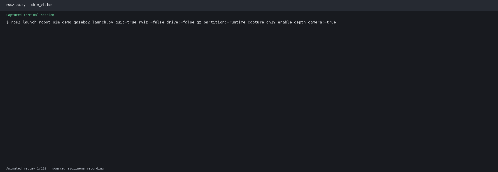

# 第30章 ROS2图像接口与相机标定

> **课程**：ROS2 Python 编程  
> **章节**：第30章  
> **课时**：2 课时（90 分钟）  
> **教学方式**：讲授 + 演示  

---

## 学习目标

本章学习目标包括：掌握sensor_msgs/Image消息结构与CameraInfo相机内参消息，学会使用cv_bridge进行ROS2图像与OpenCV格式互转，理解image_transport图像传输机制，学会usb_cam驱动的安装与使用，并掌握相机标定的原理和实践方法。

## 30.1 ROS2图像消息

### 30.1.1 Image消息结构

ROS2中使用`sensor_msgs/Image`作为标准图像消息格式：

```
sensor_msgs/Image
  - header          # 消息头 (stamp, frame_id)
  - height          # 图像高度 (像素)
  - width           # 图像宽度 (像素)
  - encoding        # 编码格式 (rgb8, bgr8, mono8...)
  - is_bigendian    # 字节序
  - step            # 行字节数 (width * bytes_per_pixel)
  - data            # 原始图像数据 (uint8数组)
```

`encoding`字段决定了图像数据的解释方式：

| encoding值 | OpenCV类型 | 说明 |
|-----------|-----------|------|
| mono8 | CV_8UC1 | 8位灰度图 |
| mono16 | CV_16UC1 | 16位灰度图 |
| bgr8 | CV_8UC3 | BGR彩色图（OpenCV默认） |
| rgb8 | CV_8UC3 | RGB彩色图 |
| bgra8 | CV_8UC4 | BGR带Alpha通道 |
| rgba8 | CV_8UC4 | RGB带Alpha通道 |
| 32FC1 | CV_32FC1 | 32位浮点深度图 |

### 30.1.2 CompressedImage消息

对于高分辨率图像，使用压缩消息可以减少带宽占用：

```
sensor_msgs/CompressedImage
  - header
  - format          # 压缩格式 (jpeg, png, bmp)
  - data            # 压缩数据
```

### 30.1.3 CameraInfo消息

相机内参通过`/camera_info`话题发布：

```
sensor_msgs/CameraInfo
  - header
  - height, width           # 图像分辨率
  - distorsion_model        # 畸变模型 (plumb_bob, rational...)
  - d                       # 畸变系数 [k1, k2, p1, p2, k3]
  - k                       # 内参矩阵 [fx, 0, cx; 0, fy, cy; 0, 0, 1]
  - r                       # 校正矩阵 (3x3)
  - p                       # 投影矩阵 (3x4)
  - binning_x, binning_y    # 合并像素
  - roi                     # 感兴趣区域
```

```python
# 读取CameraInfo示例
from sensor_msgs.msg import CameraInfo

class CameraInfoReader(Node):
    def __init__(self):
        super().__init__('camera_info_reader')
        self.sub = self.create_subscription(
            CameraInfo, '/camera/color/camera_info',
            self.info_callback, 10
        )

    def info_callback(self, msg):
        self.get_logger().info(f'分辨率: {msg.width}x{msg.height}')
        self.get_logger().info(f'内参矩阵: {msg.k}')
        self.get_logger().info(f'畸变系数: {msg.d}')
        self.get_logger().info(f'投影矩阵: {msg.p}')
```

### 30.1.4 官方要点——sensor_msgs/Image 官方定义与 cv_bridge 官方教程

> 本节内容综合翻译自 ROS 2 官方文档（sensor_msgs 与 image_transport 接口定义）、image_pipeline 官方文档（camera_calibration 包）、usb_cam 官方仓库文档与 OpenCV 官方标定教程，另参考 The Construct 的 ROS 2 视觉课程与 Robotics Back-End 的相机标定教程。原文均为英文，此处为中文编译，供课后巩固与进阶阅读。

ROS 2 官方消息定义（sensor_msgs/Image）把本章 30.1 节的字段语义写死在接口里：`header` 携带时间戳与相机帧、`height/width` 为像素行/列、`encoding` 采用与 OpenCV 相同的字符串（bgr8、mono8、32FC1 等）、`step` 是一行数据的字节数（含内存对齐）、`data` 是扁平字节流。官方 cv_bridge 文档进一步约定 `CvBridge.cvtToCvImg()` 的转换分"复制"与"共享所有权（share）"两种模式：共享模式零拷贝但要求后续算法不得改动图像缓冲，这是官方性能建议与线程安全的分界线，也解释了练习第 1 题中"转灰度后重新发布"必须先复制再改写的原因。

## 30.2 cv_bridge图像转换

### 30.2.1 CvBridge核心用法

cv_bridge提供了ROS2 Image ↔ OpenCV cv::Mat的双向转换：

```
ROS2 Image ──imgmsg_to_cv2()──→ OpenCV Mat
OpenCV Mat ──cv2_to_imgmsg()──→ ROS2 Image
```

```python
#!/usr/bin/env python3
"""cv_bridge基本用法示例"""
import rclpy
from rclpy.node import Node
from sensor_msgs.msg import Image
from cv_bridge import CvBridge, CvBridgeError
import cv2

class CvBridgeDemo(Node):
    def __init__(self):
        super().__init__('cv_bridge_demo')
        self.bridge = CvBridge()

        # 订阅原始图像
        self.image_sub = self.create_subscription(
            Image, '/camera/color/image_raw',
            self.image_callback, 10
        )
        # 发布处理后的图像
        self.image_pub = self.create_publisher(
            Image, '/image_processed', 10
        )

    def image_callback(self, data):
        try:
            # ROS2 Image → OpenCV Mat
            cv_image = self.bridge.imgmsg_to_cv2(data, 'bgr8')
        except CvBridgeError as e:
            self.get_logger().error(str(e))
            return

        # OpenCV处理：转为灰度图
        gray = cv2.cvtColor(cv_image, cv2.COLOR_BGR2GRAY)

        # 显示图像
        cv2.imshow('CV Bridge Demo', cv_image)
        cv2.waitKey(3)

        try:
            # OpenCV Mat → ROS2 Image
            msg = self.bridge.cv2_to_imgmsg(gray, 'mono8')
            msg.header.stamp = self.get_clock().now().to_msg()
            msg.header.frame_id = 'camera_link'
            self.image_pub.publish(msg)
        except CvBridgeError as e:
            self.get_logger().error(str(e))

def main(args=None):
    rclpy.init(args=args)
    node = CvBridgeDemo()
    try:
        rclpy.spin(node)
    except KeyboardInterrupt:
        cv2.destroyAllWindows()
    finally:
        node.destroy_node()
        rclpy.shutdown()

if __name__ == '__main__':
    main()
```

### 30.2.2 编码格式对应表

```python
class EncodingConverter:
    """编码格式转换工具"""

    @staticmethod
    def ros_to_opencv(ros_encoding):
        """ROS2编码 → OpenCV编码"""
        encoding_map = {
            'mono8': 'CV_8UC1',
            'mono16': 'CV_16UC1',
            'bgr8': 'CV_8UC3',
            'rgb8': 'CV_8UC3',
            'bgra8': 'CV_8UC4',
            'rgba8': 'CV_8UC4',
            '32fc1': 'CV_32FC1',
        }
        return encoding_map.get(ros_encoding, 'CV_8UC3')

    @staticmethod
    def get_channels(ros_encoding):
        """获取图像通道数"""
        if 'mono' in ros_encoding or '32fc' in ros_encoding:
            return 1
        elif 'bgr8' in ros_encoding or 'rgb8' in ros_encoding:
            return 3
        elif 'bgra8' in ros_encoding or 'rgba8' in ros_encoding:
            return 4
        return 3
```

### 30.2.3 图像发布节点

```python
#!/usr/bin/env python3
"""图像发布节点 — 从摄像头读取并发布为ROS2话题"""
import rclpy
from rclpy.node import Node
from sensor_msgs.msg import Image
from cv_bridge import CvBridge
import cv2

class ImagePublisher(Node):
    def __init__(self):
        super().__init__('image_publisher')
        self.pub = self.create_publisher(Image, '/camera/image_raw', 10)
        self.bridge = CvBridge()

        # 打开摄像头
        self.cap = cv2.VideoCapture(0)
        if not self.cap.isOpened():
            self.get_logger().error('无法打开摄像头')
            raise RuntimeError('摄像头打开失败')

        # 设置摄像头参数
        self.cap.set(cv2.CAP_PROP_FRAME_WIDTH, 640)
        self.cap.set(cv2.CAP_PROP_FRAME_HEIGHT, 480)
        self.cap.set(cv2.CAP_PROP_FPS, 30)

        # 定时发布（约30fps）
        self.timer = self.create_timer(0.033, self.timer_callback)
        self.get_logger().info('图像发布节点已启动')

    def timer_callback(self):
        ret, frame = self.cap.read()
        if not ret:
            self.get_logger().warn('读取图像失败')
            return

        # OpenCV Mat → ROS2 Image
        msg = self.bridge.cv2_to_imgmsg(frame, 'bgr8')
        msg.header.stamp = self.get_clock().now().to_msg()
        msg.header.frame_id = 'camera_link'
        self.pub.publish(msg)

    def __del__(self):
        if hasattr(self, 'cap'):
            self.cap.release()

def main(args=None):
    rclpy.init(args=args)
    node = ImagePublisher()
    try:
        rclpy.spin(node)
    except KeyboardInterrupt:
        pass
    finally:
        node.destroy_node()
        rclpy.shutdown()

if __name__ == '__main__':
    main()
```

## 30.3 image_transport

### 30.3.1 image_transport基础

ROS2中image_transport提供了图像发布与订阅的抽象层，支持原始图像和压缩图像的自动切换：

```bash
# 常用transport插件
ros-jazzy-image-transport      # 基础传输
ros-jazzy-compressed-image-transport  # 压缩图像传输
ros-jazzy-theora-image-transport      # 视频流传输
```

### 30.3.2 使用image_transport发布图像

```python
from image_transport import ImageTransport

class ImageTransportPublisher(Node):
    def __init__(self):
        super().__init__('image_transport_publisher')
        self.bridge = CvBridge()

        # 创建ImageTransport实例
        self.it = ImageTransport(self)

        # 创建发布者（支持raw和compressed）
        self.pub = self.it.advertise('/camera/image', 10)

        self.cap = cv2.VideoCapture(0)
        self.timer = self.create_timer(0.033, self.publish_image)

    def publish_image(self):
        ret, frame = self.cap.read()
        if not ret:
            return
        msg = self.bridge.cv2_to_imgmsg(frame, 'bgr8')
        msg.header.stamp = self.get_clock().now().to_msg()
        msg.header.frame_id = 'camera_link'
        self.pub.publish(msg)
```

### 30.3.3 使用image_transport订阅图像

```python
from image_transport import ImageTransport

class ImageTransportSubscriber(Node):
    def __init__(self):
        super().__init__('image_transport_subscriber')
        self.bridge = CvBridge()

        # 创建ImageTransport实例
        self.it = ImageTransport(self)

        # 订阅图像（自动处理raw和compressed）
        self.sub = self.it.subscribe(
            '/camera/image', self.image_callback, 'raw'
        )

    def image_callback(self, msg):
        try:
            cv_image = self.bridge.imgmsg_to_cv2(msg, 'bgr8')
            cv2.imshow('Image Transport', cv_image)
            cv2.waitKey(1)
        except Exception as e:
            self.get_logger().error(str(e))
```

### 30.3.4 官方要点——image_transport 官方插件机制

image_transport 官方文档（image_common 项目）说明它并非一个 publisher，而是"话题重发布器"：同一图像在 `/camera/image_raw`（raw）与 `/camera/image_raw/compressed`（sensor_msgs/CompressedImage）等多个后缀话题上共存，订阅端按需选择传输格式。官方定义的五个标准插件——raw、compressed（JPEG/PNG）、compressedDepth、theora 与 video——通过 pluginlib 动态加载，`image_transport::CameraPublisher` 还能把 Image 与 CameraInfo 同步发布。练习第 5 题的压缩发布在官方文档中就是 `advertise()` + `publish()` 的直接替换，无需修改算法代码；ros2 humble 后官方还加入了参数化压缩质量（jpeg_quality）的说明。

## 30.4 usb_cam驱动

### 30.4.1 安装usb_cam

```bash
# 安装usb_cam功能包
sudo apt install ros-jazzy-usb-cam

# 或从源码编译
cd ~/ros2_course_ws/src
git clone https://github.com/ros-drivers/usb_cam.git
cd ..
colcon build --packages-select usb_cam
```

### 30.4.2 配置和启动usb_cam

```bash
# 启动usb_cam节点
ros2 run usb_cam usb_cam_node_exe

# 查看发布的话题
ros2 topic list
# /image_raw
# /camera_info
# /parameter_events
# /rosout

# 查看图像
ros2 run image_tools showimage --ros-args -r image:=/image_raw
```

### 30.4.3 usb_cam参数配置

```xml
<!-- usb_cam_params.yaml -->
/**:
    ros__parameters:
        video_device: "/dev/video0"
        framerate: 30.0
        io_method: "mmap"
        frame_id: "camera_link"
        pixel_format: "yuyv"
        image_width: 640
        image_height: 480
        camera_name: "usb_cam"
        brightness: -1
        contrast: -1
        saturation: -1
        sharpness: -1
```

启动带参数的usb_cam：

```bash
# 从参数文件加载
ros2 run usb_cam usb_cam_node_exe \
  --ros-args --params-file usb_cam_params.yaml

# 命令行参数
ros2 run usb_cam usb_cam_node_exe \
  --ros-args -p video_device:=/dev/video1 \
  -p image_width:=1280 -p image_height:=720
```

### 30.4.4 多摄像头支持

```bash
# 启动第二个摄像头（不同设备节点）
ros2 run usb_cam usb_cam_node_exe \
  --ros-args --remap __node:=usb_cam2 \
  -p video_device:=/dev/video2 \
  --remap /image_raw:=/camera2/image_raw \
  --remap /camera_info:=/camera2/camera_info
```

## 30.5 相机标定原理

### 30.5.1 标定原理

相机将三维世界坐标映射到像素平面，内参矩阵 K 描述了这一映射关系：

```
    [ fx   0   cx ]
K = [ 0    fy  cy ]
    [ 0    0    1 ]
```

其中：fx, fy 为焦距（像素单位），cx, cy 为光心坐标（像素）。

畸变参数包括两类：径向畸变参数为 k1, k2, k3（桶形/枕形畸变），切向畸变参数为 p1, p2（镜头与传感器不平行）。

畸变校正公式：

```
x_corrected = x * (1 + k1*r² + k2*r⁴ + k3*r⁶) + 2*p1*xy + p2*(r² + 2x²)
y_corrected = y * (1 + k1*r² + k2*r⁴ + k3*r⁶) + p1*(r² + 2y²) + 2*p2*xy
```

### 30.5.2 棋盘格标定板

标定板是相机标定的关键工具。常用标定图案有三种：**棋盘格（Chessboard）**为黑白交替方格，是最常用的标定图案；**对称圆点图案**由规则排列的圆形组成；**非对称圆点图案**则用于高精度标定。

生成标定板：

```bash
# 安装标定板生成工具
sudo apt install ros-jazzy-camera-calibration-parsers

# 使用OpenCV生成标定板
python3 -c "
import cv2
import numpy as np

# 生成8x6棋盘格（每个格子24.5mm）
board = np.zeros((6*200, 8*200, 3), dtype=np.uint8)
for i in range(6):
    for j in range(8):
        if (i + j) % 2 == 0:
            board[i*200:(i+1)*200, j*200:(j+1)*200] = 255

cv2.imwrite('calibration_board.png', board)
cv2.imshow('标定板', board)
cv2.waitKey(0)
cv2.destroyAllWindows()
"
```

### 30.5.3 camera_calibration使用

ROS 2 Jazzy 中安装和使用 camera_calibration：

```bash
# 安装
sudo apt install ros-jazzy-camera-calibration

# 启动相机后运行标定
ros2 run camera_calibration cameracalibrator.py \
  --size 8x6 --square 0.0245 \
  image:=/camera/color/image_raw camera:=/camera
```

标定步骤为：先缓慢移动标定板，覆盖画面各个区域；再将标定板倾斜不同角度，并让标定板接近和远离相机；当X, Y, Size, Skew条变绿后，点击Calibrate；最后查看标定结果，点击Save保存。

标定完成后Save按钮保存结果到`/tmp/calibrationdata.tar.gz`。

### 30.5.4 标定结果加载

```python
import yaml
import numpy as np

def load_calibration(calib_file):
    """加载相机标定结果"""
    with open(calib_file, 'r') as f:
        data = yaml.safe_load(f)

    camera_matrix = np.array(data['camera_matrix']['data']).reshape(3, 3)
    dist_coeffs = np.array(data['distortion_coefficients']['data'])
    rect_matrix = np.array(data['rectification_matrix']['data']).reshape(3, 3)
    proj_matrix = np.array(data['projection_matrix']['data']).reshape(3, 4)

    calib_data = {
        'camera_matrix': camera_matrix,
        'dist_coeffs': dist_coeffs,
        'rect_matrix': rect_matrix,
        'proj_matrix': proj_matrix,
        'width': data['image_width'],
        'height': data['image_height'],
    }
    return calib_data

# 使用标定结果进行畸变校正
def undistort_image(image, camera_matrix, dist_coeffs):
    """对图像进行畸变校正"""
    h, w = image.shape[:2]
    new_camera_matrix, roi = cv2.getOptimalNewCameraMatrix(
        camera_matrix, dist_coeffs, (w, h), 1, (w, h)
    )
    undistorted = cv2.undistort(
        image, camera_matrix, dist_coeffs, None, new_camera_matrix
    )
    # 裁剪有效区域
    x, y, w, h = roi
    undistorted = undistorted[y:y+h, x:x+w]
    return undistorted
```

### 30.5.5 完整标定集成示例

```python
#!/usr/bin/env python3
"""相机标定结果加载与使用示例"""
import rclpy
from rclpy.node import Node
from sensor_msgs.msg import Image, CameraInfo
from cv_bridge import CvBridge
import cv2
import numpy as np

class CalibrationNode(Node):
    def __init__(self):
        super().__init__('calibration_node')
        self.bridge = CvBridge()
        self.camera_matrix = None
        self.dist_coeffs = None

        self.image_sub = self.create_subscription(
            Image, '/camera/color/image_raw', self.image_callback, 10
        )
        self.info_sub = self.create_subscription(
            CameraInfo, '/camera/color/camera_info', self.info_callback, 10
        )
        self.undist_pub = self.create_publisher(
            Image, '/camera/undistorted', 10
        )

    def info_callback(self, msg):
        if self.camera_matrix is None:
            self.camera_matrix = np.array(msg.k).reshape(3, 3)
            self.dist_coeffs = np.array(msg.d)
            self.get_logger().info('相机参数已加载')
            self.get_logger().info(f'内参矩阵:\n{self.camera_matrix}')

    def image_callback(self, msg):
        if self.camera_matrix is None:
            return

        frame = self.bridge.imgmsg_to_cv2(msg, 'bgr8')

        # 畸变校正
        h, w = frame.shape[:2]
        new_cam, roi = cv2.getOptimalNewCameraMatrix(
            self.camera_matrix, self.dist_coeffs, (w, h), 1, (w, h)
        )
        undistorted = cv2.undistort(
            frame, self.camera_matrix, self.dist_coeffs, None, new_cam
        )

        # 发布校正后图像
        out_msg = self.bridge.cv2_to_imgmsg(undistorted, 'bgr8')
        out_msg.header = msg.header
        self.undist_pub.publish(out_msg)

def main(args=None):
    rclpy.init(args=args)
    node = CalibrationNode()
    try:
        rclpy.spin(node)
    except KeyboardInterrupt:
        pass
    finally:
        node.destroy_node()
        rclpy.shutdown()

if __name__ == '__main__':
    main()
```

### 30.5.6 官方要点——camera_calibration 官方教程：从棋盘格到内参文件

image_pipeline 官方文档的 camera_calibration 教程与本章 30.5 节完全同源：打印 8x6 棋盘格（内角点计数按 7x5 填入 `--size 7x5`）、`ros2 run camera_calibration cameracalibrator.py --size 7x5 --square 0.108 image:=/camera/image_raw camera:=/camera`、按 X/Y/Size/Skew 四条指标条全绿后点击 Calibrate。官方文档解释了结果窗口中 d=k1/k2/p1/p2/k3 的畸变系数含义，以及保存后 `camera_info.yaml` 的 key/value 结构——`ros2 run camera_calibration_parsers` 工具可直接把 yaml 转换为 `CameraInfo` 消息。练习第 3 题的"加载标定参数"在官方生态里的标准实现是 `camera_info_manager` 库：节点按 `file:///path/ost.yaml` URL 加载并在 `/camera/camera_info` 上自动发布。

### 30.5.7 官方要点——OpenCV 官方标定教程与去畸变 API

OpenCV 官方 Camera Calibration 文档给出了 ROS 工具背后的同一套数学：`cv::calibrateCamera()` 以张氏标定（Zhang's method）最小化重投影误差，`cv::getOptimalNewCameraMatrix()` 在去畸变时按 `alpha` 参数权衡裁边与保留视野，`cv::undistort()`（全图）与 `cv::initUndistortRectifyMap()+remap()`（查表加速，适合视频流）是练习第 4 题的两种官方推荐实现。官方文档还给出经验阈值：单目标定重投影 RMS 应低于约 0.5 像素，否则提示采集样本不足或棋盘格平面性差；The Construct 与 Robotics Back-End 的课程则补充了多相机/鱼眼（fisheye/omnidir 模型）的扩展用法。

## 30.6 OpenCV图像处理与ROS2集成

### 30.6.1 图像订阅与处理节点

```python
#!/usr/bin/env python3
"""图像处理节点示例"""
import rclpy
from rclpy.node import Node
from sensor_msgs.msg import Image
from cv_bridge import CvBridge
import cv2
import numpy as np

class ImageProcessor(Node):
    def __init__(self):
        super().__init__('image_processor')
        self.bridge = CvBridge()

        self.sub = self.create_subscription(
            Image, '/camera/image_raw', self.image_callback, 10
        )
        self.gray_pub = self.create_publisher(Image, '/image_gray', 10)
        self.edge_pub = self.create_publisher(Image, '/image_edges', 10)

    def image_callback(self, msg):
        frame = self.bridge.imgmsg_to_cv2(msg, 'bgr8')

        # 灰度转换
        gray = cv2.cvtColor(frame, cv2.COLOR_BGR2GRAY)

        # 边缘检测
        edges = cv2.Canny(gray, 50, 150)

        # 高斯模糊
        blurred = cv2.GaussianBlur(gray, (5, 5), 0)

        # 发布处理结果
        gray_msg = self.bridge.cv2_to_imgmsg(gray, 'mono8')
        gray_msg.header = msg.header
        self.gray_pub.publish(gray_msg)

        edge_msg = self.bridge.cv2_to_imgmsg(edges, 'mono8')
        edge_msg.header = msg.header
        self.edge_pub.publish(edge_msg)

        cv2.imshow('Original', frame)
        cv2.imshow('Edges', edges)
        cv2.waitKey(1)

def main(args=None):
    rclpy.init(args=args)
    node = ImageProcessor()
    try:
        rclpy.spin(node)
    except KeyboardInterrupt:
        cv2.destroyAllWindows()
    finally:
        node.destroy_node()
        rclpy.shutdown()

if __name__ == '__main__':
    main()
```

### 30.6.2 常用图像处理函数

```python
class ImageProcessingUtils:
    """图像处理工具函数集"""

    @staticmethod
    def resize_image(image, width=None, height=None, scale=None):
        """图像缩放"""
        h, w = image.shape[:2]
        if scale:
            return cv2.resize(image, None, fx=scale, fy=scale)
        if width and height:
            return cv2.resize(image, (width, height))
        return image

    @staticmethod
    def rotate_image(image, angle, center=None):
        """图像旋转"""
        h, w = image.shape[:2]
        if center is None:
            center = (w // 2, h // 2)
        M = cv2.getRotationMatrix2D(center, angle, 1.0)
        return cv2.warpAffine(image, M, (w, h))

    @staticmethod
    def draw_fps(image, fps, position=(10, 30)):
        """在图像上绘制FPS"""
        cv2.putText(image, f'FPS: {fps:.1f}', position,
                    cv2.FONT_HERSHEY_SIMPLEX, 1, (0, 255, 0), 2)

    @staticmethod
    def draw_bbox(image, bbox, label='', color=(0, 255, 0)):
        """绘制检测框"""
        x1, y1, x2, y2 = bbox
        cv2.rectangle(image, (x1, y1), (x2, y2), color, 2)
        if label:
            cv2.putText(image, label, (x1, y1 - 5),
                        cv2.FONT_HERSHEY_SIMPLEX, 0.5, color, 2)
```

## 课后练习

1. 编写ROS2节点，订阅相机图像话题，将彩色图像转换为灰度图并重新发布。

2. 使用usb_cam驱动启动USB摄像头，查看其发布的/image_raw和/camera_info话题内容。

3. 使用camera_calibration工具对相机进行标定，保存标定结果并编写节点加载标定参数。

4. 编写节点，对输入的图像进行畸变校正，并发布校正后的图像话题。

5. 实现一个图像传输节点，使用image_transport发布压缩图像，并在订阅端显示。

---

## 仿真结合实例（当前仓库）：Gazebo 相机的 Image 与 CameraInfo 校验

### 目标与知识点对应

用 `robot_sim_demo` 的 Gazebo 相机替代 USB 相机，检查 `sensor_msgs/Image`、`CameraInfo`、内参矩阵和图像传输话题，完成相机标定节点接入前的接口验证。

### 运行步骤

```bash
source /opt/ros/jazzy/setup.bash
source install/setup.bash
ros2 launch robot_sim_demo gazebo2.launch.py \
  gui:=true rviz:=false drive:=false
```

另开终端：

```bash
ros2 topic info /camera/image_raw
ros2 topic echo /camera/camera_info --once
ros2 run rqt_image_view rqt_image_view /camera/image_raw
```

将本章的 `cv_bridge` 节点订阅 `/camera/image_raw`，使用消息中的 `width`、`height` 和 `encoding` 创建 OpenCV 图像，并将 `CameraInfo.k` 与像素投影代码中的 `fx/fy/cx/cy` 对照。

### 观察结果与边界

应能看到 Gazebo 相机图像以及 320x180 的 CameraInfo；仿真内参是模型设定值，不等同于真实镜头的标定结果。

### 源码

相机启动/桥位于 `src/robot_sim_demo/launch/gazebo2.launch.py`，内参发布位于 `src/robot_sim_demo/robot_sim_demo/camera_info_publisher.py`，桥配置位于 `src/robot_sim_demo/config/gazebo2_bridge.yaml`。



学习材料：
- ROS 2 官方消息定义 —— sensor_msgs/Image 与 CameraInfo：https://docs.ros.org/
- image_pipeline 官方文档 —— camera_calibration：https://docs.ros.org/ 、https://github.com/ros-perception/image_pipeline
- usb_cam 官方仓库文档：https://github.com/ros-drivers/usb_cam
- image_transport 官方文档：https://github.com/ros-perception/image_common
- OpenCV 官方标定教程：https://docs.opencv.org/
