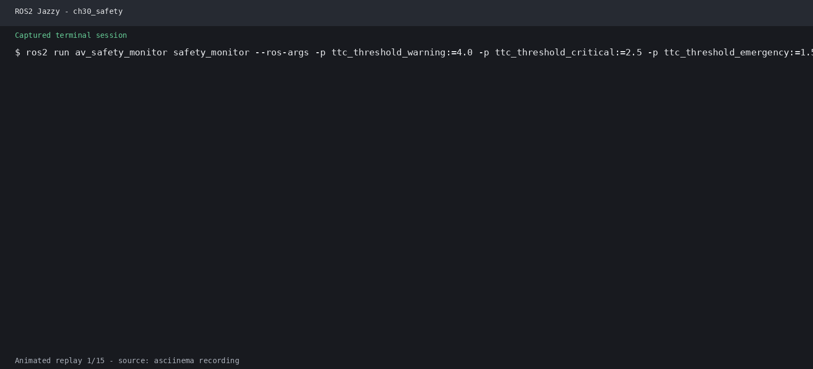

# 第44章 安全验证与系统集成

> **课程**：ROS2 Python 编程  
> **章节**：第44章  
> **课时**：2 课时（90 分钟）  
> **教学方式**：讲授 + 演示  

---

## 学习目标

本章学习目标包括：理解自动驾驶系统感知-决策-规划-控制闭环架构与ROS2接口集成方式，掌握碰撞检测、偏离检测、自动紧急制动与驾驶员接管等安全监控机制的设计方法，能够通过传感器故障模拟、通信延迟注入与降级策略设计验证系统的容错能力，掌握性能评估指标体系、舒适度Jerk分析、评估报告模板等量化评估方法，并最终掌握基于CARLA的场景覆盖、边界用例、回归测试与ScenarioRunner集成的仿真测试方法论。

## 44.1 自动驾驶系统集成

### 44.1.1 感知→决策→规划→控制闭环架构

自动驾驶系统是一个典型的**感知-决策-规划-控制**闭环架构，各模块通过ROS2的通信机制紧密协作：

```
                     ┌─────────────────────────────────────────┐
                     │              环境感知层                   │
                     │  ┌─────────┐  ┌─────────┐  ┌─────────┐  │
                     │  │ 激光雷达  │  │  相机   │  │  毫米波  │  │
                     │  │ (LiDAR)  │  │ (Camera) │  │  雷达   │  │
                     │  └────┬────┘  └────┬────┘  └────┬────┘  │
                     │       │            │            │         │
                     │  ┌────┴────────────┴────────────┴────┐   │
                     │  │       感知融合 (Sensor Fusion)      │   │
                     │  │  目标检测 | 语义分割 | 跟踪 | 定位   │   │
                     │  └────────────────┬──────────────────┘   │
                     └───────────────────┼──────────────────────┘
                                         │
                                         ▼
                     ┌─────────────────────────────────────────┐
                     │              决策规划层                   │
                     │  ┌──────────────────────────────────┐   │
                     │  │    行为决策 (Behavior Planner)     │   │
                     │  │  换道 | 跟车 | 停车 | 避让 | 变道   │   │
                     │  └────────────────┬─────────────────┘   │
                     │                   │                      │
                     │  ┌────────────────┴─────────────────┐   │
                     │  │     运动规划 (Motion Planner)      │   │
                     │  │  全局路径规划 | 局部路径规划 | 速度规划│   │
                     │  └────────────────┬─────────────────┘   │
                     └───────────────────┼──────────────────────┘
                                         │
                                         ▼
                     ┌─────────────────────────────────────────┐
                     │              控制执行层                   │
                     │  ┌──────────────────────────────────┐   │
                     │  │    车辆控制 (Vehicle Control)      │   │
                     │  │  横向控制 (Stanley/MPC)           │   │
                     │  │  纵向控制 (PID/MPC)               │   │
                     │  └────────────────┬─────────────────┘   │
                     │                   │                      │
                     │  ┌────────────────┴─────────────────┐   │
                     │  │     执行器 (Actuator)             │   │
                     │  │  油门 | 制动 | 转向 | 挡位         │   │
                     │  └────────────────┬─────────────────┘   │
                     └───────────────────┼──────────────────────┘
                                         │
                                         ▼
                     ┌─────────────────────────────────────────┐
                     │              反馈闭环                     │
                     │  CAN总线 | 里程计 | IMU | GPS → 状态估计  │
                     └─────────────────────────────────────────┘
```

**闭环工作流程**：传感器采集原始数据后，感知模块输出障碍物列表、车道线、交通标志；行为决策根据感知结果和路由信息选择驾驶行为；运动规划生成平滑无碰撞的轨迹；控制模块将轨迹转换为油门、制动、转向指令；车辆执行后通过里程计/IMU反馈实际状态，形成闭环。

### 44.1.2 ROS2接口汇总

#### 话题（Topic）接口

| 话题名称 | 消息类型 | 发布者 | 订阅者 | 频率 |
|---------|---------|--------|--------|------|
| `/perception/objects` | `Detection3DArray` | 感知融合 | 决策规划 | 20Hz |
| `/perception/lanes` | `LaneletMap` | 车道检测 | 规划 | 20Hz |
| `/perception/traffic_signals` | `TrafficSignalArray` | 信号灯检测 | 决策 | 10Hz |
| `/planning/trajectory` | `Trajectory` | 运动规划 | 控制 | 20Hz |
| `/planning/behavior` | `String` | 行为决策 | 规划/监控 | 10Hz |
| `/control/cmd` | `ControlCommand` | 控制模块 | 车辆接口 | 50Hz |
| `/vehicle/odometry` | `Odometry` | 定位 | 所有模块 | 100Hz |
| `/vehicle/status` | `VehicleStatus` | CAN总线 | 监控 | 50Hz |
| `/safety/collision_warning` | `Bool` | 安全监控 | 紧急制动 | 20Hz |
| `/safety/deviation` | `Float32` | 安全监控 | 规划 | 20Hz |

#### 服务（Service）接口

| 服务名称 | 请求/响应类型 | 功能描述 |
|---------|-------------|---------|
| `/safety/emergency_brake` | `Trigger → Bool` | 触发紧急制动 |
| `/control/set_mode` | `SetMode → Bool` | 切换自动驾驶/手动模式 |
| `/planning/set_destination` | `SetPose → Bool` | 设置导航目的地 |
| `/perception/get_objects` | `GetObjects → Detection3DArray` | 拉取检测结果 |
| `/vehicle/get_diagnostics` | `Trigger → Diagnostics` | 获取车辆诊断信息 |

#### 动作（Action）接口

| 动作名称 | 目标/结果/反馈类型 | 功能描述 |
|---------|------------------|---------|
| `/planning/follow_trajectory` | `FollowTrajectory` | 执行轨迹跟踪 |
| `/control/park` | `Park` | 自动泊车 |
| `/safety/emergency_stop` | `EmergencyStop` | 紧急停止序列 |
| `/perception/fuse_sensors` | `FuseSensors` | 传感器融合校准 |

## 44.2 安全监控机制

### 44.2.1 碰撞检测（Collision Detection）

碰撞检测通过多种信息来源交叉验证实现：

```python
# 碰撞检测逻辑示意
def check_collision(ego_pose, ego_bbox, objects, time_horizon=3.0):
    for obj in objects:
        # 预测目标运动轨迹（恒定速度模型）
        pred_traj = predict_trajectory(obj, time_horizon)
        # 计算本车与目标的时空交集
        ttc = compute_time_to_collision(ego_pose, ego_bbox, pred_traj)
        if ttc is not None and ttc < SAFETY_TTC_THRESHOLD:
            # 发布碰撞预警
            publish_collision_warning(obj.id, ttc, CollisionLevel.WARNING)
            if ttc < CRITICAL_TTC_THRESHOLD:
                publish_collision_warning(obj.id, ttc, CollisionLevel.CRITICAL)
                trigger_emergency_brake()
```

**关键指标**：**TTC（Time to Collision）**为碰撞时间阈值，安全时 ≥ 3.0s，警告时 < 2.0s，危险时 < 1.0s；**最小安全距离**为 `d_min = v_rel * t_reaction + d_stop`。

### 44.2.2 偏离检测（Lane Deviation Detection）

检测车辆是否偏离目标车道，作为规划质量的监控指标：

```python
def check_lane_deviation(ego_pose, lane_center, lane_width):
    lateral_offset = compute_lateral_offset(ego_pose, lane_center)
    heading_error = compute_heading_error(ego_pose, lane_center)

    if abs(lateral_offset) > lane_width * 0.4:
        publish_deviation_warning(lateral_offset, heading_error)

    # 累积偏离积分，判断是否持续偏离
    cumulative_deviation = integrate_deviation(lateral_offset, dt)
    if cumulative_deviation > DEVIATION_THRESHOLD:
        trigger_driver_handover("严重车道偏离")
```

### 44.2.3 自动紧急制动（AEB）

AEB系统分为三个等级：

| 等级 | 触发条件 | 制动强度 | 行为 |
|------|---------|---------|------|
| Level 1 | TTC < 2.6s | 30% | 预警 + 预填充制动 |
| Level 2 | TTC < 1.8s | 60% | 部分制动 + 安全带预紧 |
| Level 3 | TTC < 0.8s | 100% | 全力制动 + 双闪开启 |

```python
def aeb_control_loop():
    while rclpy.ok():
        ttc = get_min_ttc()
        if ttc < 0.8:
            # Level 3: 全力制动
            brake_cmd = ControlCommand()
            brake_cmd.brake = 1.0
            brake_cmd.steering = current_steering  # 保持方向
            cmd_pub.publish(brake_cmd)
            hazard_lights_pub.publish(HazardLights(ON))
        elif ttc < 1.8:
            # Level 2: 部分制动
            brake_cmd.brake = 0.6
            cmd_pub.publish(brake_cmd)
        elif ttc < 2.6:
            # Level 1: 预警
            warning_pub.publish(CollisionWarning(level=1))
```

### 44.2.4 驾驶员接管（Driver Handover）

接管机制确保在系统失效时安全移交控制权：

```
┌─────────────┐    接管控件条件    ┌─────────────┐
│  自动驾驶状态  │ ──────────────→  │  手动驾驶状态  │
│  (ADS Active) │                   │  (Manual)     │
└─────────────┘                   └─────────────┘
       ↑                                │
       │    条件恢复                    │ 触发条件:
       │    (系统自检OK)                │ ① 碰撞风险(TTC<0.5s)
       │                                │ ② 系统故障(感知丢失>500ms)
       │                                │ ③ 严重偏离(偏离>1.0m)
       │                                │ ④ 用户主动请求
       └────────────────────────────────┘
```

**接管过渡阶段**：先是**预警阶段（0-1s）**——声光警报，提示驾驶员准备接管；随后**过渡阶段（1-3s）**——逐渐降低车速，保持车道；最后**移交完成**——控制权移交，系统进入监控模式。

### 44.2.5 官方要点——安全标准的概念框架：ISO 26262 与 SOTIF

国际课程在安全章节普遍引入两份标准的概念框架（教学性介绍）：ISO 26262 关注「电子电气系统功能性故障」——即系统不按设计工作时怎么办，对应本章的失效安全（fail-safe）状态机；ISO 21448（SOTIF，预期功能安全）关注「系统按设计工作但性能不足」——感知在长尾场景下的漏检误检正是典型对象，对应 44.2 的碰撞/偏离监控与 44.5.2 边界用例。两份标准共同确立了「安全不是单点指标，而是从需求、设计、验证到运行监控的全流程论证」这一思想，本章的安全监控机制、性能指标体系（44.4）与回归测试（44.5.3）正是该流程在课程尺度上的缩影。

## 44.3 故障注入与容错

### 44.3.1 传感器故障模拟

| 故障类型 | 模拟方式 | 持续时间 | 影响评估 |
|---------|---------|---------|---------|
| 感知丢帧 | 跳过话题发布 | 100-500ms | 跟踪中断，可通过卡尔曼滤波预测补偿 |
| 信号噪声 | 添加高斯噪声 (σ=0.1~0.5) | 连续 | 检测精度下降，需自适应阈值 |
| 数据偏置 | 叠加固定偏移 | 持续 | 定位漂移，需多传感器校验 |
| 完全失效 | 停止发布 | 直至恢复 | 触发降级策略 |
| 延迟注入 | 引入50-500ms延时 | 持续 | 控制滞后，需补偿 |

```python
# 传感器故障模拟工厂
class SensorFaultFactory:
    def create_fault(self, fault_type, sensor_topic):
        if fault_type == "drop":
            return DropFrameFault(sensor_topic, drop_interval=0.1)
        elif fault_type == "noise":
            return NoiseFault(sensor_topic, stddev=0.3)
        elif fault_type == "bias":
            return BiasFault(sensor_topic, offset=1.5)
        elif fault_type == "stall":
            return StallFault(sensor_topic, duration=2.0)
        elif fault_type == "latency":
            return LatencyFault(sensor_topic, delay_ms=200)
```

### 44.3.2 通信延迟注入

ROS2通信延迟会影响整个闭环系统的稳定性：

```python
class LatencyInjector(Node):
    def __init__(self):
        super().__init__('latency_injector')
        self.sub = self.create_subscription(
            TrafficSignalArray,   # 原始消息类型
            '/perception/traffic_signals',
            self.delayed_callback,
            10)

    def delayed_callback(self, msg):
        delay_ms = self.get_parameter('delay_ms').value
        # 使用Timer模拟延迟
        if delay_ms > 0:
            self.create_timer(delay_ms / 1000.0,
                lambda: self.forward_msg(msg), oneshot=True)
        else:
            self.forward_msg(msg)
```

**延迟影响分析**：

| 延迟时间 | 控制系统影响 | 安全风险 |
|---------|------------|---------|
| 50ms | 可忽略 | 无 |
| 100ms | 轻微超调 | 低 |
| 200ms | 明显震荡 | 中 |
| 500ms | 失稳可能 | 高 |
| 1000ms+ | 完全失稳 | 极高 |

### 44.3.3 降级策略（Degradation Strategy）

当系统检测到故障时，执行分级降级：

```
Level 0: 全功能运行 ──→ 正常状态
Level 1: 感知降级 ────→ 仅使用LiDAR，禁用Camera
Level 2: 规划降级 ────→ 最高速度限制 30km/h，禁用自动换道
Level 3: 控制降级 ────→ 最小风险策略，靠边停车
Level 4: 安全停车 ────→ 立即制动，双闪，请求远程协助
```

**降级决策逻辑**：
```python
def evaluate_degradation(sensor_status, comm_latency, fault_flags):
    score = 0
    if not sensor_status['camera']:   score += 1
    if not sensor_status['lidar']:    score += 2
    if comm_latency > 200:             score += 1
    if comm_latency > 500:             score += 2
    if fault_flags['localization']:    score += 3

    if score >= 5:  return DegradationLevel.SAFE_STOP
    if score >= 3:  return DegradationLevel.LIMITED
    if score >= 1:  return DegradationLevel.DEGRADED
    return DegradationLevel.NORMAL
```

### 44.3.4 官方要点——故障注入与容错：官方工程实践

Autoware 官方文档把「故障注入」列为集成验证的标准环节：通过在链路中注入传感器失效（丢帧、畸变）、通信延迟与停滞话题，验证下游模块的看门狗与降级路径——与本章 44.3.1–44.3.3 的三类注入一一对应。ROS 2 官方文档补充了节点侧工具：`ros2 doctor` 检测系统级异常，结构化日志（`rcutils`/`spdlog` 分级）与 `ros2 topic hz` 持续监测延迟抖动是定位「哪一层先失效」的第一手证据。官方一致的结论是：容错逻辑必须「在注入实验中真实触发过」才算验证，代码路径存在但不触发等于没有。

## 44.4 性能评估指标

### 44.4.1 评估指标体系

| 指标 | 公式 | 理想值 | 评估维度 |
|-----|------|-------|---------|
| 碰撞率 | `N_collision / N_test × 100%` | 0% | 安全性 |
| 路线偏离率 | `T_deviation / T_total × 100%` | < 5% | 安全性 |
| 平均速度 | `Σv_i / N` | 符合限速 | 效率 |
| 舒适度（Jerk） | `|da/dt|` 的均方根 | < 2.0 m/s³ | 舒适性 |
| 任务完成率 | `N_completed / N_attempted × 100%` | > 95% | 可靠性 |
| 平均TTC | `min(TTC)` 的平均值 | > 3.0s | 安全性 |
| 规划耗时 | `t_planning` 的95分位值 | < 50ms | 实时性 |
| 控制误差 | `RMSE(trajectory_error)` | < 0.3m | 精度 |

### 44.4.2 舒适度评估（Jerk分析）

舒适度通过加速度变化率（Jerk）量化：

```python
def compute_comfort_metrics(velocity_log, time_log):
    # 加速度 = 速度变化率
    acc = np.diff(velocity_log) / np.diff(time_log)
    # Jerk = 加速度变化率
    jerk = np.diff(acc) / np.diff(time_log[1:])

    metrics = {
        'mean_jerk': np.mean(np.abs(jerk)),
        'max_jerk': np.max(np.abs(jerk)),
        'rms_jerk': np.sqrt(np.mean(jerk**2)),
        'jerk_95th': np.percentile(np.abs(jerk), 95)
    }
    return metrics
```

**Jerk等级划分**：🟢 优秀（RMS Jerk < 1.0 m/s³）舒适如豪华轿车；🟡 良好（RMS Jerk 1.0-2.0 m/s³）可接受；🟠 一般（RMS Jerk 2.0-4.0 m/s³）乘客会感到不适；🔴 较差（RMS Jerk > 4.0 m/s³）对应急加速、急刹车的情况。

### 44.4.3 评估报告模板

```json
{
  "test_id": "ch44_eval_001",
  "scenario": "城市拥堵路段",
  "weather": "晴天",
  "duration_s": 300,
  "metrics": {
    "collision_rate": 0.0,
    "deviation_rate": 2.3,
    "avg_speed_ms": 8.5,
    "rms_jerk": 1.2,
    "task_completion": true,
    "avg_ttc": 4.2,
    "planning_latency_ms": 35,
    "control_rmse_m": 0.18
  },
  "fault_injection": {
    "lidar_drop_rate": 0.05,
    "camera_latency_ms": 150,
    "recovery_time_s": 1.2
  },
  "assessment": "PASS",
  "notes": "在5%激光雷达丢帧率下系统表现稳定，控制精度满足要求"
}
```

### 44.4.4 官方要点——指标、回归与「可复现失败」文化

CARLA 官方 Leaderboard 与 ScenarioRunner 均以量化指标驱动验证：路线完成率、碰撞次数、闯红灯次数、停车/绕行罚时构成标准评分，官方强调同一场景多次运行的统计分布比单次成绩更可信。ROS 2 官方测试工具链（`launch_testing`、`ros2 control` 的仿真接口测试）支持把关键场景固化为自动化回归测试：每次代码变更后重放全部历史场景，防止「修好一个、弄坏三个」。国际课程的共同建议是把「失败场景 + bag 录制 + 复现步骤」归档成 issue——可复现的失败是集成阶段最宝贵的资产，这也与 45 章综合项目的演示验收形成闭环。

## 44.5 仿真测试方法论

### 44.5.1 场景覆盖（Scenario Coverage）

基于CARLA的场景测试分类：

| 场景类别 | 具体场景 | 测试数量 |
|---------|---------|---------|
| **正常行驶** | 直行、转弯、跟车、换道 | ≥ 20 |
| **交通参与者** | 行人横穿、非机动车、动物出现 | ≥ 15 |
| **交通规则** | 红绿灯、停止线、让行、限速 | ≥ 10 |
| **恶劣天气** | 雨、雾、雪、夜间、逆光 | ≥ 10 |
| **道路结构** | 隧道、环岛、匝道、施工区 | ≥ 10 |
| **紧急场景** | 前车急刹、儿童冲出、抛锚车 | ≥ 15 |
| **故障场景** | 传感器失效、通信中断、GPS丢失 | ≥ 10 |

### 44.5.2 边界用例（Edge Cases）

需要重点覆盖的边界用例：**感知边界**——远距离小目标（< 10像素）、遮挡目标、反射/眩光；**决策边界**——多目标冲突（同时避让行人和车辆）、无明确路权场景；**控制边界**——高速急弯、低附着力路面（湿滑/冰雪）；**系统边界**——高CPU负载时实时性、内存不足处理、节点崩溃恢复；**时序边界**——消息时序错乱、时间戳跳跃、异步到达。

### 44.5.3 回归测试（Regression Testing）

自动化回归测试流程：

```python
def run_regression_suite():
    test_suite = load_test_suite("scenarios/regression_v2.yaml")
    results = []

    for scenario in test_suite:
        # 启动CARLA仿真环境
        client = start_carla_simulation(scenario.map)
        # 部署自动驾驶系统
        system = deploy_autonomy_stack()
        # 运行场景
        outcome = run_scenario(client, system, scenario)
        # 评估结果
        metrics = evaluate_performance(outcome.log)
        regr_check = check_regression(metrics, scenario.baseline)

        results.append({
            'scenario': scenario.name,
            'passed': regr_check.passed,
            'delta': regr_check.metric_deltas
        })

    return results
```

**回归触发条件**：代码提交时，pre-commit hook 运行快速测试子集；PR 创建时运行完整测试集，约 30 分钟；nightly build 时运行全部场景与故障注入，约 2 小时。

### 44.5.4 CARLA ScenarioRunner集成

通过CARLA ScenarioRunner执行标准化测试场景：

```bash
# 运行单个OpenScenario场景
python scenario_runner.py --openscenario scenarios/city_junction.xosc

# 运行批量测试
python scenario_runner.py --route towns/route_01.xml \
    --reload --output-dir results/ch44_test

# 与ROS2桥接运行
ros2 launch carla_ros_bridge carla_ros_bridge.launch.py
ros2 run scenario_runner scenario_runner_node.py \
    --scenario ch44_emergency_brake
```

**自定义场景示例**（OpenSCENARIO格式片段）：
```xml
<ScenarioDefinition>
  <ParameterDeclarations/>
  <CatalogLocations/>
  <RoadNetwork>
    <Logics filepath="Town01.xodr"/>
    <SceneGraph filepath="Town01.glb"/>
  </RoadNetwork>
  <Entities>
    <ScenarioObject name="EgoVehicle">
      <Vehicle category="car"/>
    </ScenarioObject>
    <ScenarioObject name="Pedestrian1">
      <Pedestrian category="pedestrian"/>
    </ScenarioObject>
  </Entities>
  <Storyboard>
    <Init>
      <Actions>
        <Private vehicle="EgoVehicle">
          <RouteAction>
            <Route waypoints="100,200 150,200"/>
          </RouteAction>
        </Private>
        <Private vehicle="Pedestrian1">
          <TeleportAction position="120,210,0"/>
        </Private>
      </Actions>
    </Init>
    <Story name="PedestrianCrossing">
      <Act name="CrossAct">
        <Maneuver name="CrossManeuver">
          <Event name="CrossEvent" priority="overwrite">
            <Action name="CrossAction">
              <SpeedAction>
                <Target>
                  <AbsoluteTargetSpeed value="1.4"/>
                </Target>
              </SpeedAction>
            </Action>
            <StartConditions>
              <Condition name="EgoApproaching" delay="0">
                <ByEntity condition="reachPosition"
                  entity="EgoVehicle" tolerance="15.0"
                  position="110,200,0"/>
              </Condition>
            </StartConditions>
          </Event>
        </Maneuver>
      </Act>
    </Story>
  </Storyboard>
</ScenarioDefinition>
```

### 44.5.5 官方要点——场景化测试的官方框架：ScenarioRunner 与 OpenSCENARIO

CARLA 官方 ScenarioRunner 文档定义了「场景即测试用例」的工作流：用 Python 类（继承 `basic_scenario`）描述交通参与者行为序列（对向车切入、前车急停、行人横穿），每类场景按参数组合批量展开，自动统计成功/失败率——本章 44.5.4 的集成正是它的官方用法。场景描述层面，ASAM OpenSCENARIO 标准（XML 方言）用「故事板（Storyboard）：初始条件 + 触发条件 + 动作序列」的通用格式描述测试场景，被 CARLA、esmini 等官方工具支持，是 44.5.1 场景覆盖率方法学的行业通用表达：把「雾天 + 前车 60% 减速 + 本车 60 km/h」这类组合参数化，才能系统证明覆盖了 44.5.2 列出的边界用例。

---

## 本章总结

安全验证与系统集成是自动驾驶系统从研发走向部署的关键环节。通过构建完整的感知-决策-规划-控制闭环架构，并集成碰撞检测、偏离检测、AEB、驾驶员接管等安全监控机制，结合故障注入验证系统的容错能力，最后通过多维度的性能评估指标和系统化的仿真测试方法论，可以系统地评估和保障自动驾驶系统的安全可靠性。




> 参考来源：
> - CARLA ScenarioRunner 官方仓库与文档：https://github.com/carla-simulator/scenario_runner
> - ASAM OpenSCENARIO 标准说明：https://www.asam.net/
> - Autoware 官方文档 —— 安全设计与验证：https://autoware.org/
> - ROS 2 官方文档 —— 日志、诊断与测试工具链：https://docs.ros.org/
